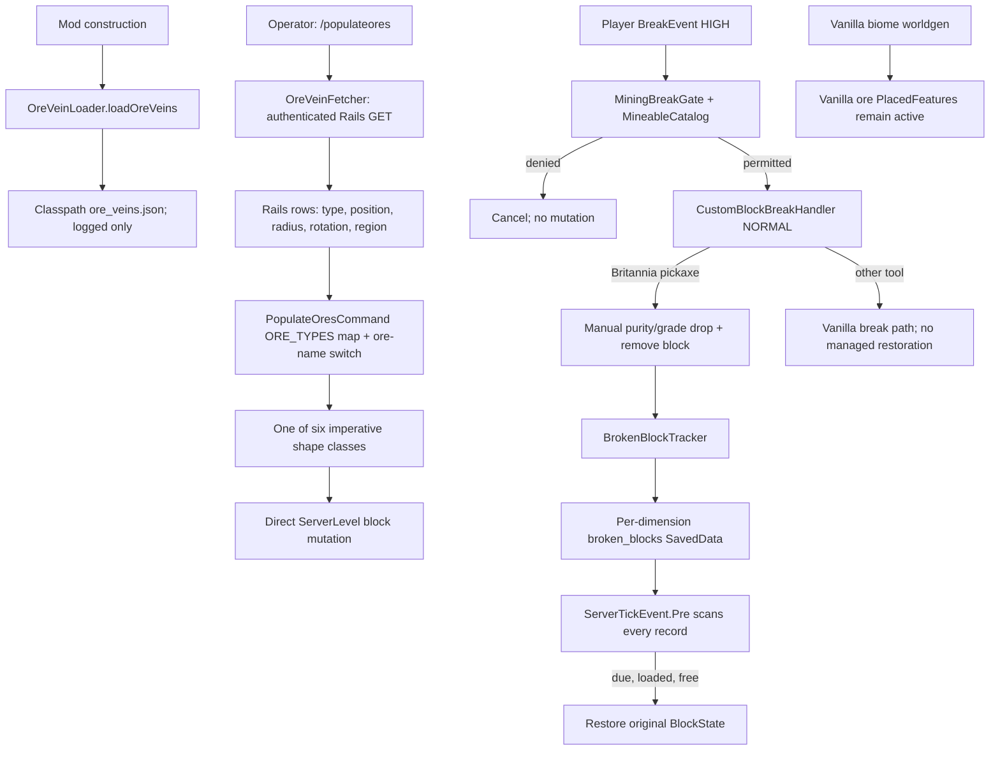
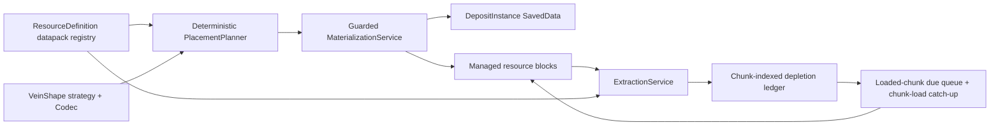

# OreVein Engineering Audit

Date: 2026-08-20  
Target: UltimaCraft / Britannia Mod, Minecraft 1.21.1, NeoForge 21.1.72

## Executive conclusion

The repository does not currently have a world-generation OreVein platform. It has three adjacent systems:

1. an operator command that synchronously fetches curated coordinates from Rails and writes ore blocks into the command source's current dimension;
2. six static, imperative shape algorithms selected by an ore-name `switch`;
3. a substantially newer, data-driven Mining catalogue and a persistent per-block restoration ledger.

The Mining catalogue is a sound seam worth preserving. The placement and restoration systems are not yet safe foundations for an authoritative, long-running resource economy. Vanilla ores are still generated normally, command placement is neither seed-deterministic nor idempotent, most shapes can overwrite arbitrary world content, deposits have no identity, a sufficiently skilled player can destroy a managed resource with the wrong tool without scheduling regeneration, coal is placed but is not managed by Mining, and every pending restoration is visited every server tick.

The correct direction is an incremental consolidation, not a giant rewrite: retain the validated Mining definition work, add generalized extraction rules, introduce pure deterministic shape planners behind one guarded placement service, persist a small deposit-instance ledger, replace the flat restoration sweep with a chunk-indexed loaded-chunk queue, then suppress explicitly enumerated vanilla placed features. Silica should be the first consumer of that platform, using a real `sedimentary_lens` shape and an item tag such as `britannia_mod:tools/extracts/silica`.

## Critical answers

| Question | Answer |
|---|---|
| 1. Safe for a long-running multiplayer world? | **No, not at the requested scale.** Persistence works, but global tick scanning, unsafe placement, bypass paths, and absent deposit identity are release blockers for an authoritative economy. |
| 2. Supports 25-50 resource types cleanly? | **Mining definitions mostly can; generation cannot.** Each generated resource currently requires edits to a block map and a shape switch, with more string special cases elsewhere. |
| 3. Deterministic and duplicate-safe? | **No.** Rails coordinates are explicit, but shapes consume `ServerLevel#getRandom()` and repeated commands reroll and reapply them. There is no generated-deposit ledger. |
| 4. Regeneration persistent across restarts? | **Yes for managed breaks.** Position, original state, epoch timestamp, and player UUID round-trip through per-dimension `SavedData`. |
| 5. Correct for unloaded chunks? | **Functionally yes, operationally inefficient.** It never force-loads; overdue records wait and restore after the chunk is loaded, but are still checked on every tick while unloaded. |
| 6. Per-tick scalability problem? | **Yes.** The scheduler is O(all pending blocks) every pre-tick, with entity searches for due loaded cells. |
| 7. Actual regeneration duration? | **Six real-world hours**, not 24 hours. `RESTORE_HOURS = 6`; timing uses `System.currentTimeMillis()`. |
| 8. Disable vanilla features or replace afterward? | **Disable explicitly selected placed features.** Post-generation block scanning is slower, less safe, and cannot distinguish terrain from structures or player work. |
| 9. Suppress vanilla ores without harming structures/manual blocks? | **Yes for future generation.** A `neoforge:remove_features` biome modifier removes biome decoration features, not blocks in structure templates or already/manual placed blocks. |
| 10. Existing chunks? | **Hybrid policy.** New chunks use suppression plus controlled deposits; existing chunks are unchanged unless an administrator previews and approves a bounded retrofit. Never silently scan/rewrite them. |
| 11. Persistent deposit identities needed? | **Yes, but only a small ledger.** Resource id, deterministic instance id, origin/seed, bounds, definition revision, and summary state are sufficient. Do not store a database row per standing block. |
| 12. Existing shape abstraction adequate? | **No.** It is a shared method signature, not a safe abstraction: algorithms mutate the world directly, use shared runtime RNG, apply inconsistent replacement policies, and have no codecs or validation. |
| 13. Best silica shape? | **A new `sedimentary_lens`**, because the current `LayeredVein` fills air in two phases and overwrites non-air in another; it is not a shallow host-rock lens. |
| 14. Generalized silica tool restriction? | Put eligible items in an item tag, e.g. `britannia_mod:tools/extracts/silica`, and store that tag in the resource's extraction definition. The break gate must cancel wrong-tool attempts before mutation. |
| 15. Changes before broad expansion? | Correct tool/bypass behavior, centralize guarded placement, make shape output deterministic and data-driven, add deposit identity, index restoration by chunk/due time, and add vanilla-feature suppression tests. |

## 1. Current Architecture

### Dependency and execution map



### Important components

- `BritanniaMod.java:123-140` loads `OreVeinLoader` at mod construction, initializes `Mineables`, and leaves the historical `FeatureRegistry` disabled.
- `OreVeinLoader.java:19-46` reads `/data/britannia_mod/ore_veins.json` from the classpath. No production placement code calls `getOreVeins()`. The file is therefore an inert sample/fallback, not an authoritative definition source.
- `PopulateOresCommand.java:62-90` registers `/populateores` and `/undoores`. This command is the authoritative active placement entry point.
- `OreVeinFetcher.java:42-81` synchronously retrieves the actual location rows from the Rails `ore_veins` endpoint. The method parameter `shardName` is unused; the credential registry's shard is sent instead (`:46-49`). Network connect/read timeouts are 5/10 seconds in `BoundedHttp.java:9-18`, so the server command thread can stall.
- `PopulateOresCommand.java:35-60` maps strings to blocks; `:314-340` separately maps resource strings to shape classes. This is duplicated resource knowledge.
- `ClusterVein`, `VerticalVein`, `SnakeVein`, `GeodeVein`, `LayeredVein`, and `VerticalLayeredVein` directly call `ServerLevel#setBlock`. They are not Minecraft `Feature` implementations and do not participate in chunk worldgen.
- `MineableCatalog.java` is a validated classpath-JSON catalogue for Mining requirements, drop/economy identity, and restoration eligibility. `Mineables.java:51-73` builds an identity-keyed block lookup for the hot path. This is the healthiest existing abstraction.
- `MiningGateHandler.java:26-40` performs the server-authoritative skill gate at HIGH event priority. `CustomBlockBreakHandler.java:27-66` owns the managed break, drop, restoration scheduling, and skill award.
- `MiningProvenance.java` is a separate per-dimension `SavedData` set containing player-placed mineable positions. Absence means natural. It prevents the obvious place-break economy loop but is not deposit identity.
- `BrokenBlockDataStorage.java` persists one `BrokenBlockData` per depleted position. `BlockRestoreHandler.java` owns regeneration.
- `MiningDebugCommand.java` supplies useful read-only block/gate/restoration diagnostics. `BlockCommands.java` can list or delete restoration records. No command lists actual deposit instances because none exist.

### When deposits are created

Deposits are created only when a permission-level-2 operator invokes `/populateores <type>` or `/populateores region <region> [type]`. They are not created at world generation, chunk generation, first chunk load, or server startup. The command always targets `context.getSource().getLevel()`; Rails data has no dimension field, so the same row can be applied in whichever dimension the operator runs the command.

### Representation

A standing deposit is represented only by blocks. There is no UUID, origin ledger, resource-to-position index, bounds record, remaining count, generation revision, or duplicate marker. The only persistent metadata appears after a managed block is mined, and it describes an individual restoration debt rather than its parent deposit.

## 2. Current Resource Matrix

The actual location/count/radius matrix lives outside the repository in Rails. Every active row supplies only `ore_type`, x/y/z, radius, rotation, and region. There are no biome, dimension, spacing, min-distance, host-block, or regeneration fields. The bundled `ore_veins.json` contains ten example rows but is not consumed by placement.

### Resources the placement command can actually generate

| Resource | Block placed | Current shape | Shape/distribution rule | Managed extraction | Regeneration |
|---|---|---|---|---|---|
| Copper | `britannia_mod:copper_ore` | Cluster | Rails center/radius; full cube visit with radial density | Britannia pickaxe, Mining 75, one purity item | 6 real hours per managed break |
| Verite | `britannia_mod:verite_ore` | Cluster | Same algorithm | Britannia pickaxe, Mining 95 | 6 hours |
| Iron | `minecraft:iron_ore` | Vertical | Upward random walk, 2-6 placement attempts per step | Britannia pickaxe, Mining 0 | 6 hours |
| Valorite | `britannia_mod:valorite_ore` | Vertical | Same algorithm | Britannia pickaxe, Mining 99 | 6 hours |
| Shadow iron | `britannia_mod:shadow_iron_ore` | Vertical | Same algorithm | Britannia pickaxe, Mining 70 | 6 hours |
| Gold | `minecraft:gold_ore` | Snake | Four upward random walks; radius must be at least 10 | Britannia pickaxe, Mining 85 | 6 hours |
| Agapite | `britannia_mod:agapite_ore` | “Geode” | `2 * radius` random points in a flattened box; not a shell | Britannia pickaxe, Mining 90 | 6 hours |
| Silver | `britannia_mod:silver_ore` | Vertical layered | Air-only planar clusters/scatter; orientation from `rotation` | Britannia pickaxe, Mining 55 | 6 hours |
| Coal | `minecraft:coal_ore` | Layered | Mixed air-only clusters plus solid-only scatter | **Not in MineableCatalog:** vanilla breaking/drops; no Mining gate | **None** through managed flow |
| Tin | `britannia_mod:tin_ore` | Layered | Same mixed algorithm | Britannia pickaxe, Mining 65 | 6 hours |

`ORE_TYPES` also advertises diamond, deepslate diamond, redstone, deepslate redstone, vanilla copper, emerald variants, and lapis variants (`PopulateOresCommand.java:51-59`), but the shape switch has no cases for them and returns zero (`:336-337`). They are accepted command names, not functioning OreVein resources.

Important extraction caveat: the “Britannia pickaxe” behavior above occurs only when `CustomBlockBreakHandler.isBritanniaPickaxe` matches. The HIGH-priority gate checks skill, not tool. A player at or above the required skill using another tool reaches vanilla breaking, bypasses the manual resource drop and does not create a restoration record. The existing vanilla-tool GameTest covers only an under-skilled player (`MiningGateGameTests.java:235-254`), so it does not catch this case.

### Current archetype matrix

All active shapes take the same arguments, but that signature is their only common abstraction. Every shape uses the level's shared runtime RNG, mutates the current command dimension directly, stores no deposit identity, has no biome/altitude policy beyond the supplied center, and inherits extraction/regeneration from whichever block it happens to place. None is a registered/configured/placed worldgen feature. A shape may cross runtime chunk boundaries by direct world access, but there is no chunk owner, clipping, generation-order guarantee, or duplicate guard.

| Name / implementation | Size, orientation, and vertical distribution | Density/randomness | Replacement rule | Boundary/safety notes |
|---|---|---|---|---|
| Cluster — `ClusterVein.java` | Visits a `(2r+1)^3` cube. `rotation` is ignored. The distance uses `y / 1.8`, increasing vertical density rather than flattening it. | Candidate chance is `1-distance/r`, then a 10% gap chance and an extra 30% outer-edge skip. | Replaces every selected current state, including air, fluids, containers, and bedrock. | O(r³); can cross/load chunks; no build-height or host validation. Used by Copper/Verite. |
| Vertical — `VerticalVein.java` | Runs `r` upward steps. Each step applies a random X/Z walk, then 2-6 same-Y placement attempts within ±1 X/Z. `rotation` is ignored. | Shared level RNG; attempts may collide and overcount. | Replaces anything except bedrock. | Can wander across chunks; no upper build-height guard. Used by Iron/Valorite/Shadow iron. |
| Snake — `SnakeVein.java` | One primary and three offset upward random walks. Each walk attempts up to `3 * height` steps with `dy` 0 or 1; tendril origins are within ±10 X/Z. `rotation` is ignored. | 80% placement chance per step; tendril height rerolled. | Replaces any state. | `nextInt(radius - 9)` throws for radius <= 9; no height/host guard. Used by Gold. |
| “Geode” — `GeodeVein.java` | Places `2r` samples in an approximately r-by-r-by-r/2 box around center. `rotation` is ignored. | Independent random samples; duplicates count repeatedly. | Replaces any state. | It is a sparse point cloud, not a shell/geode; no host or chunk policy. Used by Agapite. |
| Layered — `LayeredVein.java` | Horizontal centers/scatter within radius; core has no Y variance, peripheral has ±1 Y, scatter stays at center Y. `rotation` is ignored. | `3r` core clusters of 8-14 attempts, `2r` peripheral clusters of 6-11, and `6r` scatter attempts. | Core/peripheral replace **air only**; scatter replaces **non-air only**. | Produces floating cave ore and arbitrary solid replacement in one algorithm. Used by Coal/Tin. |
| Vertical layered — `VerticalLayeredVein.java` | `XZ` makes an X/Y plane with thin Z; `YZ` makes Y/Z with thin X; `XY` is horizontal; `ZW` duplicates a Y/Z-like plane. | Same `3r`, `2r`, `6r` attempt families as Layered; duplicate attempts overcount. | Every phase replaces **air only**. | Frequently places nothing in solid geology; invalid rotation collapses offsets to center. Used by Silver. |
| Altitude scaled — `AltitudeScaledFeature.java` | Dormant prototype using an `OreConfiguration`; samples 3, 5, or 12 positions depending on Y. | Context RNG. | Uses configured ore target predicates. | Not registered: `FeatureRegistry.old` is inactive and registration is commented out. Not a current archetype. |

### Other active Mining resources

These are governed by the same break/restoration flow but have no OreVein placement shape. They arrive through vanilla terrain, structures, creative/player placement, or no discovered generation path.

| Resource | Blocks | Required Mining | Current origin |
|---|---|---:|---|
| Stone / cobblestone | stone, cobblestone | 0 | Vanilla terrain/building |
| Calcite | calcite | 5 | Vanilla geology |
| Diorite | diorite | 10 | Vanilla geology |
| Andesite | andesite | 15 | Vanilla geology |
| Granite | granite | 20 | Vanilla geology |
| Tuff | tuff | 25 | Vanilla geology |
| Deepslate / cobbled deepslate | corresponding vanilla blocks | 30 | Vanilla terrain/building |
| Glacial rock | custom block | 35 | No discovered worldgen path |
| Dripstone | dripstone block | 35 | Vanilla caves |
| Igneous rock | custom block | 40 | No discovered worldgen path |
| Basalt | basalt, smooth basalt | 40 | Vanilla Nether/geodes |
| Volcanic rock | custom block | 45 | No discovered worldgen path |
| Metamorphic rock | custom block | 30 | No discovered worldgen path |
| Blackstone | blackstone | 45 | Vanilla Nether |

All active catalogue rows are forced to `restorable=true` by `MineableCatalog.validate()` (`:155-159`), but the runtime does not consult that field; the current all-true invariant makes the omission invisible.

## 3. World Generation Pipeline

### Active UltimaCraft pipeline

1. An operator runs `/populateores` in a selected dimension.
2. The server thread performs an authenticated blocking Rails GET.
3. The command filters rows by type and optionally region.
4. `ORE_TYPES` resolves a block and the ore-name switch resolves a shape.
5. The shape consumes `level.getRandom()` and directly mutates every selected position, including across chunk boundaries.
6. Original states are retained only in the static in-memory `originalBlocks` map for `/undoores`.

Coordinates are controlled, but geometry is not reproducible from world seed or row data. It depends on the shared level RNG state at command execution. Re-running the command rerolls the same deposit and can add, erase, or overwrite blocks. There is no idempotence check.

Cross-chunk shapes are not clipped and can reach adjoining chunks, but that does not make them chunk-safe worldgen. They execute synchronously at runtime, can cause chunks to be loaded, have no owner-chunk rule, and have no duplicate prevention. The `originalBlocks` map is keyed only by `BlockPos`, so equal coordinates in different dimensions collide; it is also lost on restart. `/undoores` applies all remembered states to the dimension where the command is run.

The historical `AltitudeScaledFeature` is a dormant Minecraft `Feature<OreConfiguration>`. `FeatureRegistry.old` is not a Java source file and its registration is commented out at `BritanniaMod.java:140`. It is not a supported archetype or execution path.

## 4. Vanilla Ore Generation

UltimaCraft currently does nothing to suppress vanilla mineral generation. The only shipped biome modifiers add two mob spawns. NeoForge's feature registry is disabled, and there are no configured/placed feature JSONs.

Minecraft 1.21.1's `BiomeDefaultFeatures.addDefaultOres` adds coal, iron, gold, redstone, diamond, lapis, and copper placed features to the `underground_ores` decoration step. Mountain biomes add emerald; badlands add extra gold. Nether biomes add Nether gold, quartz, ancient debris, and related geological features in `underground_decoration`. The repository's decompiled 1.21.1 source confirms the exact keys in `OrePlacements.java:22-61` and the default group in `BiomeDefaultFeatures.java:52-81`.

This has two consequences today:

- naturally generated vanilla iron and gold are treated as managed Mining resources because their stone and deepslate variants are in `mineables.json`; players can extract and regenerate them independently of curated Rails deposits;
- coal and all other non-catalogued ores keep vanilla behavior, so the resource economy remains uncontrolled.

NeoForge 1.21.1 provides the appropriate prevention mechanism: a data-driven `neoforge:remove_features` biome modifier can remove explicit `PlacedFeature` holders from selected biome tags and generation steps. It runs against biome generation settings, so it prevents future feature placement rather than scanning blocks afterward. See the official [NeoForge 1.21.1 biome modifier documentation](https://docs.neoforged.net/docs/1.21.1/worldgen/biomemodifier/).

## 5. Regeneration System

### Actual implementation

- Delay: `BlockRestoreHandler.java:43-45` defines **6 hours** in milliseconds.
- Clock: `BrokenBlockTracker.java:14-16` records `System.currentTimeMillis()`; `BlockRestoreHandler.java:52,75` compares wall-clock epoch time. Offline time counts.
- Granularity: one timer record per mined block position, not per deposit.
- Persistence: `BrokenBlockData` stores x/y/z, full original block state, broken epoch, and player UUID. `BrokenBlockDataStorage` serializes the entire map into per-dimension `broken_blocks.dat` via `SavedData`.
- Restarts: timestamps and states survive save/load. Existing GameTests round-trip the NBT (`MiningRestorationGameTests.java:205-229`, `SilverMiningGameTests.java:112-134`). These are serialization tests, not a real stop/start integration test.
- Dimensions: the pre-tick listener traverses `server.getAllLevels()`.
- Unloaded chunks: `level.isLoaded(data.pos)` prevents force-loading. A due record remains pending until a later tick when its chunk is loaded.
- Occupied block: restoration waits if the current state is non-air and not replaceable, or if any entity occupies the block AABB.
- Fluids: vanilla water and lava states are `replaceable`; therefore the current policy permits restoration to overwrite them.
- Player construction: a chest/solid building blocks restoration indefinitely. The record then stays in the every-tick scan forever.
- Explosions, pistons, commands, and non-BreakEvent mutation: not integrated. No restoration is scheduled. Custom ore blocks also have normal piston behavior because `BaseOreBlock` supplies only strength/color properties.

### Performance

`BlockRestoreHandler.restoreDueBlocks` iterates `storage.getBrokenBlocks().entrySet()` every server pre-tick. With 10,000 depleted cells, the server performs about 200,000 record checks per second before considering multiple dimensions. Once records are due and loaded, each candidate can also call `getEntitiesOfClass`. Unloaded overdue cells are especially wasteful: they can never restore during the current tick but remain in every scan.

Mining one block is otherwise O(1): insert/replace one map record, mark `SavedData` dirty, spawn one item. Periodic saves serialize all pending records, so save cost and file size are O(pending blocks). There are no block entities or individually ticking blocks, which is good; the scalability flaw is the global polling loop.

## 6. Weaknesses

### Critical

1. **Wrong-tool/high-skill destruction bypass.** The skill gate permits an eligible player regardless of tool (`MiningBreakGate.java:111-141`). `CustomBlockBreakHandler` acts only for Britannia pickaxes (`:48-66`). An eligible ordinary-tool break therefore follows vanilla mutation, yields no managed item for custom ores, and schedules no restoration. Realistic failure: players or griefers permanently delete high-tier nodes once their Mining skill is high enough.
2. **No controlled economy while vanilla features remain.** Vanilla iron/gold are even enrolled in the managed catalogue, while coal/copper/diamonds and others remain vanilla. Curated deposits cannot be authoritative under this pipeline.
3. **Unsafe shape writes.** Cluster, Snake, and Geode replace arbitrary states; Vertical rejects only bedrock; Layered and VerticalLayered inconsistently target air/non-air. They can overwrite bedrock, chests, structure blocks, fluids, block entities, and prior deposits. There is no host-block tag or transaction.
4. **No deterministic identity or duplicate prevention.** Re-running a command rerolls shared runtime randomness and writes again. The server cannot answer how many deposits exist or whether a row was already applied.

### High

1. **Restoration is O(n) every tick.** Tens of thousands of debts are not viable for a persistent economy.
2. **`/populateores clear` is dangerous and misleading.** It synchronously obtains a 41x41 chunk square and inspects approximately 165.7 million block positions at 1.21.1 Overworld height. It can load/generate chunks and replaces every recognized ore with stone, including structure/manual blocks, deepslate variants, and Nether terrain. It is not global; it is a 20-chunk radius (`PopulateOresCommand.java:212-265`).
3. **Explosion/piston bypass.** These paths do not fire the managed player break flow. A piston can move deposit blocks away from any intended location; explosions can destroy them without a restoration debt. Moving player-placed mineables also strands provenance at the old coordinate and makes the moved block look natural.
4. **Static undo state is cross-world and nonpersistent.** The single `Map<BlockPos, BlockState>` omits dimension/server identity and is cleared on restart.
5. **Shape correctness defects.** `SnakeVein` throws for radius <= 9; `LayeredVein` creates ore in air for cluster phases; `VerticalLayeredVein` is entirely air-only; `GeodeVein` is not a geode; “ZW” duplicates a YZ-like plane; reported placed counts include repeated writes.
6. **Server-thread network and mutation spikes.** A Rails outage can block the command thread up to configured network timeouts. Large shapes are then generated synchronously with no operation budget or rollback.

### Medium

1. Resource identity is split across `ORE_TYPES`, a resource-name switch, the Mining JSON, block/item registries, client color switches, and raw-item rendering conventions.
2. The classpath `ore_veins.json` is loaded and logged but never used, creating a false source of truth.
3. API rows are weakly validated: unknown resource names are skipped, invalid rotations can collapse to the center, invalid radii can crash algorithms, and there are no world bounds/host/dimension checks.
4. `restorable` is declared and validated but not evaluated by the extraction service; no per-resource delay exists.
5. There is no schema/data version for either restoration or provenance `SavedData`, increasing migration risk.
6. The current restoration guard overwrites water/lava and can retry permanently blocked cells forever without backoff or operator alerting.

### Low

1. Shape comments and names do not consistently describe their math. For example, dividing Y by 1.8 in Cluster increases Y density; it does not flatten the ellipsoid as claimed.
2. Placement attempts are reported as blocks placed even when multiple attempts hit the same coordinate.
3. `OreVeinFetcher.fetchOreVeins` accepts a shard argument it does not use.
4. INFO logging emits every fetched/loaded vein and can become noisy at scale.

## 7. Scalability Assessment

| Scale | Current behavior |
|---|---|
| 10 resource types | Already requires two Java mappings and has one placed-but-unmanaged resource (coal). Operationally fragile. |
| 25 resource types | Mining catalogue lookup remains O(1), but generation switch/mappings and client/refining special cases will drift. |
| 50 resource types | Not maintainable without codecs, registry ids, validation, and reusable shapes. Five-switch edits and missing cases become routine. |
| Thousands of deposits | No persistent instances, indexes, or duplicate detection; commands must refetch and rewrite blocks to infer state. |
| 10,000 depleted blocks | Roughly 200,000 scheduler visits/second plus full-ledger save serialization. |
| Long-lived world | Unbounded pending/blocked restoration data, no schema migration, no definition revision pinning, and unsafe retrofit commands. |

Shape cost is also uneven. Cluster is O(radius cubed): it visits `(2r+1)^3` candidates (68,921 at radius 20). Other shapes are roughly O(radius), but all perform world access synchronously and many attempt duplicate positions.

## 8. Recommended Architecture

### Keep, refactor, replace

- **Keep:** `MineableCatalog`'s fail-fast validation, `Mineables` hot-path lookup, skill/economy identity, player-placement provenance principle, read-only Mining diagnostics.
- **Refactor:** turn Mining definitions into or compose them with one canonical `ResourceDefinition`; make the gate evaluate extraction tools; migrate restoration storage without losing debts.
- **Replace:** the placement map/switch, direct-mutating shape classes, static undo map, and every-tick flat restoration sweep.

### Target model



#### `ResourceDefinition`

Register a custom datapack registry with a `Codec`; NeoForge 1.21.1 explicitly supports custom datapack registries through `DataPackRegistryEvent.NewRegistry`. See the official [registry documentation](https://docs.neoforged.net/docs/1.21.1/concepts/registries/). A definition should contain:

- stable `ResourceLocation` identity;
- managed deposit block/state and raw output item;
- `VeinShape` id plus validated shape config;
- dimension and biome holder sets/tags;
- altitude, deterministic spacing/separation/salt, attempts/count, and optional curated-placement mode;
- host-block tag and exposure/air/fluid rules;
- extraction item-tag id, Mining requirement/challenge, yield policy, Fortune/Silk Touch policy, and tool durability cost;
- regeneration mode/delay and occupied-cell policy;
- schema/revision or immutable definition fingerprint.

Do not create a parallel third catalogue. Either extend `MineableDefinition` into this record or make `ResourceDefinition` embed/reference the existing Mining portion. One resource id must drive placement, extraction, restoration, economy, and diagnostics.

#### `VeinShape`

Use a small strategy registry keyed by `ResourceLocation`, with a codec for each config. A shape must be a pure planner:

```text
plan(origin, deterministicSeed, shapeConfig) -> candidate relative positions
```

It must not read `ServerLevel#getRandom()` or mutate the world. One materialization service validates build height, dimension/biome constraints, host tags, existing block entities, instance ownership, and operation budget before applying candidates. Shape tests can then be plain deterministic unit tests.

For natural generation, derive candidate cells and instance seeds from world seed + dimension id + resource id + grid cell + definition salt. An owner-cell rule produces one deterministic deposit id. For deposits larger than a chunk, each generating chunk should materialize only its own slice by recomputing nearby owner cells and filtering the pure shape output; it must not generate or force-load neighboring chunks. Curated Rails/admin coordinates use the same planner but a persisted explicit instance id and seed.

#### `DepositInstance`

Use per-dimension `SavedData` for a compact ledger, not a database and not one block entity per node:

- deterministic UUID or stable hash;
- resource definition id and revision/fingerprint;
- dimension, origin, seed, bounds, creation source (`natural`, `rails`, `admin`, `retrofit`);
- generation/materialization version and status;
- summary counters (planned, materialized, depleted, blocked restoration).

Standing coordinates can normally be recomputed from seed/shape and need not all be stored. Store only exceptions/depletion. This identity enables duplicate prevention, admin lookup, migrations, surveying, and eventual Rails synchronization without making Rails a prerequisite for every block break.

#### Regeneration

For the first scalable implementation, keep one per-dimension `SavedData` but change its shape to `Map<ChunkPos, ChunkDepletionLedger>`. Maintain an in-memory min-heap only for currently loaded chunks. On mining, add a `dueAtEpochMillis`; on chunk load, register future entries and immediately process overdue entries; on unload, remove that chunk's queue entries. Tick once per second (not 20 times) with a hard work budget. Never load a chunk to regenerate.

This retains easy migration from `broken_blocks.dat`, persists across restarts and offline time, and makes tick cost O(due work in loaded chunks), not O(all historical depletion). If the ledger eventually reaches hundreds of thousands of records, migrate chunk ledgers to persistent chunk attachments; NeoForge recommends attachments for chunk-specific data and supports codec serialization in 1.21.1 ([data attachment documentation](https://docs.neoforged.net/docs/1.21.1/datastorage/attachments/)).

Restore only when the current block state equals the exact expected depleted state and no entity occupies the cell. Do not treat every replaceable block as empty; water/lava should block restoration. Persist `dueAt`, not just `brokenAt`, and add schema versioning and a retry/backoff/blocked count. Per-resource policy can support `PER_CELL_DELAY` initially and `DEPOSIT_CYCLE` later without changing storage ownership.

#### Managed block and extraction boundary

Use managed deposit blocks (including custom iron/gold deposit blocks) rather than vanilla ore blocks. This distinguishes controlled deposits from structure decoration and legacy terrain. Give managed blocks `PushReaction.BLOCK`; explicitly prevent explosion extraction/destruction unless a definition opts in.

At HIGH priority, one extraction policy must jointly evaluate:

1. registered deposit/resource identity;
2. real player/admin/automation policy;
3. required item tag;
4. Mining skill;
5. game mode and protection rules.

Wrong tools should cancel the break with no mutation, drop, durability, skill, or regeneration. Correct extraction should be a single transaction: validate, replace with expected depleted state, create yield, damage tool once, write depletion, update instance summary, then award skill. Failure before commit changes nothing.

## 9. Silica Sand Design

### Resource and block

Register a managed geological block such as `silica_sand_deposit` with a pale sand-like texture and a raw `silica_sand` output item (or a separately placeable material block if gameplay requires it). The deposit block should not inherit uncontrolled falling behavior: gravity movement would detach it from deposit identity. Ordinary sand remains unrelated.

### Shape

Add `britannia_mod:sedimentary_lens`; do not reuse the current `LayeredVein`. A suitable algorithm is a broad horizontal ellipse with independently configured X/Z radii, 2-5 block thickness, low-frequency deterministic noise on its boundary and roof/floor, and optional small internal gaps. It should replace only `#britannia_mod:silica_host_blocks` (initially selected natural sand/sandstone or other approved sediment), never air, fluids, block entities, bedrock, or arbitrary structure materials.

Initial balancing envelope—not a final economy commitment:

- Overworld only;
- biome tag such as `#britannia_mod:has_silica_deposits`, curated separately from “all beaches/deserts”;
- shallow/subsurface altitude chosen from terrain surface with absolute min/max clamps;
- deterministic spacing in the 256-512 block range and explicit minimum separation;
- lens radius/thickness and abundance data-driven and calibrated by seeded-world statistics.

### Tool architecture

Create an item tag `britannia_mod:tools/extracts/silica` containing the initial Silica Shovel. Store the tag id in the resource definition. This admits future quality/material variants or compatible tools through data, without direct item comparisons. Also replace `CityGameModeHandler`/`SurvivalZoneHandler`'s `instanceof QualityToolItem` checks with a generalized extraction-tool tag or policy so a shovel can reach the same server-authoritative path outside cities.

### Mining behavior

- Correct tagged shovel + sufficient skill: cancel vanilla breaking, yield the configured quantity of raw silica, damage the tool once, schedule regeneration, and award Mining according to the same transaction as ores.
- Ordinary/vanilla shovel, bare hand, wrong tool, fake player: cancel; no drop and no depletion. “Break but no resource” permits sabotage and is inappropriate for a controlled economy.
- Fortune and Silk Touch: ignore or reject them explicitly for managed extraction unless a resource definition opts in. The current managed ore path always creates exactly one purity item and already ignores both enchantments; silica should preserve that economic principle.
- Creative/operator: permit administrative removal without economic yield, but make it an explicit bypass with diagnostics rather than an accidental vanilla path.
- Explosions/pistons: protect the managed deposit block.
- Regeneration: configure 24 real-world hours if that is the desired design value. This is a new silica setting; it is not the current global value. Use per-cell delay initially, offline-aware, chunk-lazy, and exact-empty-state restoration.

## 10. Vanilla Ore Suppression Strategy

Implement one or more `neoforge:remove_features` JSONs under `data/britannia_mod/neoforge/biome_modifier/`. Target biome tags and explicit placed-feature tags/lists, not the entire generation step.

The initial Overworld denylist should cover:

- `ore_coal_upper`, `ore_coal_lower`;
- `ore_iron_upper`, `ore_iron_middle`, `ore_iron_small`;
- `ore_gold`, `ore_gold_lower`, `ore_gold_extra`;
- `ore_redstone`, `ore_redstone_lower`;
- `ore_diamond`, `ore_diamond_medium`, `ore_diamond_large`, `ore_diamond_buried`;
- `ore_lapis`, `ore_lapis_buried`;
- `ore_emerald`;
- `ore_copper`, `ore_copper_large`.

Use the `underground_ores` step. Do not remove the whole step: it also contains dirt, gravel, granite, diorite, andesite, tuff, sand/clay disks, and other terrain geology that may remain desired.

Handle Nether policy separately in `underground_decoration`: Nether gold/deltas, quartz/deltas, and both ancient-debris features can be denied when UltimaCraft has replacements. Magma, soul sand, blackstone, and gravel are geological resources but should be independent explicit policy decisions, not collateral damage.

Use a placed-feature tag owned by UltimaCraft as the audited denylist. Vanilla entries are required; compatibility datapacks may add third-party feature ids as optional entries. Do not automatically remove every feature from a mod namespace or every configured feature whose output happens to be an ore-tagged block; those heuristics can remove decorative/world-specific features unexpectedly. Add a startup/CI audit that reports known ore-producing placed features not classified as `suppressed` or `allowed`.

Feature removal covers stone/deepslate variants because each vanilla configured feature selects both host variants. It does not touch structure templates, manually placed blocks, or already generated chunks. This is precisely why literal post-generation “replace every ore with stone” should not be the primary mechanism.

## 11. Migration Strategy

Adopt a **hybrid, administrator-controlled cutover**:

1. Back up the world and record a generation-policy version.
2. Enable vanilla feature suppression for all newly generated chunks.
3. Generate deterministic controlled deposits in new chunks.
4. Import/register existing curated Rails deposits as `DepositInstance`s using stable ids/seeds; do not blindly rerun their shapes.
5. Leave existing terrain untouched by default.
6. Offer a dry-run administrative retrofit for selected region files/chunk ranges. It must report candidate deposits, affected host-block counts, protected/occupied conflicts, and estimated work before an explicit apply step. Apply in bounded batches with a durable migration ledger.

There is no reliable way to distinguish a naturally generated vanilla ore block from the same block used in a structure or placed before Mining provenance existed. Therefore a universal legacy block-replacement pass cannot meet the “do not harm structures/manual blocks” requirement.

For a strict economy, controlled deposits should use custom managed blocks and legacy vanilla ore blocks should cease yielding economic resources after cutover. They may remain decorative/legacy terrain, be protected from ordinary extraction, or be grandfathered as a consciously temporary supply. This is safer than rewriting them. Administrators can selectively clean or convert known mining regions using protected structure bounds and previews.

## 12. Testing Strategy

### Existing coverage

The project has good tests for catalogue validation, Mining thresholds, skill award identity, player-placement provenance, Silver extraction, and NBT round-trips. `MiningDebugCommand` is read-only and useful. However, several “policy tests” inspect Java source strings rather than executing the scheduler, and the only generator GameTest proves that one Silver shape call places at least one block in air. There are no OreVein placement unit tests, vanilla-suppression tests, or deposit-identity tests.

### Required automated coverage

**Pure unit/property tests**

- same world/resource/cell seed produces byte-identical instance id and planned positions;
- different salts/resources produce independent plans;
- every shape stays inside declared bounds, returns unique positions, validates zero/negative/oversized parameters, and never emits outside build height;
- chunk-slice union equals the whole shape, regardless of chunk generation order;
- owner-cell/instance ledger prevents duplicates;
- host predicate rejects air, fluids, block entities, bedrock, and non-host structure blocks;
- codec round-trips and rejects malformed definitions, unknown shapes, unresolved block/item/tag ids, and unsafe policies;
- definition revision/migration behavior is explicit.

**GameTests/integration tests**

- correct tagged tool extracts exactly once, damages once, drops expected identity/quantity, schedules once, and awards once;
- high-skilled wrong tool is denied (the current missing regression);
- ordinary shovel cannot extract silica; Silica Shovel can;
- Fortune/Silk Touch behavior is pinned;
- Adventure, Survival, Creative/operator, fake player, automated breaker, command, explosion, and piston behavior;
- depleted state and full `SavedData` survive a real save/reload boundary;
- offline epoch advancement makes a record due after restart;
- unloaded chunks are never loaded by regeneration, then catch up on chunk load;
- occupied blocks, entities, water, and lava wait without being overwritten;
- bounded restoration work under 10k+ synthetic debts;
- vanilla ore placed features are absent from generated test chunks while structures/manual ore blocks remain;
- silica lens distribution statistics for fixed seeds, biomes, altitudes, spacing, size, and chunk borders;
- controlled retrofit dry-run/apply idempotence and existing-world safety.

**Operational tests**

- generate fixed seed regions before/after suppression and count all ore block variants;
- profile chunk generation and loaded-chunk restoration queues;
- restart with pending/blocked depletion and compare ledger checksums;
- execute Rails outage, malformed row, duplicate row, and oversized deposit scenarios without blocking or partial mutation.

## 13. Implementation Milestones

### M0 - Audit and decision record

Exit criteria: this report is reviewed; owners decide curated vs seeded placement coexistence, strict legacy-ore policy, silica's initial 24-hour delay, and whether managed iron/gold get custom blocks.

### M1 - Correctness containment

Fix the high-skill wrong-tool path; protect managed blocks from pistons/explosions; require exact vacant state for restoration; validate API rows/radii/rotations/build bounds; disable or harden dangerous clear/undo commands. Add regression GameTests.

Exit criteria: no player/automation mutation path can destroy or yield a managed resource outside the extraction transaction; commands cannot rewrite unbounded/generated terrain accidentally.

### M2 - Canonical data-driven resource definitions

Introduce `ResourceDefinition` codecs/registry by extending or composing the Mining catalogue. Add extraction item tags and remove the generation block map/resource switch. Convert existing resources without changing approved Mining tiers/economy ids.

Exit criteria: adding a test resource uses block/item registration plus one definition and an existing shape; no resource-name generation switch changes.

### M3 - Deterministic shape and placement core

Convert shapes to pure planners, centralize host-guarded materialization, add stable seeds/ids, owner cells, chunk-slice behavior, operation budgets, and placement transactions. Preserve historical shapes only where tests prove intended behavior; rename misleading ones only through explicit migrations.

Exit criteria: repeated placement is idempotent; generation order does not change geometry; no shape writes arbitrary blocks or force-loads chunks.

### M4 - Deposit identity and regeneration hardening

Add compact `DepositInstance` per-dimension `SavedData`, migrate legacy broken-block records, group depletion by chunk, and run loaded-chunk due queues with load-time catch-up and bounded once-per-second processing.

Exit criteria: restart/offline/unloaded tests pass; tick cost is independent of unloaded debts; admins can inspect one deposit and its blocked/due summary.

### M5 - Vanilla mineral suppression

Ship explicit Overworld denylist biome modifiers, then separately enable approved Nether removals. Add generated-chunk and structure-preservation tests plus a feature-classification audit.

Exit criteria: controlled test seeds contain zero denied natural ore features in new chunks and unchanged structure/manual ore blocks.

### M6 - Silica resource and extraction

Register silica deposit block/raw item, Silica Shovel, extraction tags, definition, visuals/localization, economy/refining identity, and wrong-tool/enchantment behavior.

Exit criteria: all extraction matrix tests pass; ordinary sand and silica identities never resolve interchangeably.

### M7 - Sedimentary lens and silica distribution

Implement/configure `sedimentary_lens`, biome/host tags, altitude/spacing/size rules, and fixed-seed statistics.

Exit criteria: deterministic lenses are broad/shallow, host-safe, chunk-order independent, and meet approved abundance bounds.

### M8 - Migration and admin tooling

Add `/orevein inspect`, `list [resource]`, `locate`, `stats`, `regenerate <id>`, and preview/apply import/retrofit. Defer arbitrary create/delete until instance integrity rules are proven.

Exit criteria: administrators can answer count/location/remaining/next-regeneration/duplicate questions and perform a bounded dry-run migration with durable audit output.

### M9 - Live-world QA and rollout

Back up a staging copy, import current Rails rows, run compatibility/terrain scans, profile peak depletion, rehearse rollback, then cut over new-chunk suppression.

Exit criteria: staged restart and rollback are successful; performance budgets and economic counts are approved; no silent existing-chunk rewrite occurs.

## Change classification

### Required before Silica

- M1 correctness containment, especially wrong-tool protection and safe host writes;
- canonical extraction item-tag support from M2;
- pure deterministic placement/shape boundary from M3;
- stable deposit/depletion ownership and scalable regeneration core from M4.

Silica can be registered before vanilla suppression is enabled globally, but it should not be generated into production worlds until those foundations exist.

### Recommended soon

- explicit vanilla ore suppression;
- custom controlled blocks for iron/gold rather than reusing vanilla ore identity;
- admin inspect/list/stats and Rails import idempotence;
- generation and restart GameTests;
- definition/data schema versioning and migration fixtures.

### Future enhancement

- per-deposit cycle regeneration in addition to per-cell delay;
- surveying/discovery/map integration;
- Rails analytics synchronization based on deposit summaries, not block-level synchronous calls;
- chunk attachments if the compact per-dimension depletion ledger outgrows operational budgets;
- additional geological shapes only when a real resource cannot be expressed by existing validated shapes.

## Verification performed

- Repository-wide searches covered OreVein names, shape classes, command registration, worldgen/configured/placed features, biome modifiers, Mining handlers/catalogue, `SavedData`, chunk events, regeneration, Rails endpoint usage, admin commands, GameTests, unit tests, explosions, and pistons.
- Local decompiled Minecraft 1.21.1 sources were checked for the vanilla `OrePlacements` and biome feature groups.
- NeoForge 1.21.1 official documentation was checked for `remove_features`, custom datapack registries, `SavedData`, and chunk attachments.
- `gradlew test` completed successfully on the inspected baseline (34 actionable tasks; test task was up to date).
