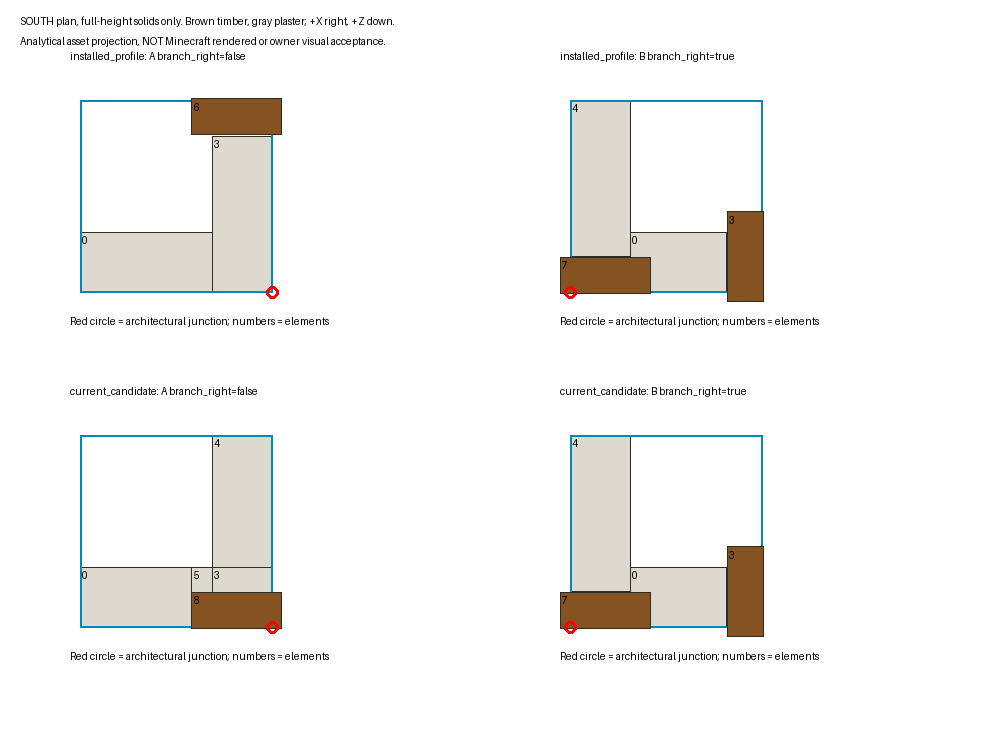

# Reopened plaster/support corner discovery — 2026-10-08

Status: **DISCOVERY_COMPLETE_WITH_BOUNDED_RUNTIME_LIMITATIONS; PLASTER_VISUAL_DEFECT_REOPENED**. No new production acceptance. This report adds a dated discovery entry and preserves the October 6–7 implementation/evidence. It does not implement M1–M5, change application assets/code, rebuild a release JAR, commit/push, merge PR 501, change protection rules, deploy, restart the owner’s client/server, edit live worlds or send desktop inputs.

## Finding and recommended next step

The accessible owner client installation is **not the repaired candidate**. Its selected CurseForge profile contains clean source **4435912197fba84630d6e5a0544f29fc3a736450**, SHA **c04f3092fa577e4c98c4c4ee16febd5008403ccc98a0ebc064d860e3ac8981c6**. Its false-branch corner retains the far-end post. This is demonstrated by embedded provenance, selected ZIP entry hashes and transformed coordinates, rather than the filename/version. The true-branch meshes match the repaired candidate byte for byte and already contain junction timber plus a free-end post. Exactly three examined meshes differ: false full corner, its mirror, and false half corner. Selectors and both plaster/timber textures match.

The current source and verified **986ed746** candidate agree. All 16 lower corner selectors have a vertical timber element covering the intersection of their physical edge runs, and all eight legal dependent half selectors do too. All 16 upper corner selectors are air; lower meshes supply Y0..32. This is an **asset-coordinate finding**, not proof of the owner’s requested appearance. Actual A/B surroundings and acceptable/defective labels are still unavailable. The attached file contains overlay transcriptions only, not image pixels or full geometry views.

There is a second bounded visual question: analytical rays aimed at the post center encounter plaster from the interior of both handedness cases, but timber from the exterior. Full timber absence, some hidden timber, and an expectation of timber on the interior junction are different contracts. Do not declare the candidate visually accepted just because its post bounds include the junction. See [face analysis](evidence/FACE_RAYS.json) and [short comparison](CONTROLLED_COMPARISON.md).

**Recommended scope:** M0 first establishes the labeled A/B failure, client/server identity and exterior/interior visible-timber contract using the preserved candidate. If this discrepancy alone explains the failure, the remedy is a later authorized installation of the verified candidate, with independent client/server verification; another mesh repair is not justified. If a candidate view still fails, use the bounded asset/face options below. A conditional multi-milestone implementation prompt can now be written; an unconditional “add/move a pillar” prompt cannot yet be justified.

## D0 — source, package and installed provenance

Root: `C:\projects\britannia\mod\Britannia_Mod`. Exact branch `patch-18`; entry HEAD **71de2312a552ebf4dad3ecf147efd1de4bd815db**, closeout HEAD **cf49b1700d1a8992f39396f2ae531f0cb26502d7**. Tracked/index clean at entry. A concurrent fence discovery integrated `cf49b170` during this session; it adds fence documentation/evidence and `FenceRuntimeIdentityGameTests.java`, with no production implementation/resource changes. It was inspected and preserved, not reset or committed by this discovery. Six owner kickoff/playbook files and untracked `docs/hotfixes/edge-fence-0.1.8d/` were preserved. No applicable `AGENTS.md` was found in ancestor locations or relevant source/document/tool paths; README, pinned build properties, plaster playbook, implementation ledger and combined/plaster handoffs were read. This discovery adds only documentation/analysis/fixtures.

Version authority [gradle.properties](../../../gradle.properties): Minecraft 1.21.1, NeoForge 21.1.72, GeckoLib 4.6.6, mod 0.1.8d. Java 21 toolchain [build.gradle](../../../build.gradle). No source/test/tool/build/attribute diff from `986ed746` through entry `71de2312`; closeout differs only by the concurrent fence test harness in those paths. Production implementation/resources still match the candidate. `build.gradle` lines286/297 exclude the entire GameTest package from both JAR tasks; the new harness is not a candidate binary mismatch, and its checks are not counted as this discovery's tests. Descendants `a80af0fd`, `b0c8508d`, `71de2312` are documentation closeouts. Relevant worktrees and source comparison are in [SOURCE.json](evidence/SOURCE.json).

| Artifact | Embedded source / clean | Bytes | SHA-256  |
| --- | --- | ---: | --- |
| Preserved combined candidate `tmp/combined-0.1.8d/release/britannia_mod-0.1.8d-all.jar` | `986ed746866dc944b7b496ab9428b670f65e15c0`, clean | 36,142,668 | `f02d2876d60e10a539829950b173b61055a72e6e42dd36643bec97ab62f482bd` |
| Prior plaster candidate `tmp/plaster-corner-0.1.8d/release/britannia_mod-0.1.8d-all.jar` | `ac6b2e80e1dac33d48dfd0b48b52543deab5cb2d`, clean | 36,140,726 | `de563ecfcb8f9067248ec09ae0578f7776ea5c1beefa4f1c182b9ac255a5df2e` |
| Owner selected client `C:\Users\dusti\curseforge\minecraft\Instances\UltimaCraft - Britannia\mods\britannia_mod-0.1.8d.jar` | `4435912197fba84630d6e5a0544f29fc3a736450`, clean | 36,107,339 | `c04f3092fa577e4c98c4c4ee16febd5008403ccc98a0ebc064d860e3ac8981c6` |
| New disposable headless fixture `tmp/plaster-corner-0.1.8d/reopened-discovery-20261008/mods/britannia_mod-0.1.8d-all.jar` | Runtime explicitly logs `986ed746`, dirty=false | 36,142,668 | `f02d2876d60e10a539829950b173b61055a72e6e42dd36643bec97ab62f482bd` |

[ARTIFACTS.json](evidence/ARTIFACTS.json) records absolute paths, embedded properties, selected-entry SHA values and relevant class hashes. [PARITY_AND_PARENTS.json](evidence/PARITY_AND_PARENTS.json) verifies installed JSON against its embedded `44359121` source and candidate JSON against current source. All examined candidate entries are byte-equal to current source; installed selectors/textures/true-branch models are byte-equal. Four responsible Java classes differ from the candidate (`DoubleWallBlock`, `MirrorableWallBlock`, `PlasterWallHalfBlock`, decorator); `WallConnection.class` matches. Thus updating only the art would not deliver the combined paired-wall code repair.

The process inventory initially observed Javaw PID3192 using that CurseForge gameDir with no compiled project roots. The latest client log names that exact mod file and resource module; it is a client session launched October8 at15:02 local. It does **not** independently expose an in-memory build hash for the supplied screenshot moments. Disk identity plus discovery/pack-load log supports the selected installation, not a cryptographic claim about earlier screenshot capture. The installed file was already present before the observed launch. No owner process was restarted or controlled.

Accessible alternate profiles are inventoried with hashes/embedded metadata in [PROFILE_INVENTORY.json](evidence/PROFILE_INVENTORY.json): Britannia(1)/(2)/(3) have0.1.8c, Atrevion has another0.1.8c artifact without this identity entry, Roaming`.minecraft` has1.4j without this identity entry. These are distinct installations, not evidence for the active pair. Inactive `.old` A/B/C/1.7k backups are preserved. Only one Britannia `.jar` is discoverable in the active mods folder; `.old` files are not loaded mod duplicates.

Effective ownership: client options select no external resource packs. The latest reload list includes vanilla and `mod/britannia_mod`, with Sodium/Iris/Freecam/DistantHorizons/WorldEdit/GeckoLib and NeoForge modules. Relevant paths were inspected inside mods, resourcepacks, server-resource-packs and downloads. The only load-eligible local archive providing these selected Britannia blockstates/models/textures is the installed mod; three `.old` archives are excluded from effective ownership. Vanilla `block/block` is a display-transform parent with no replacement elements; `block/air` is empty. [RESOURCE_STACK.json](evidence/RESOURCE_STACK.json) records exact contenders, eligible flags and narrowly whitelisted log lines. Selected shader is **Photon v1.1**, enabled; no claim about its visual behavior. Shaderpack/resource-manager in-memory inspection and the exact screenshot-time stack remain unavailable.

Actual owner server: the client log connects to `sosaria.apexmc.co:25565`; no local production server JAR/build metadata/world is accessible here. It was not contacted or mutated. Its code can select states independently of client art, so server identity is an explicit missing item. The new localhost fixture is a separate verified dedicated server, **not owner server parity**. Resource reload can replace baked resources but does not replace loaded Java code; a later installation remedy requires a client process restart, and separately a server restart only when server code is replaced under deployment authorization.

## D1 — exact A/B mappings and geometry

| Overlay transcription | A | B |
| --- | --- | --- |
| Filename / size | `image(20261008-215448).png`,480×145 | `image(20261008-215502).png`,472×147 |
| Position | `(5266,72,4166)` | `(5269,72,4166)` |
| State | support blank, south, corner, lower, unmirrored, branch=false | same except branch=true |
| Model / Y rotation | `structure/plaster/plaster_wall_and_support_blank_corner`,180° | `structure/plaster/plaster_wall_and_support_blank_corner_branch_right`,180° |
| Physical strips | south and east | south and west |
| Block-local architectural joint X/Z | `(16,16)` | `(0,16)` |
| World edge intersection X/Z | `(5267,4167)` | `(5269,4167)` |
| Owner acceptable/defective label | **unresolved** | **unresolved** |

Registry [BlockRegistry.java:2479](../../../src/main/java/com/seggellion/britannia_mod/registry/BlockRegistry.java#L2479) is `MirrorableWallBlock`, noOcclusion. Selectors are [blockstate lines187/201](../../../src/main/resources/assets/britannia_mod/blockstates/plaster_wall_and_support_blank.json#L187), each singular variant, no multipart. X rotation 0; Y 180; uvlock absent/default false. Mirroring selects separately authored meshes, not a negative-scale runtime transform. Model element angles are all 0 (stored pivots therefore do not move geometry). South transform is `(x,y,z) → (16-x,y,16-z)`. Facing means occupied block edge, not direction of wall travel. Joint follows the two physical edge strips; it is not automatically the cell center.

| Asset / element (zero-based) | Authored bounds from → to | South transformed bounds | Role |
| --- | --- | --- | --- |
| Current A corner `elements[8]` | `(-0.8,0,-0.1) → (6.7,32,2.9)` | `(9.3,0,13.1) → (16.8,32,16.1)` | Covers SE joint through both visible heights |
| Installed A corner `elements[6]` | `(-0.8,0,13.1) → (6.7,32,16.1)` | `(9.3,0,-0.1) → (16.8,32,2.9)` | NE free end; **does not cover SE joint** |
| Current/installed B `elements[3]` | `(-0.1,0,-0.8) → (2.9,32,6.7)` | `(13.1,0,9.3) → (16.1,32,16.8)` | SE free end |
| Current/installed B `elements[7]` | `(9.3,0,-0.1) → (16.8,32,2.9)` | `(-0.8,0,13.1) → (6.7,32,16.1)` | Covers SW joint through both visible heights |

A current world timber bounds: **(5266.58125,72,4166.81875)→(5267.05,74,4167.00625)**. A installed: **(5266.58125,72,4165.99375)→(5267.05,74,4166.18125)**. B joint timber: **(5268.95,72,4166.81875)→(5269.41875,74,4167.00625)**; free-end timber: **(5269.81875,72,4166.58125)→(5270.00625,74,4167.05)**. Overhangs up to0.05 block belong to the model, not another block’s post. [OBSERVATIONS.json](evidence/OBSERVATIONS.json) retains exact state/measurement records.

Current A plaster: element0 `(6.7,0,0)→(16,31.9,5)` main; element3 `(0,0,2.9)→(5,31.9,5)` short branch bridge; element4 `(0,0,5)→(5,31.9,16)` restored branch/free end; element5 `(5,0,2.9)→(6.7,31.9,5)` junction filler. Elements1/2/6/7 are Y0..1 timber trim, not pillars. Current B plaster: element0 `(3,0,0)→(11,31.9,5)` main; element4 `(11,0,3)→(16,31.9,16)` return;1/2/5/6 are low trim. All elements, omitted faces, UV bounds, face rotations and pivots are recorded in [GEOMETRY.json](evidence/GEOMETRY.json); source references: [A mesh](../../../src/main/resources/assets/britannia_mod/models/block/structure/plaster/plaster_wall_and_support_blank_corner.json), [B mesh](../../../src/main/resources/assets/britannia_mod/models/block/structure/plaster/plaster_wall_and_support_blank_corner_branch_right.json).

Parents/textures: `minecraft:block/block`, `#1→britannia_mod:block/structure/plaster/dirty_plaster`, `#2→.../wood_support`; selected PNG bytes equal across candidate/installed. Every post has all six faces and no cullface declaration. Side UVs `[0,6.09375,16,7.84375]`, rotation 90 for unmirrored vertical sides. A cap up rotation 0/down 180; B joint cap up 180/down 0; B free-end cap 90/90. These cap differences are inherited art, not a selector mismatch. Mirrored A reflects X and swaps E/W faces/U bounds with inverse rotations; B mirror has its own recorded chain. World rotation rotates the quads with the model, retaining per-face UV data.

Current A has no positive-volume post/plaster overlap, but touching/adjacent plaster can obscure faces. B joint intersects its main plaster by **1.7×31.9×2.9** model pixels (half equivalent 1.7×16×2.9). Exterior north/east faces remain outside plaster and are supplied; this is not complete geometric burial. The first-face analytical probe hits A element8/B element7 timber from exterior, and A element5/B element0 plaster from interior, at Y8 and Y24; half models show the same directional result at Y8. Those are sample rays, not complete visibility, shaders, textures or adjacent-cell rendering. They prevent the invalid inference that “no volume overlap” or “post exists” proves all-view visibility.

Brown=timber; gray=plaster; red=edge-run joint. Posts are drawn last in this plan to show extents; intersections are **not** a rendering simulation. The pair differs in free-end design/post count as well as handedness. One-versus-two-post design must remain explicit rather than duplicating B into A.

## D2–D3 — state, neighborhood and disposable runtime evidence

Actual owner lower/upper/horizontal neighbors, custom architecture tags and creation/edit history are **not captured**. The brief’s overlay transcriptions establish only targeted lower states; actual upper divergence cannot be assumed. No live-state change or production-world read via credentials was attempted.

Current selector semantics: physical branch is `branch_right XOR mirrored` for non-straights ([MirrorableWallBlock.java:61](../../../src/main/java/com/seggellion/britannia_mod/block/MirrorableWallBlock.java#L61)). Derivation uses lower neighborhood and physical neighbors. Existing nonstraight corners can use the equivalent perpendicular primary edge to preserve their stored branch variant; initially straight/ordinary placement derives both facing and branch. [DoubleWallBlock.java:85](../../../src/main/java/com/seggellion/britannia_mod/block/DoubleWallBlock.java#L85) placement faces opposite player direction;119 updates pair authority;142 decoration derives from visible lower then writes both halves before notification. Rotations rotate facing; Mirrorable mirrors flip MIRRORED once. Legacy valid upper collision/outline reads the lower without save mutation. Decorator main hand rotates and offhand mirrors either half of a validated pair. Full walls/doors/tagged peers can affect derivation; terminal tag is empty in this packaged source, connectable tag includes doors/gates. Owner datapack tag changes remain unknown.

Equivalent A blank L arms: west straight south and north straight east. B: east straight south and north straight west. Mirrored combinations reverse the secondary strip via XOR, so their neighbors must also change. Identical neighborhoods would normalize one case and are not a handedness comparison. Arm setup is command construction, not BlockItem proof.

New verified candidate runtime in **new** `tmp/plaster-corner-0.1.8d/reopened-discovery-20261008`, Minecraft bind127.0.0.1:25579, no GUI, no production credentials, no client launches. SDK launch clears MOD_CLASSES and excludes compiled project roots plus standalone Gecko/nano dependencies. New runtime explicitly reports candidate hash/source/pins. Both successful runs stopped normally; server is stopped at closeout. No candidate packaging or application compilation executed. Missing offline asset index/server artifact caused initial setup failures; preserved separately, resolved using public SDK dependency/cache resolution. They are not candidate test failures or acceptance passes.

| New check | Actual outcome / limit |
| --- | --- |
| 16 full corners, both branches/mirrors/four facings, matching pairs and blank arms | All 32 lower/upper exact markers after setup/ordinary base notifications; stopped-world NBT confirms. |
| Exact A/B south false/true unmirrored | Both persist as requested with matching companions; constructed coordinates8,80,8 and20,80,8. Not owner coordinates/world. |
| Eight half selectors with equivalent two-arm blank layouts | N/S four exact; E/W four normalize to equivalent N/S representations. Saved states recorded, not waived/claimed exact. |
| Restart/load before arm replacement | **40/40 exact stored-state assertions**, zero failure markers, including the four normalized half states. |
| Replace blank arms with support arms using sequential ordinary setblock notifications | All 16 full pairs still match; all 24 cases retain the same physical edge sets. Eight E/W full cases change primary facing and stored branch; halves also normalize. |
| Eight half selectors, seed straight + lone perpendicular full blank wall + notifications | **8/8 exact corner markers**, saved NBT confirms all facings/both branches reachable through this source path. Not actual BlockItem placement. |
| Forced asset probes |24 legal block_display states prepared at Y84. They bypass neighbor normalization and have no wall collision. No new rendered observation. |
| New actual player placement/decorator/structure interaction, visible faces/UV/collision/outline | **Not performed**; prior relevant successful evidence retained, no new claim. |

Important normalization: blank→support arm replacement writes upper before lower with ordinary notifications. A temporary invalid/replaced arm can let the center become straight; on re-derivation it can choose the equivalent opposite authored branch. The current nonstraight-preservation clause does not promise a branch style while the state is temporarily straight. E/W full cases 6–9/12–15 change branch and therefore one/two-post style while preserving occupied edges. This is a measured adjacency/style limitation to inspect if the owner expects invariance across rebuilding an arm; it is **not evidence of missing junction timber** or a failed structure-transform gate. The earlier GameTest writes complete pairs with known-shape flags, so it does not prove this sequential construction’s visual style invariance.

Exact results: [blank saved states/neighbors](evidence/SAVED_BLANK.json), [support saved states/neighbors](evidence/SAVED_SUPPORT.json), [lone-half saved states](evidence/SAVED_LONE_HALF.json), [runtime summary/log identities](evidence/RUNTIME_SUMMARY.json). Full state/asset matrix: [40-row CSV](evidence/MATRIX.csv), [full JSON with post geometry](evidence/MATRIX.json). [Runtime matrix](evidence/RUNTIME_MATRIX.csv) joins every legal row to its actual blank/support state, half reachability finding and remaining visual/BlockItem check; [runtime JSON](evidence/RUNTIME_MATRIX.json) retains complete fields. Full block domain 96; corner domain 32=4 facings×2 branches×2 mirrors×2 halves. Half domain 24; corner domain 8=4 facings×2 branches, **no MIRRORED or HALF property**. Matrix “junction_post_present” is mathematical lower-owned art coverage, not a visual pass or placement reachability guarantee. Upper rows rely on the matching lower.

## D4 — why old green checks can coexist with this report

Asset repair **ac6b2e80** edits exactly false full corner, its mirror and false half derivative; true branch preserved. Runtime selectors actually reference all three edited meshes. Scoped `python tools/generate_half_walls.py --support-corner-only --check` newly returns **fresh**. The candidate packages the same bytes; neither stale candidate derivation nor a selector mismatch is supported by this audit.

[PlasterSupportCornerContractTest.java](../../../src/test/java/com/seggellion/britannia_mod/block/PlasterSupportCornerContractTest.java) actually checks:

- One false-branch post at fixed expected bounds under both mirrors and all rotations/heights; true branch is absent from that geometry assertion.
- Plaster coverage at the false branch’s vacated segment; false mirrored UV/face reflection; false half post/caps.
- All 96 selector IDs, upper-air behavior and seven-pixel collision-edge contract, including branch/mirror combinations; it does not locate B’s timber or establish visible ownership across neighbors.

Original red XML has precisely three failures: `singleJunctionPillarAcrossAllAffectedRotationsMirrorsAndVerticalSections`, `finishedPlasterCoversTheVacatedPostSegmentAndBranch`, `halfCornerHasJunctionTimberAndExplicitCutCaps`. Reflection and selector/physics assertions were green with the old far-end model. Thus symmetry and correct collision do not locate the pillar. See [original red XML](../plaster-corner-0.1.8d/implementation/red-junit/TEST-com.seggellion.britannia_mod.block.PlasterSupportCornerContractTest.xml).

Art/collision tests use solid-box envelopes and2.5px slack, often erode/clip trim and ignore texture identity; full blank-wall checks and half support-family checks establish collision/art coverage, not exposed vertical timber at a specified visible junction. [WallPairGeometryTest](../../../src/test/java/com/seggellion/britannia_mod/block/WallPairGeometryTest.java) proves lower-owned legacy collision and structure mirror edge math; the owner-style preservation sample begins south,false,false. [WallPairGameTests](../../../src/main/java/com/seggellion/britannia_mod/gametest/WallPairGameTests.java) exercises actual item entry point for either-half edits on registered consumers, legacy recovery, broken-pair refusal, and 576 full corner/structure combinations across three mirrorable families, with pair/branch/collision assertions. None is a GPU/visible timber oracle; complete-pair known-shape fixture writes omit sequential arm replacement transients.

Historical packaged render records do include all eight true-branch full controls (south,true,false included) and all four true-branch halves, with retained two-post design. Those were source/control observations, **not owner acceptance of the new intended paired building junction**. They were not the current owner coordinates/resource stack. Old mirrored-neighborhood helper arms were derived from stored branch rather than XOR mirror, and some samples normalized; later wall-pair fixtures address physical topology. This new scene uses XOR and records actual post-notification states. Never relabel forced/control renders as normally placed owner joins.

Historical complete gates **4,129 JUnit/0failure/0error/23skips;1,366 required GameTests** remain reported successful evidence for their actual artifacts/scopes. They were not rerun here, and cannot establish what a client loading **44359121** sees. Shared fix **5a6734ba** changed paired decoration, lower-owned legacy collision, mirror-aware derivation and shared consumers; installed classes do not include it. Pre-existing upper collision divergence was blocking and repaired, not waived. No fresh collision repair is justified by the overlay pair alone.

## D5 — causes ranked and correction boundaries

| Cause | Evidence / disposition | Smallest discriminator |
| --- | --- | --- |
| Owner selected installation has pre-repair false-branch art | **Confirmed discrepancy**, exact three meshes and old far-end coordinates; strongest explanation if A is the defective exterior corner. Screenshot-time build not independently captured. | Label A/B and reproduce the same view in verified candidate fixture. |
| Current post exists but intended interior timber is obscured / wrong ownership across cells | **Supported bounded possibility:** face rays hit plaster internally; true post overlaps plaster; actual neighbors/views missing. | Compare exterior/interior lower and upper sections with blank arms first, support arms second. |
| Neighbor derivation/style selection | Exact A/B and full grid stable in blank Ls; sequential arm replacement changes E/W branch style without edge displacement. Actual owner neighborhoods unknown. | Capture owner neighbor states read-only; compare first-placement/arm-order snapshots only if candidate failure persists. |
| True-branch post absent in candidate | **Rejected as model absence**: element7 at its joint, all six faces; does not rule out the intended view’s occlusion. | Candidate visible paired view, not a post-count assertion. |
| Wrong saved selector/Y rotation or stale half/candidate entries | **Not supported**:96/24 mappings,32/8 corner domain, matched transform edges, scoped freshness, source/ZIP equality. | No broad remap/regeneration without new contradictory evidence. |
| Client override or server/client code disparity | Installed code differs; selected Photon enabled; server build/tag stack unverified. No competing local active model provider found. | Client/server environment report, paired state capture, compare unoverridden disposable candidate to owner stack later without altering owner settings now. |

Smallest correction options, conditional on M0:

1. **Installation discrepancy only:** reuse preserved f02 candidate; later authorized isolated/current-install verification and independent client/server code/resource identity. No application source edit/build/migration. Resource reload alone is inadequate for Java pair fixes. Do not replace mods or restart production under this discovery.
2. **Demonstrated visible mesh/face defect:** edit the authoritative proved failing corner(s) under `src/main/resources/assets/britannia_mod/models/block/structure/plaster/`, restoring any displaced plaster/trim. Four possible full consumers are `_corner`, `_corner_mirrored`, `_corner_branch_right`, `_corner_branch_right_mirrored`; half consumers are `_half_corner` and `_half_corner_branch_right`. Choose only proven affected files. Preserve two-post/free-end design unless the concrete paired preview approves another design; a duplicate post is not an automatic repair.
3. **False derivative defect:** use `tools/generate_half_walls.py --support-corner-only`, then `--check` and existing generation guard. Its scoped mode owns **false half only**. If a true authored correction is required, first propose/approve a narrowly expanded true-half derivative path or an independently checked true-half cut; do not invoke the broad generator and silently rewrite unrelated families. No selector/state changes are necessary for a mesh/face correction.
4. **Selector/transform repair:** only if a captured correctly intended state maps to art occupying different physical edges; present evidence before editing the two family blockstates. Current audit does not justify it.
5. **State-logic repair:** only if the failing candidate join/normal placement/paired edit selects incorrect physical edges or loses required visible ownership. Exact possible code loci are `MirrorableWallBlock.deriveConnections`, `DoubleWallBlock` placement/update/pair authority, `PlasterWallHalfBlock.derive` and decorator pair entry point. Shared `WallConnection` also serves floor supports/bannisters; avoid changing it for an art/visibility mismatch. Such a change requires consumer-specific registered tests for three mirrorable families, other DoubleWall families (blank/support variants and sandstone windows/battlement), and half/full boundaries. No shared-system rewrite authorized.

An asset-only correction preserves registry IDs, save domain, selectors, textures, seven-pixel collision and version0.1.8d; old saved lower states would acquire changed appearance when new resources load, with no re-placement/migration. Upper stays air. It can still affect boundary overhangs, UV grain, interior/exterior visible timber and generated caps, so those are the concrete verification risks. A state correction has wider existing-world behavior and must be separately bounded by reproduced defect/consumer evidence.

Independent future contract: derive the junction from connected edge runs and neighbor endpoints; require a continuous **visible timber surface in the owner-approved exterior/interior views** through both heights, with no unsupported boundary gap or neighboring post disguising the target. Verify both handedness cases, all mirrors/rotations and actual half consumers. Establish the permitted free-end ownership/count separately. Include model/face-aware sample coverage plus actual packaged visual observation; neither an arbitrary timber volume, total post count, reflected bounding box nor coarser collision envelope is sufficient. This contract can stay red while an expected view remains plaster-obscured even if every current coordinate test passes.

## Remaining evidence and project readiness

Prepared: verified artifacts/current tree, exact selectors/geometry,40-row matrix, source/ZIP/parent equality, effective available local resource ownership, current state/neighbor/restart fixtures and bounded face visibility hypothesis, old-test audit, concise comparison and M0–M5 plan.

Missing: owner A/B good/bad label, actual screenshot pixels/view direction, lower/upper/eight neighboring states at owner coordinates, actual owner server identity/tags/history, current candidate’s short exterior/interior rendered comparison with matching outline, and intended visible-post ownership/free-end design. Normal player placement/arm-order, actual either-half decorator and structure render checks are future targeted implementation acceptance; discovery command builds are not substitutes. Prior owner sustained movement and medallion approval remain preserved and are not requested again.

The reopened plaster visual defect remains unresolved. Combined production acceptance retains independent fence corner/decorator/reload and alligator playback holds. The newly integrated [fence rediscovery handoff](../../projects/patch18-edge-fence-hotfix/RELEASE_HANDOFF.md) independently confirms the active client's old fence artifact, while owner-server identity and matched deployment/real interaction/render remain open; none is cleared by plaster evidence. No source publication or PR work occurs here. See [CONTROLLED_COMPARISON.md](CONTROLLED_COMPARISON.md), [IMPLEMENTATION_PROPOSAL.md](IMPLEMENTATION_PROPOSAL.md) and [STATUS.md](STATUS.md).
