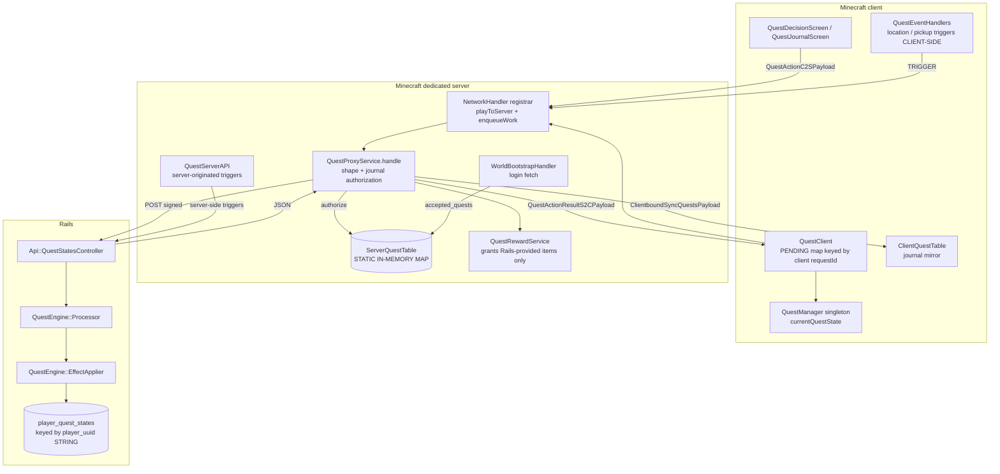

# QuestEngine / QuestGiverEntity Health Check

Investigation date: 2026-08-11
Scope: `QuestGiverEntity`, the Minecraft quest client/proxy, Rails `Api::QuestStatesController`,
`QuestEngine::Processor`, `QuestEngine::EffectApplier`, persistence, identity, lifecycle.
Method: repository reconstruction first, then a deterministic Rails reproduction harness.
No production data was read or altered. No behaviour was changed.

---

## 1. Executive health verdict

> **DEGRADED**

The authority *shape* is right — Rails owns quest truth, the Minecraft server proxies and
never trusts the client with rewards — and the C2S payload surface has clearly been through a
security pass. But the system carries **one confirmed, reproduced, permanent, silent
player-specific turn-in failure**, a second confirmed silent failure that stops environmental
quest progress after every relog, an unrecoverable reward-loss window, and two subsystems
whose design does not survive contact with the Rails-authoritative NPC architecture.

Two aspects are individually *architecturally unsafe* and are called out as such below:

- **the server-side quest journal that authorizes every quest action is in-memory only**, and is
  populated exclusively by a best-effort login fetch that the code explicitly permits to fail;
- **QuestGiver identity is a substring of a display-name string**, with no Rails identity, no
  spawn authority, and no participation in the spawn-point/assignment machinery every other
  server-managed NPC now uses.

The reported defect — "a quest-end request sometimes never reaches or completes in the
QuestEngine for certain players" — is **not random networking**. It is two deterministic,
data-dependent and session-dependent code paths, both reproduced below.

---

## 2. Current architecture



Two independent transports reach Rails:

| Path | Origin | Used by |
| --- | --- | --- |
| `QuestClient` → `QuestActionC2SPayload` → `QuestProxyService` | client-initiated | INTERACT, START, **CHOOSE (turn-in)**, TRIGGER, ABANDON |
| `QuestServerAPI` | server-initiated | mob kills, escort death, lava item destruction |

They do **not** share validation, journal updates, logging, or response handling.
`QuestServerAPI` bypasses `ServerQuestTable` authorization entirely; `QuestProxyService`
depends on it absolutely.

---

## 3. Quest lifecycle, as actually implemented

| Stage | Caller → callee | Side / thread | Identifiers | Persistence |
| --- | --- | --- | --- | --- |
| Definition | Rails `Quest`, `Node` (admin) | Rails | `quests.id`, `quests.origin_npc` | Postgres |
| Giver appears | `QuestGiverSpawnBlockEntity.tick` → `spawnOrRestoreNpc` | MC server, every 200 ticks | tracked entity UUID in block NBT | block entity NBT only |
| Interaction | `QuestGiverEntity.interactAt` (**client branch**) → `QuestClient.interactWithNpc(entityId, uuid)` | client | runtime entity id + entity UUID | none |
| | → `QuestProxyService.resolve` validates entity, alive, ≤8 blocks, UUID match; extracts `internalApiId` = substring after `:` in `personalName` | server thread | `npc_name` = api id | none |
| Eligibility | Rails `QuestStatesController#interact` | Rails | `player_uuid` (normalized), `origin_npc` | reads `player_quest_states` |
| Accepted | `PlayerQuestState.create!(player_uuid: normalized_player_uuid, …)` | Rails | **row keyed by uuid string, not user_id** | Postgres |
| Journal write | `applyAuthoritativeResult` → `ServerQuestTable.addFromRailsAcceptSuccess` | MC server | `quest_state_id` | **RAM only** |
| Objective progress | `QuestEventHandlers.onPlayerTick` / `onItemPickup` (**client-side**) → TRIGGER | client | `QuestManager.currentQuestState.quest_id` | none |
| | server-side variants: `onItemEntityTick` (lava), `QuestEventHandler.onEntityDeath` (kills, escort death) → `QuestServerAPI` | server | `player.getStringUUID()` | none |
| Turn-in | `QuestDecisionScreen` choice → `QuestClient.sendTransition` → CHOOSE | client → server → Rails | `quest_id` + `choice_id` | — |
| Authorization | `QuestProxyService.authorizedForCurrentJournal` → `ServerQuestTable.hasActiveQuestId` | MC server | player UUID + quest definition id | RAM |
| Completion | `QuestStatesController#transition` → `QuestEngine::Processor#call` | Rails | **`@player.minecraft_uuid`** | `state.update!(completed: true)` |
| Rewards | `EffectApplier` (Rails, XP/karma/achievements) + `granted_items` in the response → `QuestRewardService.apply` (items) | split | — | Rails commits; items exist only in the HTTP response |
| MC sync | `removeAfterRailsCompletionSuccessByQuestId` + `ClientboundSyncQuestsPayload` | MC server | quest definition id | RAM |

---

## 4. Authority matrix

| State | Client | MC server | Rails | Notes |
| --- | --- | --- | --- | --- |
| Quest definition | — | — | **authoritative** | fetched per request, never cached |
| QuestGiver existence | — | **authoritative** | none | local block spawner, Rails has no record |
| QuestGiver location | — | **authoritative** | none | `restrictTo(worldPosition, radius)` |
| QuestGiver identity | — | mirror | **join key only** | `quests.origin_npc` string ↔ `personalName` substring |
| Quest assignment | mirror (`ClientQuestTable`) | **mirror used as an authorization gate** (`ServerQuestTable`, RAM) | **authoritative** | ⚠ conflict: a non-durable mirror gates writes |
| "Current quest" for env. triggers | **authoritative** (`QuestManager` singleton) | none | none | ⚠ client-only, lost on relog |
| Objective progress (location/pickup) | **asserted by client** | pass-through | records it | ⚠ trust boundary |
| Objective progress (kills, lava, escort death) | — | **authoritative** | records it | correct |
| Turn-in eligibility | — | partial gate | **authoritative** | two different identity keys (§6) |
| Completion | — | — | **authoritative** | `state.completed = true` |
| Reward issuance — XP/karma/achievement | — | — | **authoritative** | committed in Rails txn |
| Reward issuance — items | — | **authoritative** | proposes | ⚠ split transaction, no replay |
| Completed history | — | none | **authoritative** | MC keeps no record |

Dual/unclear authority: **quest assignment** (Rails owns it, but a RAM mirror on the MC server
can veto every Rails write) and **reward issuance** (Rails commits the state, Minecraft commits
the items, with nothing tying the two together).

---

## 5. NPC compatibility matrix

| Concern | Trader / Merchant / ServiceNPC (current) | QuestGiverEntity | Compatible? | Risk |
| --- | --- | --- | --- | --- |
| Spawn authority | Rails: spawn points + assignments, revision-aware pending UPSERT, tombstones | local `QuestGiverSpawnBlockEntity` tick loop | **No** | Rails cannot see, place, move or retire quest givers |
| Persistent identity | `worldNpcPublicId` (UUID) synched + saved on `CitizenEntity` | `personalName` string `"Display:api_id"` | **No** | identity is presentation data |
| Rails ID | `world_npcs.public_id`, `service_npc_spawn_points.public_id` | none — only `quests.origin_npc` text match | **Partial** | rename the NPC label and the join still works, but any write to `personalName` without the `:` silently changes the Rails key |
| Minecraft UUID | tracked in the spawn ledger, reconciled | tracked in the block entity only | Partial | escort conversion **discards and recreates** the entity with a new UUID |
| Runtime entity id | never trusted beyond a single interaction | used for INTERACT only, validated against UUID + distance | **Yes** | acceptable |
| World/shard binding | shard-scoped registry, city public id stamps | none (`cityName` is cosmetic) | **No** | quest givers are not shard-aware on the MC side |
| Request routing | signed server→Rails with public ids | signed server→Rails with a name string | Partial | works, but unjoinable to NPC records |
| Persistence | Rails rows + durable caches + receipts | block entity NBT | **No** | wiping a chunk loses the giver silently |
| Restart recovery | reconciler re-projects from Rails | spawner re-spawns from its own NBT | Partial | survives, but Rails never learns |
| Despawn / reload | ledger + diagnostics (`/economy post`) | 10-second polling + AABB rescue scan | Partial | no observability |
| Retry behaviour | outbox, acknowledgements, revisions | none | **No** | — |
| Duplicate protection | idempotency keys, dedupe by stamped projection | none | **No** | — |

`QuestGiverEntity extends CitizenEntity`, so it *inherits* `worldNpcPublicId`,
`economicNpcTypeKey` and `economicCityPublicId` — and the quest spawner never sets any of them.
Every quest giver in the world today carries empty Rails identity fields.

---

## 6. Player-specific failure analysis

### CONFIRMED — Root cause #1: the turn-in path resolves the journal row by a different identity key than every other path

`app/services/quest_engine/processor.rb:12`

```ruby
state = ::PlayerQuestState.active_journal.find_by(player_uuid: @player.minecraft_uuid, quest_id: @quest_id)
return fail_fast("Quest not active.") unless state
```

The turn-in (`POST /api/quests/:id/choose`, reached from the only "complete the quest" button in
`QuestDecisionScreen:123`) matches `player_quest_states.player_uuid` **byte-for-byte against
`users.minecraft_uuid`**. Every other quest path that had to survive real data uses a candidate
list instead:

| Path | Player identity used | Hardened? |
| --- | --- | --- |
| `trigger_node` | `minecraft_uuid_candidates` = [normalized, compact, raw] | ✅ |
| `quit` / `find_quittable_state` | `minecraft_uuid_candidates` | ✅ |
| world bootstrap `accepted_quest_states_for` | `minecraft_uuid_candidates` | ✅ |
| `interact`, `start`, `abandon`, `record_kill`, `clear_all`, `update_player_state` | exact normalized match | ❌ |
| **`transition` → `Processor` (turn-in)** | **`@player.minecraft_uuid`** | ❌ |

Why the two forms coexist in the data: migration `20260602001000_enforce_unique_minecraft_uuid_on_users`
normalized `users.minecraft_uuid` and de-duplicated it — and touched
`shard_users`, `shard_user_skills`, `houses`, `achievements`, `minecraft_verification_codes`,
`blessed_items`, `orders`, `pages`, `posts`, `media`, `comments`, `articles`, `replies`,
`events`, `products`, `player_contributions`. **`player_quest_states` is not in that list.**
Journal rows written before that migration still carry compact or upper-case UUIDs.
`User.with_normalized_minecraft_uuid` querying `[normalized, compact]` is independent
confirmation that both forms are live in this database.

The consequence for an affected player is exact and permanent:

- the quest **appears in their journal** (bootstrap uses candidates) ✅
- **environmental triggers advance it** (`trigger_node` uses candidates) ✅
- **quitting works** (`quit` uses candidates) ✅
- **turning it in returns HTTP 403 `"Quest not active."` forever** ❌

Reproduced deterministically — see §12; all four cases pass today:

```
BASELINE   turn-in completes when the journal row uuid matches the user uuid      PASS
REPRO      turn-in refused (403 "Quest not active.") for a legacy compact uuid    PASS
ASYMMETRY  the same legacy row IS found by trigger_node                           PASS
REPRO      a lost turn-in response cannot be retried (rewards gone)               PASS
```

This alone explains "player A works, player B never does, on the same quest".

### CONFIRMED — Root cause #2: the completion request is often never *generated* after a relog

Location, pickup and lava-destroy triggers are driven **entirely from the client** by a single
static field:

`QuestEventHandlers.onPlayerTick:69` → `QuestManager.getInstance().getCurrentQuestState()`

`QuestManager.currentQuestState` has exactly two writers, and neither runs at login:
`QuestClient.processResponse:99` (a successful client-initiated quest action this session) and
`ClientNetworkHandler:255` (a server-originated trigger result, i.e. the lava-destroy path).
Login sync (`ClientboundSyncQuestsPayload` → `ClientQuestTable`) populates a **different** store
and never touches `QuestManager`; `QuestDecisionScreen:184` and the lava proxy also *clear* it.

Therefore:

- after any relog, `currentQuestState` is `null` → **no location/pickup/destroy trigger fires at
  all** until the player re-opens dialogue with a quest giver;
- with two active quests, only the **most recently interacted** quest can progress
  environmentally — the other is inert.

If the quest's ending is a location or destroy trigger, the "quest-end request" is then never
constructed on any thread. That is literally "the QuestEngine never received it", and it is
session-history dependent, i.e. player-specific.

### HIGHLY LIKELY — Root cause #3: an empty in-memory journal vetoes the request before it is sent

`QuestProxyService.handle` → `authorizedForCurrentJournal` → `ServerQuestTable.hasActiveQuestId`.
`ServerQuestTable` is a `static ConcurrentHashMap` ("In-memory per-player accepted quest mirror")
filled **only** by `WorldBootstrapHandler.apply`. `WorldBootstrapHandler.complete` returns early —
leaving the map untouched — on `overall_timeout`, `request_error`, any `data.failureCode()`,
`queue_rejected`, `stale_generation`, `cancelled_player_session`, and when server auth is
unavailable ("Skipping world bootstrap because server authentication is unavailable" is already
present in gametest logs).

A player whose login bootstrap failed gets **HTTP 422 `invalid_quest_action` for every CHOOSE,
TRIGGER and ABANDON for the rest of the session, with no log line whatsoever** (`send(...)` at
`QuestProxyService:46` logs nothing). Rails is never contacted. This is per-player because
bootstrap is a per-player fetch.

`QUESTS_BY_PLAYER` is also **never cleared on logout** (`onLogout` only invalidates the bootstrap
coordinator), so within one server run a re-login whose bootstrap fails silently keeps using the
previous session's journal.

### PLAUSIBLE — #4: duplicate / merged user records

`transition` resolves the user with `::User.find_by!(minecraft_uuid: normalized_player_uuid)` —
no `active_identity` scope, no ordering. `quit` and `trigger_node` prefer
`User.active_identity` (`merged_at IS NULL`) and fall back. The dedup migration nulls the losing
row's `minecraft_uuid` rather than merging quest states (which it cannot, because
`player_quest_states` has no `user_id`). A user whose row was merged after their quest rows were
written is resolved differently by different endpoints, and `Processor` then reads
`@player.minecraft_uuid` from whichever row won.

### PLAUSIBLE — #5: duplicate location-trigger storms

`onPlayerTick` fires the location trigger **every 20 ticks while the player stands in the zone**,
with no debounce and no in-flight guard. Several identical CHOOSE/TRIGGER requests race; the
first wins, the rest return errors the player sees as failure. Also one HTTP POST per player per
second while anyone idles in a trigger volume.

### RULED OUT

- **Packet registration / codec mismatch.** `QuestActionC2SPayload` and
  `ServerboundQuitQuestPayload` are registered `playToServer` with `ctx.enqueueWork` and a
  `ServerPlayer` check (`NetworkHandler.java:297-313`). Nothing thread-unsafe, nothing client-only
  invoked server-side.
- **Client-forged rewards.** `QuestRewardService.apply` only grants items present in an
  authenticated Rails response, bounded (32 stacks, 1024 count), with id validation.
- **Request loss in transport.** The proxy always answers: 422 (invalid), 503 (unavailable /
  queue full), or the Rails status. The player-visible "nothing happened" is a *rejection*, not a
  loss.

---

## 7. Findings register

| ID | Sev | Subsystem | File(s) / method | Observed | Failure scenario | Recommended correction | Regression risk |
| --- | --- | --- | --- | --- | --- | --- | --- |
| Q-01 | **BLOCKER** | Rails turn-in | `quest_engine/processor.rb:12` `#call` | state looked up by `@player.minecraft_uuid` | any journal row whose `player_uuid` is not byte-identical to the user row → 403 "Quest not active." forever | resolve by the same `minecraft_uuid_candidates` used by `trigger_node`/`quit`; then a one-off migration normalizing `player_quest_states.player_uuid` | low; strictly widens a lookup |
| Q-02 | **CRITICAL** | Client trigger state | `QuestEventHandlers.onPlayerTick:69`, `QuestManager` | single client static, written only on a successful in-session action | after relog, or with 2+ active quests, environmental quest ends never fire | drive triggers from `ClientQuestTable` (all active quests), populated by login sync | medium; changes which quests can progress |
| Q-03 | **CRITICAL** | MC authorization | `ServerQuestTable`, `WorldBootstrapHandler.complete:221` | RAM-only journal gates all quest writes; bootstrap failure leaves it empty | one failed/timed-out login fetch ⇒ every quest action 422 for the session, unlogged | make the gate fail *open* to a Rails re-fetch, or lazily refresh the journal on a miss before rejecting | medium |
| Q-04 | **CRITICAL** | Reward integrity | `Processor#call` + `QuestRewardService.apply` | Rails commits completion; items live only in that one HTTP response | timeout/disconnect after commit ⇒ quest completed, items never granted, retry returns 403 | idempotent completion: return the same `granted_items` for an already-completed state within a replay window, keyed by a client-supplied request id | medium |
| Q-05 | **HIGH** | Trust boundary | `QuestEventHandlers.onItemPickup:96`, `onPlayerTick`, `QuestPayloadHandler.ClientProxy.evaluateLavaQuest` | pickup/location/destroy objectives asserted by the client | a modified client fires `trigger_key`s it never earned and collects rewards | move these to server-side detection (the lava path already has a correct server implementation to copy) | medium |
| Q-06 | **HIGH** | Duplicate requests | `onPlayerTick:80` | trigger re-sent every 20 ticks inside the zone | request storms, racing node transitions, 1 POST/s/player | in-flight + already-fired guard per (quest, trigger_key) | low |
| Q-07 | **HIGH** | Rails identity | `quest_states_controller` `#interact/#start/#abandon/#record_kill/#clear_all/#update_player_state` | exact-match `player_uuid`, plain `find_by!` | legacy/merged rows invisible; duplicate accepted-state rows can be created under a second uuid form | one private `resolve_player!` used by every action | low |
| Q-08 | **HIGH** | QuestGiver identity | `QuestGiverEntity`, `QuestProxyService.internalApiId`, `QuestGiverSpawnBlockEntity` | Rails join key is the substring after `:` in the display name | any code path setting `personalName` without the encoding silently repoints the NPC at a different (or no) quest | promote the api id to its own synched+saved field on the entity; keep `personalName` presentational | medium |
| Q-09 | **MEDIUM** | Memory / stale state | `ServerQuestTable` | never cleared on logout | unbounded growth; stale journal reused when a later bootstrap fails | clear on `PlayerLoggedOutEvent` (once Q-03 gives a durable refresh path) | low |
| Q-16 | **CRITICAL** | Escort lifecycle | `EscortPlayerGoal.hasActiveQuestAssignment:111` → `clearInvalidEscortAssignment` (duplicated in `QuestPayloadHandler.FollowPlayerGoal:209`) | the goal asks the **RAM** journal whether the escort quest is active, and on "no" **permanently deletes** the entity's `escort_active` / `quest_escort_*` / `quest_state_id_*` / `quest_id_*` tags | the goal ticks as soon as the chunk loads; after a server restart (or while the login bootstrap is still in flight, or forever if it failed) the journal answers "no" and the persisted escort assignment is destroyed — the ward stops following and cannot be recovered | never destroy persisted state from a negative in-memory answer: treat "journal not loaded" as unknown and idle, and only clear on an authoritative Rails "not active" | low — strictly stops a destructive path |
| Q-10 | **MEDIUM** | Rails transaction | `Processor#call` | `EffectApplier` runs in a txn, `state.update!` runs **outside** it | effects applied but state not advanced (or vice versa) on failure | wrap effects + state advance in one transaction | low |
| Q-11 | **MEDIUM** | Entity lifecycle | `QuestPayloadHandler.activateEscort:111-128` | escort conversion discards the NPC and creates a new one | the open dialogue's `quest_giver_uuid` becomes dangling; escort identity is carried in *string tags* (`quest_state_id_…`) | keep the entity and attach the goal, or return the new UUID to the client | medium |
| Q-12 | **MEDIUM** | Concurrency | `Processor`, `trigger_node` | no row lock on `player_quest_states` | two near-simultaneous actions ⇒ last-write-wins node advance | `lock!` the state row inside the transaction | low |
| Q-13 | **LOW** | Rails routing | `RailsApiUrlResolver.QUEST_QUIT` vs `routes.rb:299` | path param named `quest_state_id` client-side, `:id` server-side, and `find_quittable_state` accepts *either* a state id or a quest id | quest id ≠ state id conflation is load-bearing, with only a warning log | make the contract single-meaning; keep the fallback logged | low |
| Q-14 | **LOW** | Layout | `quest/QuestClient.java`, `QuestModels.java`, `QuestServerAPI.java`, `QuestEventHandlers.java` | files sit in `quest/` but declare `quest.network` / `quest.events` | tooling and future source-set moves break confusingly | move the files into matching directories | low |
| Q-15 | **INFO** | Test coverage | `test/controllers/api/quest_states_controller_test.rb` | 7 tests: interact, start, quit ×5 | **no test covers `transition` or `trigger_node`** — the completion paths | see §12 | — |
| Q-17 | **LOW** | Dead journal endpoint | `config/routes.rb:291-292`, `RailsApiUrlResolver.QUEST_JOURNAL` | `get 'status/:player_uuid' => quest_states#show` is declared **twice** and `#show` **does not exist**; the MC `Endpoint.QUEST_JOURNAL` constant is never called | there is currently **no working per-player journal fetch**, which is exactly what the Q-03 fix needs | implement `#show` (candidate-aware, shard-scoped, `QuestJournalEntrySerializer`) and delete the duplicate route | low |

---

## 8. Silent failure register

Every one of these can swallow a quest completion with nothing an operator can search for:

| # | Location | What disappears |
| --- | --- | --- |
| S-1 | `QuestProxyService.handle:45-49` | 422 `invalid_quest_action` — **no log at all**. Covers a failed shape check *and* an empty journal (Q-03). The single highest-value line to instrument. |
| S-2 | `QuestProxyService.handle:57` | `if (…getPlayer(connectedPlayerId) != player) return;` — a Rails-committed completion is dropped silently when the player reconnected mid-flight. |
| S-3 | `QuestProxyService.applyAuthoritativeResult:118` | non-2xx returns with no log; the journal simply never updates. |
| S-4 | `QuestProxyService.applyAuthoritativeResult:146` | `catch (RuntimeException)` logs without player, quest id or body. |
| S-5 | `QuestEventHandlers.onPlayerTick:81` | client trigger callback ignores `response.success == false` entirely. |
| S-6 | `QuestEventHandlers.onItemPickup:111` | same — failures invisible on both sides. |
| S-7 | `QuestEventHandler.onEntityDeath:61` | `response -> {}` — escort-death trigger result discarded. |
| S-8 | `QuestEventHandler.onEntityDeath:77` | kill recording result discarded. |
| S-9 | `QuestClient.handleProxyResult:56` | `if (pending == null) return;` — a response whose request id was evicted vanishes. |
| S-10 | `Processor#call` | `fail_fast("Quest not active.")` — no logging of player, uuid, candidates or existing rows. This is the message the affected players actually hit. |
| S-11 | `QuestProxyService.resolve` | returns `null` for six distinct reasons (dead entity, out of range, UUID mismatch, blank api id, bad shape…) collapsed into one unlogged 422. |
| S-12 | `WorldBootstrapHandler.complete:221` | logs the bootstrap failure but never says "this player's quest journal is now empty and every quest action will be refused". |

Today the logs **cannot** answer "player X attempted to complete quest Y through giver Z at time
T" — only `trigger_node` has meaningful structured logging (`[QuestTrigger] …`), and that is not
the turn-in path.

---

## 9. Identity findings

| Identity | Health | Detail |
| --- | --- | --- |
| Player | **Broken** | Three resolution strategies in one controller; the turn-in path uses the weakest. `player_quest_states.player_uuid` is a denormalized string with no FK, never normalized by the migration that normalized every other table. `belongs_to :user, foreign_key: :player_uuid, primary_key: :minecraft_uuid` inherits the same fragility. |
| Quest definition | OK | `quests.id`, passed as `quest_id` everywhere. |
| Quest instance | **Conflated** | `quest_state_id` (the `PlayerQuestState` id) exists and is correctly the journal key on the MC side — but the *authorization gate* (`hasActiveQuestId`) and the completion call both key on the **definition** id, so a player with two states for one definition is ambiguous. `quit` accepts either id and guesses. |
| QuestGiver | **Weak** | Display-name substring; no Rails id; not in any registry. |
| Rails NPC identity | **Absent** | quest givers have no `world_npcs` row, no spawn point, no assignment. |
| MC runtime entity id | OK | used only inside one interaction and cross-checked against the entity UUID and an 8-block distance. |

---

## 10. Persistence / restart findings

| Event | Rails quest state | MC `ServerQuestTable` | Client `QuestManager` | Client `ClientQuestTable` | QuestGiver | Escort assignment |
| --- | --- | --- | --- | --- | --- | --- |
| Player relog | survives | refetched **iff bootstrap succeeds** | **lost — never restored** | resynced with the journal | survives | **destroyed if the goal ticks before the journal loads** (Q-16) |
| Death / respawn | survives | survives (keyed by UUID) | survives (client static) | survives | — | survives |
| MC server restart | survives | **empty until each player relogs** | lost | lost | respawned by the block | **destroyed by the same race** |
| QuestGiver reload / chunk unload | unaffected | unaffected | unaffected | unaffected | re-spawned, or re-found by AABB scan | tags persist in entity NBT |
| Rails restart / outage | authoritative | keeps stale mirror | stale | stale | unaffected | survives (journal is stale-but-populated) |

The escort *behaviour* is durable by design — `EscortPlayerGoal` is registered for every
`QuestGiverEntity` in `registerGoals` and drives itself from persisted entity tags
(`escort_active`, `quest_escort_<player uuid>`, `quest_state_id_<id>`, `quest_id_<id>`). The
imperative `FollowPlayerGoal` added in `activateEscort` is a redundant second implementation of
the same thing.

What is *not* durable is the assignment those tags represent: the goal validates them against the
RAM journal and **erases them** on a negative answer (Q-16). Because the journal is empty from
server start until each player's bootstrap lands, a loaded escort near its owner can lose its
assignment permanently within the first ticks after a restart.

---

## 11. Recommended architecture (smallest coherent change)

1. **One player-identity resolver in Rails.** A single private `resolve_player!` returning
   `[user, uuid_candidates]`, used by every quest action including `Processor`. Follow with a
   data migration normalizing `player_quest_states.player_uuid` (the one table the 2026-06-02
   migration missed), after which the candidate list becomes belt-and-braces rather than
   load-bearing.
2. **Quest instance id as the wire identity.** `quest_state_id` already exists end to end. Make
   CHOOSE/TRIGGER/ABANDON carry it, gate on `hasActiveQuestState`, and retire "authorize by quest
   definition id".
3. **Idempotent completion.** Client-generated `questCompletionRequestId` → forwarded by the
   proxy → stored on `player_quest_states`. Replaying the same id returns the original result
   (including `granted_items`) instead of "Quest not active.", closing Q-04 without any chance of
   double rewards.
4. **The journal gate must not depend on a best-effort login fetch.** On a `hasActiveQuestId`
   miss, re-fetch that player's journal from Rails once and re-evaluate before rejecting; log
   every rejection with a reason code.
5. **Server-side objective detection.** Move location/pickup/destroy triggers to the server tick,
   iterating the player's *server* journal. Deletes Q-02, Q-05 and Q-06 together.
6. **QuestGiver: option D — stay locally managed, gain a durable Rails-linked identity.**
   Quest givers are narrative props with escort behaviour, not staffed service posts; forcing them
   through `ServiceNpcSpawnPoint` would buy nothing and cost the escort lifecycle. What they do
   need is a first-class `questGiverApiId` synched+saved field (stop parsing the display name) and,
   optionally, the inherited `worldNpcPublicId` populated so Rails can join. Only revisit full
   Rails spawn authority if quest givers ever need to be placed or retired from the website.

---

## 12. Test plan

**Already written and passing** (uncommitted, in the Rails repo at
`test/controllers/api/quest_completion_identity_repro_test.rb`) — 4 tests / 12 assertions:
BASELINE turn-in, REPRO legacy-uuid turn-in refusal, ASYMMETRY vs `trigger_node`, lost-response
retry. These assert *current* behaviour; after the Q-01 fix, REPRO and the retry test flip to the
corrected expectations and become the regression guard.

Still required:

| Scenario | Where | Assertion |
| --- | --- | --- |
| Happy path turn-in | Rails | completes once, rewards once |
| Two players, same quest | Rails | A completing leaves B active; B completes later |
| Duplicate completion | Rails | same request id ⇒ same result, one reward |
| Concurrent completion | Rails | row lock ⇒ one advance, one rejection |
| Rails commits, MC times out | Rails + MC | retry returns the original `granted_items` |
| Reconnect before turn-in | GameTest | journal refetched; CHOOSE authorized |
| Bootstrap failure | GameTest | quest action is **not** silently 422'd (post-fix) |
| Death / respawn | GameTest | quest data and escort assignment survive |
| Escort present at restart | GameTest | assignment tags survive a cold journal (Q-16) |
| Server restart | GameTest | first quest action after restart succeeds |
| QuestGiver reload | GameTest | turn-in works with a new runtime entity id |
| Wrong QuestGiver | GameTest | explicit, logged rejection |
| Stale client | GameTest | explicit failure with a recoverable message |
| Legacy uuid data shape | Rails | every action resolves the same row |
| Missing Rails user | Rails | deliberate, observable failure |
| Client-forged pickup trigger | GameTest | rejected once objectives move server-side |

---

## 13. Observability plan

Emit a correlation id created by the client, threaded through the proxy, into the Rails request
and back. Minimum events:

```
event=quest_action_requested request_id=<uuid> action=CHOOSE player_uuid=<uuid>
  quest_id=<id> quest_state_id=<id> quest_giver_uuid=<uuid> quest_giver_api_id=<key>
event=quest_action_rejected  request_id=<uuid> stage=journal_gate
  reason=not_in_server_journal journal_size=<n> bootstrap_status=<code>
event=quest_completion_result request_id=<uuid> result=success|rejected|error
  reason=<machine_readable> rails_status=<code> granted_item_count=<n>
```

Rails side, mirroring the existing `[QuestTrigger]` style into the turn-in path — critically,
log the *candidates* on a miss:

```
event=quest_turn_in_rejected request_id=<uuid> reason=state_not_active
  normalized_uuid=<uuid> user_id=<id> user_minecraft_uuid=<uuid>
  candidates=[...] matching_rows=<n>
```

That last line alone would have identified root cause #1 on the first report. No secrets, no
shard client secret, no signature material in any of it.

---

## 14. Proposed corrective milestones

| Milestone | Content | Exit criteria |
| --- | --- | --- |
| **22.0** | This document (reconnaissance, authority matrix, reproduction harness) | owner review |
| **22.1** | Observability: correlation id end to end; every rejection logged with a reason code; S-1/S-10 first | a failed turn-in is explainable from logs alone |
| **22.2** | Q-01 + Q-07: one Rails player resolver; migration normalizing `player_quest_states.player_uuid`; repro tests flip green | no player can hold an un-completable quest |
| **22.3** | Q-04 + Q-10 + Q-12: idempotent completion keyed by request id, single transaction, row lock | replay is safe; no split commits |
| **22.4** | Q-03 + Q-09: journal gate re-fetches instead of vetoing; cleared on logout | a failed bootstrap no longer disables quests |
| **22.5** | Q-02 + Q-05 + Q-06: server-side objective detection over the server journal | client cannot assert progress; no trigger storms |
| **22.6** | Q-16 + Q-08 + Q-11: escorts never lose an assignment to a cold journal; `questGiverApiId` field; escort activation without entity replacement | quest giver and escort identity survive every restart |
| **22.7** | Regression suite from §12 (Rails + GameTest) | all green |
| **22.8** | Multiplayer + failure-injection validation: two players, reconnect, restart, Rails outage | no silent failures observed |

---

## Final question

> If we deployed the QuestEngine today alongside the newly redesigned Trader/Merchant/ServiceNPC
> networking and Rails-authoritative spawning architecture, would you trust it in production
> multiplayer?

> **NO** at the time of the investigation. **YES, WITH CONDITIONS** as of the Milestone 8
> automated suite — see the addendum below.

---

## Addendum — verdict after Milestones 0–8 (2026-08-12)

Every finding this document raised as BLOCKER or CRITICAL is closed:

| Finding | Closed by | Evidence |
| --- | --- | --- |
| Q-01 turn-in identity (BLOCKER) | M3 | reproduction harness flipped; mutation-tested |
| Q-16 escort destruction | M1 | mutation-tested (2 tests fail without the guard) |
| Q-02 objectives dead after relog | M6 | detection moved to the server journal |
| Q-03 cold journal disables quests | M5 | miss refetches; mutation-tested |
| Q-04 reward lost on a lost response | M4 | replay by correlation id; mutation-tested |
| Q-05 client-asserted objectives | M6 | refused; mutation-tested |
| Q-06 trigger storm | M6 | in-flight guard + objective rewrite |
| Q-09 stale journal across logout | M5 | forgotten on logout |
| Q-10 split transaction, Q-12 no row lock | M4 | one transaction, `FOR UPDATE`; mutation-tested |
| Q-08 identity from a display name, Q-11 escort re-spawn | M7 | durable field; entity preserved |
| Q-07, Q-13, Q-14, Q-15, Q-17 | M3, M5, M7, M8 | — |

**Suites**: Rails 1383 runs / 6566 assertions / 1 known deterministic failure; GameTest 379/379;
MC unit 1791 with the 21 pre-existing banner failures inherited from `patch-18`.

**The condition.** The automated suite cannot walk a player into a zone, pick an item up or burn
one — the gametest harness has no Rails to answer a trigger. Milestone 6's round trip has
therefore never run end to end, and by owner decision it stays **strongly validated but not
production-proven** until the ten live rows in `QUESTENGINE_LIVE_VALIDATION_RUNBOOK.md` pass with
captured evidence. Until then the honest answer is *yes, with conditions* — and the condition is
that runbook, not a further code change.

> Original verdict, for the record: **NO.**

Reasons, in order:

1. **Q-01 is confirmed and permanent.** A reproducible class of player can never turn in a quest,
   and the failure is a bare 403 with no log. It is already happening; it is not hypothetical.
2. **Q-02 means the completion request is frequently never generated at all** after a relog, or
   for any quest that is not the client's single "current" one.
3. **Q-04 destroys rewards.** A timeout after the Rails commit costs the player the item
   permanently, and the retry tells them the quest was never active.
4. **Q-03 makes correctness depend on a network call that the code explicitly allows to fail**,
   silently, per player, for a whole session — and via Q-16 that same cold journal *destroys*
   persisted escort assignments during the first ticks after every restart.
5. **Observability cannot answer the basic question.** The one investigation the operator needs to
   run — "what happened to this player's turn-in" — is unanswerable from logs.
6. **Nothing here is contradicted by the security posture, which is good.** The proxy validates
   shape, distance, entity identity and journal membership, and rewards flow only from
   authenticated Rails responses. This is a reliability and identity failure, not an exploit
   surface — with the one exception of Q-05, where objective progress is still client-asserted.

The fix path is small and well-bounded: 22.1 and 22.2 together (one Rails resolver, one migration,
one correlation id) would move the verdict to **YES, WITH CONDITIONS** — conditional on 22.3's
idempotent completion before any high-traffic event.
