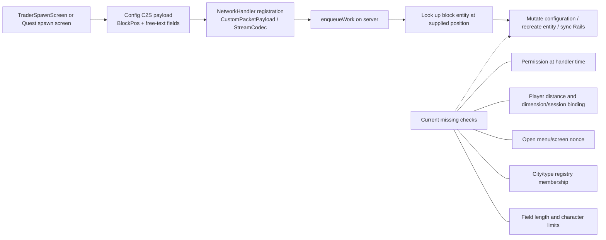
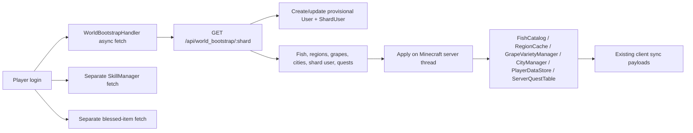
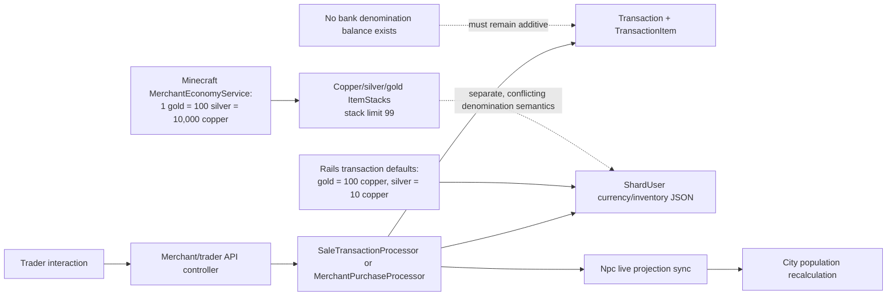

# UltimaCraft banking and service NPC compatibility map

Status: Milestone 1 discovery record and architecture decision record

Date verified: 2026-07-14

Scope: Rails control plane and NeoForge live-world runtime

Implementation status: documentation only; Milestone 2 has not started

## 1. Purpose and boundaries

This document records the verified extension points for the cohesive banking and
service-NPC design. It is the compatibility contract for later milestones, not
an implementation specification that overrides the architecture document.

The authoritative product design is
`ultimacraft_cohesive_banking_service_npc_spawn_design_v2.md`. The milestone
sequence is `ultimacraft_codex_milestone_playbook.md`. Both files were supplied
at the NeoForge repository root and were intentionally left untracked and
unstaged during this milestone.

Milestone 1 made no migrations, API changes, Rails application changes, mod
runtime changes, dependency changes, or environment changes. Existing quest,
trader, bootstrap, economy, authentication, city population, entity
persistence, and world-save behavior remains untouched.

## 2. Repository and workspace map

| Concern | Rails application | NeoForge mod |
| --- | --- | --- |
| Resolved native path | `/home/dusti/ultimacraft-website` | `C:\projects\britannia\mod\Britannia_Mod` |
| Alternate path | `\\wsl.localhost\Ubuntu\home\dusti\ultimacraft-website` | same as workspace root |
| Git root | `/home/dusti/ultimacraft-website` | `C:/projects/britannia/mod/Britannia_Mod` |
| Branch | `main`, tracking `origin/main` | `banking` |
| Baseline HEAD | `9c8b300c5c31589796eff51e6e1ac9a5a9b8c8a5` | `62df1dc97c5113a86f9c0f258cb90538f31efe89` |
| Pre-change native Git status | `M db/seeds/grapes.rb`; nothing staged | two untracked planning documents; nothing staged |
| Repository instructions | no `AGENTS.md`, `CLAUDE.md`, or `CODEX.md`; repository `README` applies | no `AGENTS.md`, `CLAUDE.md`, or `CODEX.md`; repository `README` applies |
| Build/test family | Rails 8.0.1, Ruby 3.2.2, PostgreSQL, Minitest | NeoForge 21.1.72 for Minecraft 1.21.1, Gradle 8.9, Java 21 |

The Codex host process is Windows 11 PowerShell. The mod is a directly mounted
writable workspace root. Rails is a separate Git repository in Ubuntu WSL and
is accessed with `wsl -d Ubuntu --cd /home/dusti/ultimacraft-website -- ...`.
It is not nested under the mod.

The candidate locations resolved as follows:

- `/home/dusti/ultimacraft-website` resolves inside Ubuntu WSL.
- `\\wsl.localhost\Ubuntu\home\dusti\ultimacraft-website` resolves from
  Windows.
- `/mnt/wsl/Ubuntu/home/dusti/ultimacraft-website` does not exist in the
  Ubuntu distribution used here.

Native WSL Git is authoritative for Rails status. Windows Git over the UNC path
can misinterpret Linux dependency symlinks and colon-bearing
`Zone.Identifier` filenames as additional changes. Rails commands and future
Git operations should therefore run inside WSL. No submodules or linked
worktrees were found in either repository.

### 2.1 Rails repository shape

The expected Rails markers were verified: `Gemfile`, `bin/rails`,
`config/application.rb`, `config/routes.rb`, `app/models`, `db/migrate`,
`test`, and `README.md`. The repository uses Minitest rather than RSpec.

### 2.2 NeoForge repository shape

The mod has `build.gradle`, `settings.gradle`, a Gradle wrapper, main Java and
resource source sets, run configurations, and GitHub Actions. The CI workflow
in `.github/workflows/build.yml` sets up Java 21 and invokes the Gradle
`build` task.

## 3. Source-authority rules

These rules are required because the mod contains legacy and physically
misplaced files.

1. Only tracked or current `src/main/java/**/*.java` files compiled by Gradle
   are production Java authority.
2. A class's declared `package` and fully qualified class name are
   authoritative. The physical directory is not always aligned with the
   package.
3. The registration and call graph is authoritative when choosing between
   similarly named systems: start at `BritanniaMod` and registry/event
   registration, then follow live references.
4. Files ending in `.old` are not compiled and are not extension points. There
   are 65 such Java backup files in the current tree.
5. `build/` output, IDE output, generated sources, Gradle caches, and reports
   from other branches or commits are not current source authority.
6. There is no current `src/test` or `src/gametest` tree and no current
   `@GameTest` use. A stale report referring to a `blacksmithing` branch and
   five `CraftableRegistry` tests is not evidence of tests on `banking`.

Known path/package mismatches that later work must handle deliberately:

| Physical path below `src/main/java/com/seggellion/britannia_mod` | Declared package |
| --- | --- |
| `network/WorldBootstrapAPI.java` | `com.seggellion.britannia_mod.sync` |
| `network/RailsApi.java` | `com.seggellion.britannia_mod.api` |
| `client/gui/QuestDecisionScreen.java` | `com.seggellion.britannia_mod.client.screen` |
| `components/WineData.java` | `com.seggellion.britannia_mod.component` |
| `spawner/CitySpawnRules.java` | `com.seggellion.britannia_mod.registry` |
| `client/gui/StringDropdownWidget.java` | `com.seggellion.britannia_mod.client.screen` |

Later additions should use directory/package alignment, but Milestone 1 does
not relocate existing classes.

## 4. Architecture decisions

The following decisions reconcile the design with the verified code. They are
binding extension rules unless a later reviewed ADR replaces them.

### ADR-001: Rails owns durable intent; Minecraft owns live runtime state

Rails remains authoritative for identity, stable public identifiers, shard and
city configuration, service types, durable NPC identity, spawn assignments,
dialogue content, name allocation, banking ownership, idempotency, and audit.
Minecraft remains authoritative for blocks currently present in a world,
loaded block entities and entities, AI, rendering, interaction, inventory
mutation, NBT, and recovery while Rails is unavailable.

The two sides synchronize explicit identifiers and revisions; neither side
silently infers the other's durable state from a display name.

### ADR-002: Extend; do not repurpose `npcs`

The existing Rails `Npc`/`npcs` system is a live runtime projection used by
merchant transactions, city population, world bootstrap, heartbeat, and
despawn flows. Its `npc_id` is normally an entity UUID, and some paths fall
back to spawn-source identifiers.

The durable person proposed by the design should therefore be a new
`WorldNpc`/`world_npcs` concept. Later work must not reinterpret existing
`npcs.npc_id` rows as durable people or change their lifecycle in place.

### ADR-003: A spawn post is not an NPC

A stable block/post UUID identifies a physical service post. A durable NPC
identity identifies a person. An assignment joins them for a time and may
change without replacing the post. The existing trader `sourceId` is a useful
post-lifecycle precedent, but existing trader rows couple source and entity
more tightly than the new design permits.

### ADR-004: Preserve existing quest and commercial trader paths

Service dialogue may reuse the verified quest screen presentation and JSON
node/choice concepts, but it must not replace `QuestGiverEntity`,
`QuestDecisionScreen`, `QuestClient`, quest journal state, or the quest CMS.
Service NPCs also must not replace `TraderTypes`,
`AbstractTraderEntity`, merchant transaction processors, or trader spawn
blocks.

### ADR-005: Bootstrap evolves additively

`Api::WorldBootstrapController` and `WorldBootstrapHandler` are live,
unversioned bootstrap paths with existing consumers. Banking/service data must
be introduced through an additive, versioned contract with explicit schema
version and revisions. Later work must retain compatibility for current
payload keys until both sides are migrated.

### ADR-006: Existing `User` is the bank owner

Rails has no `Player` model. Minecraft identity resolves through
`User.minecraft_uuid`, provisional account merge behavior, and `ShardUser`.
Recommended banking foreign keys therefore use `user_id`, with `shard_id` or
city scope where the selected banking mode requires it; a parallel `Player`
model is not recommended.

### ADR-007: Banking is additive to the current economy

Existing Rails transaction processors, treasuries, currencies, trader sales,
city supplies, and Minecraft coin items remain intact. A bank ledger must
integrate through explicit transfer/idempotency boundaries and must not alter
existing merchant denominations as a side effect.

### ADR-008: Credentials remain server-only in the target design

The target protocol uses per-server authentication, request signing,
timestamps/nonces, and replay protection. The current client exposure of city
API tokens and secrets is a compatibility fact, not a precedent to copy.
Milestone 1 does not change authentication.

### ADR-009: Nested containers are bankable in the first release

Date: 2026-07-19. Status: Human-approved (not Codex-inferred).

Nested containers (shulker boxes, bundles) with contents are bankable in the
first release. The canonical ItemStack codec must serialize container
contents recursively; it must not treat a nested container as an opaque
blob. This directly affects Milestone 8 Slice 1's codec work already in
progress on this branch — Slice 1's test coverage should be checked against
this requirement once its report is available.

### ADR-010: Quest-bound items carry no banking restriction in the first release

Date: 2026-07-19. Status: Human-approved (not Codex-inferred).

Quest-bound and other non-transferable items require no banking restriction
in the first release. No eligibility check needs to be added for this item
class before Milestone 9 enables inventory mutation.

### ADR-011: "Bank check" is renamed to "bank cheque" for all new work

Date: 2026-07-19. Status: Human-approved (not Codex-inferred).

"Bank check" is renamed to "bank cheque" throughout this project, effective
immediately and before any Milestone 11 implementation begins. Future class
names, table names, API fields, and documentation should use "cheque" (for
example `BankCheque`, `bank_cheques`), not "check". This entry governs new
work only: it does not rewrite existing historical references to "check" in
the milestone playbook or in this document's own already-written sections
and ADRs (including ADR-001 through ADR-008 above and the Open Decisions
cross-references below).

### ADR-012: Bank cheques carry one authoritative monetary value, not a gold-only or per-currency amount

Date: 2026-07-19. Status: **Reversed by ADR-027 (2026-08-03).** Retained here
as the record of what was decided and why, not as current design. A cheque is
no longer a currency-agnostic value that converts into a coin mix at
redemption; it is a fixed number of coins of one named denomination and never
converts. Read ADR-027 before relying on anything below.

Bank cheques (Milestone 11) carry a single authoritative monetary value in
Rails, not separate per-currency amounts and not a gold-only restriction.
This explicitly overrides Milestone 11's own stated default assumption of
gold-only-unless-otherwise-approved. On redemption, the value converts into
an appropriate mix of gold/silver/copper coins, and reserves settle between
the issuing account/city and the redeeming location as appropriate.

The exact settlement mechanics between issuing and redeeming locations are
not resolved by this entry and remain open design work for Milestone 11
itself.

A prerequisite was found during Milestone 8 recon: gold/silver/copper
conversion is not currently centralized anywhere in the codebase —
`MerchantEconomyService` and `ServerEconomyService.Payout` each implement the
1:100:10000 ratio independently. Milestone 11 must establish one single
authoritative conversion source before cheque redemption can convert a value
into coins safely.

### ADR-013: Quest-bound items are not bankable in the first release (revises ADR-010)

Date: 2026-07-20. Status: Human-approved (not Codex-inferred).

Quest-bound items are not bankable in the first release. This revises
ADR-010's "no restriction" finding: `QuestCleanupService`'s cleanup mechanic
(`cleanupAfterQuestQuit`, `cleanupStaleLocalQuestState`) only scans a
player's live inventory, so banking a quest item would let it silently
escape that cleanup — an implication ADR-010 was not written knowing.

Detection uses the existing informal marker `QuestRewardService` already
stamps onto these items (the `quest_item` `CUSTOM_DATA` key, confirmed during
Milestone 8 recon) — no new formal item type or component is introduced;
this reads the same ad hoc convention `QuestCleanupService` itself already
relies on.

### ADR-014: Items from unrecognized/unsupported mod origins are not bankable in the first release

Date: 2026-07-20. Status: Human-approved (not Codex-inferred).

Items from unrecognized/unsupported mod origins are not bankable in the
first release. Enforced via an allowlist keyed by registry namespace (not a
denylist — the set of known-compatible origins is small and enumerable; the
set of possibly-incompatible mods is not). Only vanilla (`minecraft`) and
this mod's own namespace (`britannia_mod`, confirmed against
`BritanniaMod.MODID`) are permitted at the item's own registry-key level.

Component-level origin (for example a foreign enchantment attached to an
otherwise-eligible item) is explicitly not checked in this pass. This is a
known, documented boundary of this ADR, not a silent gap: an item whose own
registry key is vanilla or `britannia_mod` is accepted even if some
component attached to it originates elsewhere.

### ADR-015: Cheque redemption is bearer-based

Date: 2026-07-26. Status: Human-approved (not Codex-inferred).

Cheque redemption is bearer-based. Anyone holding the physical cheque item
may redeem it — there is no issued-to-specific-player restriction. This is
a deliberate acceptance of the same "lost/stolen is unrecoverable"
tradeoff physical cash carries; it does not change anything about the
cheque's own single-value-instrument model from ADR-012.

### ADR-016: Cheque redemption interaction is double-click-in-inventory while the bank account is open

Date: 2026-07-26. Status: Human-approved (not Codex-inferred).

Cheque redemption interaction is double-click-in-inventory while the bank
account is open. Redeeming a cheque does not construct or insert physical
coin stacks — it credits the resolved value directly to the open bank
account's balance. This makes redemption structurally closer to a
currency deposit (remove an item, credit a balance) than a withdrawal
(construct and insert stacks); implementation should reuse deposit-side
patterns where applicable, not withdrawal-side ones.

### ADR-017: Cheque redemption settles by debiting the issuing account directly

Date: 2026-07-26. Status: Human-approved (not Codex-inferred).

Cheque redemption settles by debiting the issuing account directly,
regardless of where or by whom it's redeemed. No shard-level pooling
exists; ADR-012's "reserves settle between the issuing account/city and
the redeeming location as appropriate" is resolved as: always the issuing
account, unconditionally.

### ADR-018: Approved cheque amount range is 500 to 100,000 gold-equivalent value

Date: 2026-07-26. Status: Human-approved (not Codex-inferred).

Approved cheque amount range is 500 to 100,000 gold-equivalent value, per
ADR-012's single-value model. The canonical unit this range is expressed
in is whatever the coin-conversion centralization work (the prerequisite
ADR-012 itself names, confirmed during Milestone 11 recon as still absent
from the codebase as of this entry's date) establishes; this entry is a
to-be-confirmed cross-reference for that unit definition until that slice
lands, not for the numeric bounds themselves, which are final.

### ADR-019: Cheque amount range's canonical unit is resolved: copper, per CoinConversion

Date: 2026-07-27. Status: Human-approved (not Codex-inferred).

ADR-018 left the canonical unit of the 500 to 100,000 gold-equivalent
cheque amount range as a to-be-confirmed cross-reference, pending the
coin-conversion centralization work ADR-012 itself required. That work
has now landed (NeoForge, `CoinConversion`, commit `a8f603d`): the
canonical smallest unit is copper (`CoinConversion.COPPER_PER_GOLD` =
10,000). The approved cheque amount range is therefore 5,000,000 to
1,000,000,000 copper, inclusive — the same 500 to 100,000 gold-equivalent
value ADR-018 approved, now expressed in the concrete unit Rails'
`bank_cheques` schema stores and validates against. ADR-018's numeric
bounds remain final and unchanged; only the previously open unit
cross-reference is resolved by this entry.

### ADR-020: Cheque settlement debits the issuing account at issuance, not at redemption

Date: 2026-07-27. Status: Human-approved (not Codex-inferred).

ADR-017 resolved that cheque settlement always debits the issuing
account, unconditionally. This entry clarifies the timing that
resolution left implicit: the debit happens once, at issuance time — not
at redemption. There is no live cross-account transfer, hold, or
settlement step at redemption; redemption only credits whichever
account/location the cheque is redeemed at (per ADR-016), from a value
the issuing account already gave up when the cheque was created.
Issuance and redemption are therefore temporally and structurally
independent operations, connected only through the cheque's own durable
identity (its stable UUID and authoritative value/state) — not through
any operation that touches both accounts at once.

### ADR-021: World-state change retention window is a fixed 72 hours, not admin-configurable

Date: 2026-07-28. Status: Human-approved (not Codex-inferred).

The Milestone 13 recon found that Milestone 1's own decision log never
actually resolved a retention window for world-state change deltas,
despite Milestone 13's own prompt asserting it had — this entry is the
real, first resolution. Retained world-state changes are pruned after 72
hours (3 days), implemented as a fixed application constant rather than
an admin-configurable setting. This is deliberately not tunable per-shard
or at runtime: the incremental-sync design already has a safe, cheap
backstop for any client that falls outside the retention window (the
`full_bootstrap_required` fallback), so the retention window only needs
to be long enough to comfortably cover routine maintenance and outage
windows without unbounded change-log table growth, not tuned per
deployment. 72 hours was chosen as that comfortable margin. A future
milestone may revisit this as configurable if real operational needs
emerge; nothing in this entry blocks that.

### ADR-022: World-state versioning and partitioning is scoped by shard only, no dimension-level partitioning for v1

Date: 2026-07-28. Status: Human-approved (not Codex-inferred).

The Milestone 13 recon also found no ADR resolving item 10 from the
Milestone 1 risk list ("region or dimension partitioning strategy for
large bootstrap payloads") as it applies to the world-state version/change
log specifically. This entry resolves it for v1: the monotonic world-state
version counter and its change log are scoped per shard, with no further
partitioning by dimension, world, or region. This matches every other
versioned/authenticated concept already established in this program —
shard-server authentication (`Api::ShardServerAuthentication`), the
existing world bootstrap endpoint (`Api::WorldBootstrapController`, keyed
by shard), and spawn-point registration (shard-scoped uniqueness) all
partition by shard and nothing finer. Introducing a finer partitioning
axis only for this one new primitive would be a speculative, unrequested
divergence from that pattern. Finer partitioning may be revisited later if
a single shard's change volume proves large enough to need it, but that is
not assumed or designed for now.

### ADR-023: World-state change retention pruning must run on a real recurring schedule, not an admin-triggered action

Date: 2026-07-28. Status: Human-approved (not Codex-inferred).

Every existing Rails-side "cadence" in this program (`CommodityConsumptionJob`,
`AutoMintQueueJob`, and Milestone 12's `CityStaffingReconciliationJob`) is,
per the Milestone 13 recon's fresh re-verification, `perform_later`-only
from an admin-controller action — genuinely not scheduled anywhere, with
no Procfile clock process, no scheduler gem, and no cron/whenever
configuration present in this application at all. Every one of those cases
was an acceptable deferral: a human forgetting to trigger commodity
consumption or staffing reconciliation degrades gracefully (the prior
state simply persists a little longer). Retention pruning for world-state
changes is different in kind: the failure mode of "nobody remembers to
prune" is unbounded change-log table growth, not a stale-but-safe
snapshot. This is therefore the first case in the program where a genuine,
real recurring schedule (not an admin button) is a hard requirement, not a
convenience. This entry approves that requirement; it does not select the
scheduling mechanism itself — that investigation and decision belongs to
the pruning job's own implementation slice, informed by Milestone 13 Rails
Slice 1's own scheduling-mechanism investigation (see that slice's
completion report).

### ADR-024: ServiceNpcType/ServiceDialogueSet publication to the world-state change log is deferred

Date: 2026-07-30. Status: Human-approved (not Codex-inferred).

ServiceNpcType/ServiceDialogueSet publication to the world-state change
log is deferred. Neither model has a shard association, and neither has
any real mutation call site in application code today (seed-data only) —
matching WorldNpc#retire!'s identical situation in the same slice. The
global-vs-shard-scoped broadcast design question is real but has no
design pressure to resolve until a future milestone gives these models
an actual mutation path; that path will inform the right answer rather
than this being guessed in advance.

### ADR-025: `Shard#client_secret` has no rotation path today — a compromised secret has no graceful remedy

Date: 2026-08-01. Status: Human-approved (not Codex-inferred).

Recorded here as a cross-reference for a NeoForge-side reader; the full
detail lives on the Rails side, in `docs/server_authentication.md`
(Milestone 14 Security Slice 1's Decision 5) and
`docs/known_environment_baseline.md` §3.3 (`ultimacraft-website`
repository). `Shard#client_secret` is a single credential per shard with
no previous-value, grace-period, or expiry concept — Security Slice 1
added real HMAC request signing and Redis-backed replay protection
keyed by this same secret, but deliberately did not add rotation
support, since that needs schema this model does not have today.

Stated plainly: the only current remedy for a shard operator who
suspects their `client_secret` has leaked is to regenerate it directly.
That immediately breaks every Minecraft server on that shard — there is
no overlap window — until each is manually reconfigured with the new
value, per the existing "Rotation and coordinated deployment" runbook
(Rails `docs/server_authentication.md`). Confirmed empirically, not
assumed, that this remedy at least behaves predictably: a dedicated test
rotated a shard's secret mid-session and proved the old secret is
rejected on the very next request, the new one works immediately with
no propagation delay, and a signature computed against the old secret
never validates again — nothing in the new signature-verification layer
caches or holds a stale copy of the secret anywhere.

A future slice should implement the grace-period overlap already
decided in Security Slice 1's Decision 5 (recommended 24 hours) once
`Shard` has the schema support (a previous-secret value and its own
expiry, or a credential-history table) to make it possible.

### ADR-026: The minimum cheque is 500 coins of the funding denomination, superseding the floor half of ADR-018/ADR-019

Date: 2026-08-03. Status: **Superseded by ADR-027 the same day.** Its floor
survives verbatim -- 500 coins -- but its central asymmetry does not: ADR-027
makes the *ceiling* a coin count too, so the "floor is a coin count, ceiling
is a value" split this entry records no longer exists. Retained as the record
of how the floor became a coin count, and of the reasoning ADR-027 then
carried to its conclusion.
Superseded: the *floor* of ADR-018, and ADR-019's expression of that
floor in copper.

**The smallest cheque is 500 coins of whichever denomination funds it**
— 500 gold, 500 silver, or 500 copper. One sentence a player can hold in
their head, in whichever denomination they are looking at.

ADR-018 approved "500 to 100,000 gold-equivalent value" and ADR-019
resolved that into 5,000,000 to 1,000,000,000 copper. Both were written
when cheque issuance was gold-only, where "500 gold" and "5,000,000
copper" were the same statement and the distinction between a coin count
and a value could not arise. Design §12.3.1's owner decision to fund
cheques from any of the three denominations made it arise. An earlier
pass through that decision kept the absolute copper floor, which would
have made the minimum cheque cost 500 gold / 50,000 silver / 5,000,000
copper — the same price in three different labels, and a silver or
copper option no player would ever use. The owner revised it after
seeing it in the built interface: *"it should be 500 coins, and not a
value of 500 gold."*

**Gold is unaffected.** 500 gold *is* 5,000,000 copper, so the floor
gold has always had is the floor it keeps. Only silver and copper gain
reachable floors, and neither denomination existed for cheques before
this epic — so nothing that has ever shipped changes behaviour.

**The ceiling stays value-denominated, and that asymmetry is structural
rather than an inconsistency.** A cheque's amount is stored and debited
as an int32 copper column, so ADR-018's 100,000-gold maximum
(1,000,000,000 copper) is a capacity limit on that column, not a policy
about how many coins a cheque may be worth. The maximum therefore
differs per denomination — 100,000 gold, 10,000,000 silver, 1,000,000,000
copper — because that is what fits. The floor is a product decision and
scales with the denomination; the ceiling is a storage fact and does not.

**ADR-012 is narrowed, not reversed.** A cheque remains
currency-agnostic *at rest*: `bank_cheques.amount` is still one copper
integer, there is still no `currency_key` column on that table, and
redemption still splits the stored value by `BankCheque#coin_mix`
knowing nothing about what funded it. Only the *funding instruction* —
which balance the issuance debits — gains a denomination, and it lives
on the issuing operation for as long as that operation is in flight.

Implemented by Milestone 8a (Rails, `ultimacraft-website`): the
denomination-aware floor `amount / unit(currency_key) >= 500` lives in
`BankTransferOperations::ChequePayloadValidator`, because only the
request knows the denomination; `BankCheque::MIN_AMOUNT` drops from
5,000,000 to 500 as a model-level sanity floor, mirrored by the
`bank_cheques_approved_amount_range` check constraint;
`BankCheque::MAX_AMOUNT` is unchanged. The separate whole-coin-multiple
rule survives unchanged in substance and is now per-denomination: it
guards the debit arithmetic against silent truncation, independently of
the floor. Full contract: Rails `docs/banking_bank_cheque_issuance.md`.

### ADR-027: A cheque is a fixed number of coins of one denomination and never converts — reversing ADR-012

Date: 2026-08-03. Status: Human-approved (not Codex-inferred).
Reverses: ADR-012. Supersedes: the bounds half of ADR-018, ADR-019 and
ADR-026.

**A cheque is a fixed number of coins of one named denomination. It never
converts, and it never carries a mix. 500 copper in, 500 copper out.**

- Bounds: **500 to 5,000,000 coins**, identically for gold, silver and copper.
- Issuance debits exactly that many coins from that denomination's balance.
- Redemption credits exactly that many coins to that denomination's balance.

Issuance and redemption are exact inverses. That property is the entry.

**What was wrong.** ADR-012 made a cheque a currency-agnostic *value*:
`bank_cheques.amount` was one copper integer with no denomination, and
redemption split it into a gold/silver/copper mix by `divmod`. Under that
design a cheque returned what was put into it only for gold, which is the
identity case — 500 gold *is* 5,000,000 copper, and splitting 5,000,000
copper gives back 500 gold. Silver and copper did not survive the round
trip:

| Written | Debited | Stored | Redeemed as |
| --- | --- | --- | --- |
| 500 gold | 500 gold | 5,000,000 | 500 gold |
| 500 silver | 500 silver | 50,000 | **5 gold** |
| 500 copper | 500 copper | 500 | **5 silver** |

The conversion predates this epic; the exposure does not. Cheques were
gold-only by ADR-012's own design, so the conversion had nothing to convert
and nobody noticed. Milestone 8a made silver and copper funding reachable,
which turned a dormant property into a live one: a player writing a copper
cheque would have lost 99% of it.

**Why this reverses ADR-012 rather than narrowing it.** ADR-026 already
narrowed ADR-012 once, keeping the cheque currency-agnostic at rest while
giving only the *funding instruction* a denomination. That split is precisely
what made the defect possible: the instrument knew a number but not what the
number counted. Narrowing it a second time would have preserved the same
mismatch in a smaller box. `bank_cheques` gains a `currency_key` column, the
cheque carries its own denomination, and `BankCheque#coin_mix` /
`.coin_mix_for` are deleted rather than left unused — a leftover method that
splits a value is exactly how this would come back.

**This removes an int32 problem rather than creating one.** ADR-018/ADR-019's
ceiling of 1,000,000,000 was never a product decision; it was the capacity of
a column holding a copper value, which is why it bought 100,000 gold but
1,000,000,000 copper, and why ADR-026 had to leave the ceiling
value-denominated while making the floor a coin count. As a coin count,
5,000,000 fits the same int32 column in every denomination. Both bounds are
now product decisions, they are the same two numbers everywhere, and gold
reaches the ceiling for the first time.

**It is a breaking contract change, and the only one in this epic.** The
request shape is unchanged — `{ amount, currency_key }` — but `amount` means
coins rather than copper, so a pre-8c client would issue a cheque 10,000×
too large. That is acceptable for exactly one reason, confirmed by the owner:
**Milestone 8a was never deployed**, so no client sends `currency_key` and no
silver or copper cheque has ever existed. **No compatibility shim was added,
deliberately** — 5,000,000 is a legal request under both meanings, so no
heuristic can tell them apart, and guessing would be guessing about a
player's money. Playbook §1.1 rule 2 still binds: Rails ships first.

Implemented by Milestone 8c (Rails, `ultimacraft-website`), whose migration
converts every existing row (`currency_key = 'gold'`, `amount = amount /
10,000`) and asserts the precondition that makes that exact, aborting loudly
on any row that violates it. Full contract: Rails
`docs/banking_bank_cheque_issuance.md` and
`docs/banking_bank_cheque_redemption.md`. The NeoForge half — coin counts on
the form, the request and the tooltip — follows this and is separate.

## 5. Authority and extension matrix

| Domain | Current authority | Verified current representation | Extension rule |
| --- | --- | --- | --- |
| Minecraft account identity | Rails | `User.minecraft_uuid`, provisional/merge flags, verification codes | Reuse `User` and normalizers |
| Per-shard player state | Rails | `ShardUser` currency/inventory/stat JSON | Preserve; banking rows should be normalized separately |
| Shard/city configuration | Rails, with runtime caches in mod | `Shard`, `City`; `CityManager`/`CityRegistry` | Add stable public IDs before relying on names |
| Live NPC projection | Minecraft reports; Rails mirrors | Rails `Npc` and mod entity UUID/status | Keep projection semantics |
| Durable service person | absent | none | Add `WorldNpc` later |
| Physical service post | live Minecraft world | trader `sourceId` is closest precedent | New stable post UUID, stored in block entity NBT and mirrored in Rails |
| Post assignment | absent | trader config directly chooses NPC/type | Add explicit assignment later |
| Quest content/state | Rails | `Quest`, `Node` metadata, `PlayerQuestState`; mod quest clients/tables | Preserve and reuse only at presentation boundaries |
| Service dialogue | absent as service-specific runtime | Rails `Service` is unrelated CMS content | Use `ServiceNpcType` naming to avoid collision |
| Live inventories/entities | Minecraft | ItemStacks, block entities, entities, SavedData/NBT | Minecraft performs mutations; Rails records durable bank state |
| Banking ledger/audit | absent | generic transaction/economy systems only | Add append-only/idempotent bank records later |
| City ambient population | Minecraft plus Rails inputs | `CitySpawner`, `CitySpawnRules`, population update server/job | Service staffing must remain a separate mechanism |

## 6. Rails compatibility map

### 6.1 Framework, configuration, and tests

- Rails version: 8.0.1.
- Required Ruby: 3.2.2 in `.ruby-version` and `Gemfile`.
- Database: PostgreSQL.
- Test framework: Minitest with parallel workers.
- Schema version: `2026_06_08_000000`.
- Relevant inventory at discovery time: 55 models, 76 controllers, two
  serializer files, 13 service files, three job files, and 44 test files.
- Routes are under an unversioned `/api` namespace. There is no current
  `/api/v1` namespace.

### 6.1.1 Exact Rails extension-point inventory

| Kind | Current files |
| --- | --- |
| Core models | `app/models/npc.rb`, `shard.rb`, `city.rb`, `user.rb`, `shard_user.rb`, `service.rb`, `quest.rb`, `node.rb`, `edge.rb`, `player_quest_state.rb`, `currency.rb`, `treasury.rb`, `treasury_balance.rb`, `transaction.rb`, `transaction_item.rb`, and `city_commodity.rb` |
| API controllers | `app/controllers/api/npcs_controller.rb`, `world_bootstrap_controller.rb`, `quest_states_controller.rb`, `merchant_transactions_controller.rb`, `trader_transactions_controller.rb`, `transactions_controller.rb`, `base_transactions_controller.rb`, `cities_controller.rb`, `skills_controller.rb`, `regions_controller.rb`, `blessed_items_controller.rb`, and `minecraft_verifications_controller.rb` |
| Quest CMS | `app/controllers/admin/quests_controller.rb` and the corresponding `app/views/admin/quests/` templates |
| Services | `app/services/minecraft_account_linker.rb`; `app/services/economy/sale_transaction_processor.rb`, `merchant_purchase_processor.rb`, and `city_food_supply_recalculator.rb`; `app/services/quest_engine/processor.rb`, `condition_evaluator.rb`, and `effect_applier.rb` |
| Serializers | `app/serializers/quest_journal_entry_serializer.rb` and `app/serializers/region_serializer.rb` |
| Jobs | `app/jobs/application_job.rb`, `auto_mint_queue_job.rb`, and `commodity_consumption_job.rb` |
| Routing/schema | `config/routes.rb`, `db/schema.rb`, and `config/storage.yml` |

Relevant exact migrations are:

- `db/migrate/20241230143809_create_initial_schema.rb`
- `db/migrate/20250119152528_add_npc.rb`
- `db/migrate/20250908012201_shard_client_secret.rb`
- `db/migrate/20251006205944_treasuries.rb`
- `db/migrate/20260228233235_quest_engine_core.rb`
- `db/migrate/20260530000000_create_minecraft_verification_codes.rb`
- `db/migrate/20260530001000_add_provisional_minecraft_accounts_to_users.rb`
- `db/migrate/20260531000000_add_economy_sync_contract_fields.rb`
- `db/migrate/20260602000000_add_minecraft_verified_at_to_users.rb`
- `db/migrate/20260602001000_enforce_unique_minecraft_uuid_on_users.rb`
- `db/migrate/20260604000000_backfill_legacy_minecraft_bootstrap_users.rb`
- `db/migrate/20260608000000_add_journal_lifecycle_to_player_quest_states.rb`

### 6.2 Existing model and table map

| Model/table | Verified role and key compatibility facts |
| --- | --- |
| `Shard` / `shards` | Name, country, address, slug, and globally unique `client_secret`. No stable `public_id`/`key` separate from display/routing values. |
| `City` / `cities` | Scoped by `shard_id` with unique `(shard_id, name)`; supplies, population, and `mint_tag`. No stable public ID. |
| `Npc` / `npcs` | Runtime projection keyed by globally unique `npc_id` with type, `city_name`, shard, `spawn_block_id`, source, status, runtime position, timestamps, model, and profession. Also has a non-unique `(shard_id, npc_id)` index. |
| `User` / `users` | Minecraft account owner. Normalizes `minecraft_uuid`; supports provisional identities, verification, and merge. |
| `ShardUser` / `shard_users` | User/shard join with currency, inventory, stats JSON, and gender. |
| `Quest`, `Node`, `Edge` | CMS quest graph. Runtime choice authority is node metadata JSON; the edge table is not the active transition authority in all paths. |
| `PlayerQuestState` | Accepted/current quest progress and journal state. |
| `Service` / `services` | Existing rich-content CMS model with Active Storage content; unrelated to service NPC types. This creates a naming collision with a generic `Service` class. |
| `Currency`, `Treasury`, `TreasuryBalance` | Existing economy and city treasury concepts that banking must preserve. |
| `Transaction`, `TransactionItem` | Existing merchant/economy transaction audit. `(shard_id, idempotency_key)` has a unique partial index. Not a bank transfer state machine. |
| `CityCommodity` | City commodity pricing/stock/weight behavior. |
| `Setting` | Runtime configuration lookup; its initialization currently touches the database while Rails boots. |
| `MinecraftVerificationCode` | Verification-code lifecycle used to bind Minecraft identities. |

Relevant schema history includes the initial schema, NPC creation,
`Shard.client_secret`, treasuries, the quest engine, economy synchronization,
Minecraft verification and identity uniqueness/merge work, and transaction
journal lifecycle migrations. There are no current bank, service-NPC type,
spawn-point, assignment, durable world-NPC, or NPC-name tables.

### 6.3 Rails identity and authentication

There is no shared API base controller that uniformly authenticates and scopes
every endpoint. Authentication is controller-local:

- Many endpoints accept either a Bearer token stored through `Setting` or a
  `Shard-Secret` header matching a shard's `client_secret`.
- Some endpoints accept Bearer only.
- Region reads are unauthenticated.
- There is no HMAC signature, timestamp window, nonce, replay cache, protocol
  version negotiation, or separate server credential model.
- Bearer-only success does not always establish a shard scope.
- World bootstrap authenticates a valid token/secret, then independently looks
  up the shard named in the path. A valid secret is not conclusively bound to
  that requested shard in the current controller.

Current client-side `CityAPITokenData` stores and transmits both an API token
and secret to clients, and current token commands can log secrets. Later
server-auth work must eliminate that exposure for new protocols without
breaking current paths prematurely.

### 6.4 Current API and auth matrix

Exact routes remain defined by `config/routes.rb`. This matrix groups the live
controllers rather than proposing replacements.

| Endpoint group | Rails owner | Current caller/consumer | Current authentication | Contract notes |
| --- | --- | --- | --- | --- |
| `GET /api/world_bootstrap/:shard` | `Api::WorldBootstrapController#show` | `WorldBootstrapAPI` / login handler | Bearer or shard secret | Unversioned aggregate, ETag, no schema/revision envelope; has identity-creation side effects |
| `POST /api/quests/interact` | quest state API | `QuestClient` | controller auth | Returns interaction/dialogue state |
| `POST /api/quests/:id/start` | quest state API | `QuestClient` | controller auth | Starts player quest |
| `POST /api/quests/:id/trigger_node` | quest state API | client/server quest paths | controller auth | Evaluates runtime transition |
| `POST /api/quests/:id/choose` | quest state API | `QuestDecisionScreen` via `QuestClient` | controller auth | Choice IDs come from node metadata |
| `POST /api/quests/:id/abandon` | quest state API | `QuestClient` | controller auth | Abandons state |
| `POST /api/npcs`, `POST /api/npcs/sync`, `POST /api/npcs/upsert` | `Api::NpcsController` | `CityDataSync` | Bearer or shard secret | Accepts entity/runtime/source fields and may create/update live projections |
| `POST /api/npcs/:id/heartbeat`, `inactive`, `despawn`, `death`, and `status`; `PATCH /api/npcs/:id/status`; `DELETE /api/npcs/:id` | `Api::NpcsController` | `CityDataSync` and spawn lifecycle | Bearer or shard secret | Despawn/delete paths can destroy rows |
| `POST /api/merchant_transactions`, `POST /api/trader_transactions`, `POST /api/transactions`, `POST /api/transactions/sale` | merchant/trader/transaction controllers and processors | trader interaction systems | mixed controller auth | Idempotency exists on hardened paths; legacy wine/salvage paths remain |
| City, treasury, market, commodity routes | city/economy controllers | bootstrap and live sync | mixed controller auth | Names currently identify cities in multiple payloads |
| Skill routes | skill controllers | `SkillManager` login fetch | controller auth | Separate from world-bootstrap fetch |
| Blessed-item routes | blessed-item controllers | `BlessedItemSyncHandler/API` | controller auth | Separate login synchronization domain |
| Region reads | region controller | bootstrap/region cache | unauthenticated | Public current behavior |
| Minecraft verification routes | verification controller | account-link flow | Bearer-only current path | Uses normalized UUIDs and secure comparison |

No current endpoint implements service-NPC type catalogs, spawn-post
registration, assignment reconciliation, name allocation, bank account
snapshots, prepare/confirm/cancel transfers, or bank ledger synchronization.
Minecraft callers own current request construction and Rails controllers own
the response JSON shape; there is no shared request/response envelope,
serializer layer, or generated contract spanning the two repositories.

Relevant quest routes not shown individually in the compact table also include
`GET /api/status/:player_uuid` and the player-state, clear-all, record-kill,
and quit actions under `/api/quests`. Relevant catalog/bootstrap routes include
`GET /api/world_bootstrap/:shard/city/:city_name`,
`GET /api/city_commodities`, `GET /api/catalog`,
`POST /api/trader_catalog`, skill configuration/state actions, region
index/lookup, and blessed-item index.

### 6.5 World bootstrap path

`Api::WorldBootstrapController#show` currently:

- finds the shard by the path value after authentication;
- creates or updates a provisional `User` and associated `ShardUser` as a side
  effect;
- returns fish, regions, grape varieties, cities, shard-user state, accepted
  quests, and current quests;
- embeds city supplies, treasury, markets, commodities, and active NPC
  projections;
- provides an ETag but no explicit schema version or independent domain
  revisions.

This is the only large aggregate bootstrap, but it is not the only login-time
fetch. Skills and blessed items use separate API paths. Later bootstrap work
must inventory all three and remain additive. There is no revision cursor,
incremental-change feed, durable server-side delivery snapshot, or atomic
client apply/rollback contract.

### 6.6 Quest CMS and dialogue

Verified Rails quest extension points:

- `app/controllers/admin/quests_controller.rb` and its admin views form the
  quest CMS.
- `Quest` associates availability with an origin NPC tag.
- `Node` metadata JSON carries choices, conditions, effects, and transition
  targets used by the current runtime.
- `Edge` exists but should not be assumed to drive the current player flow.
- `PlayerQuestState` is durable player quest state.
- Quest processing lives in `QuestEngine::ConditionEvaluator`,
  `QuestEngine::EffectApplier`, and `QuestEngine::Processor`.
- `QuestJournalEntrySerializer` is a verified serializer boundary.

Service dialogue can learn from this JSON contract and screen shape. It must
not attach banking interactions to quest progress, rewards, or journal state.

### 6.7 NPC projection and city population

`Api::NpcsController` supports create/sync/upsert, heartbeat, status,
inactive, death, despawn, and delete operations. It selects an ID from fields
such as trader/entity/NPC UUIDs and can fall back to spawn block/source IDs.
That fallback conflicts with the target separation between post and person.

The association to `City` uses `city_name` plus shard scope rather than a city
foreign key. City population is recalculated from NPC rows in some controller
paths. `CommodityConsumptionJob` also updates population from
`city.npcs.count` and consumes commodities. The active-status filters are not
identical across these paths.

The current implementation destroys an NPC row on at least some
despawn/delete paths. `docs/economy_api_contract.md` describes preservation of
history for a delete/despawn case that the controller does not currently
preserve. Later work must treat code as current behavior and resolve the
documentation conflict explicitly.

### 6.8 Economy, transactions, and jobs

- `SaleTransactionProcessor` is the strongest existing idempotent transaction
  example. It can synchronize/upsert an NPC projection and grant currency to
  `ShardUser` JSON state.
- `MerchantPurchaseProcessor` is also idempotent.
- `TraderTransactionsController` contains legacy wine/salvage behavior and
  routes standard hardened transactions to the sale processor.
- Current Rails defaults express copper-unit values as gold 100, silver 10,
  copper 1.
- `AutoMintQueueJob` handles treasury mint behavior.
- `CommodityConsumptionJob` consumes city commodities and sends population
  updates to Minecraft.
- No recurring scheduler configuration for these jobs was conclusively
  verified in the repository, and no existing job is a banking recovery job.

The `transactions` idempotency index is a useful database precedent, but a
bank operation requires its own explicit operation states and recovery
contract. It should not be hidden inside `ShardUser` JSON.

### 6.9 Active Storage and GCS

`config/storage.yml` defines the `ultimacraft` GCS bucket. Production Active
Storage URLs are proxied and use short expiration behavior; helpers call blob
URL APIs. A custom resumable upload flow also exists.

No Rails portrait resolver was found. The mod currently constructs public URLs
of the form
`https://storage.googleapis.com/ultimacraft/portraits/{gender}/{name}.png`.
The target name/portrait system should provide an explicit Rails asset
reference rather than perpetuating client-side URL construction.

### 6.10 Rails test conventions and representative coverage

Minitest tests relevant to later work include:

- `test/controllers/api/world_bootstrap_controller_test.rb`
- `test/controllers/api/npcs_controller_test.rb`
- `test/controllers/api/quest_states_controller_test.rb`
- `test/controllers/api/merchant_transactions_controller_test.rb`
- `test/controllers/api/trader_transactions_controller_test.rb`
- `test/controllers/api/minecraft_verifications_controller_test.rb`
- `test/services/economy/sale_transaction_processor_test.rb`
- `test/services/economy/city_food_supply_recalculator_test.rb`
- `test/controllers/application_controller_active_storage_test.rb`
- `test/lib/ultimacraft/public_url_options_test.rb`

Later milestones should add tests beside these conventions. They should not
introduce RSpec.

## 7. NeoForge compatibility map

### 7.1 Build and registration spine

`src/main/java/com/seggellion/britannia_mod/BritanniaMod.java` is the
registration spine. It registers blocks, block entities, entities, items, data
components, network payloads, and event handlers. It also initializes
`WorldBootstrapHandler`, loads names from
`assets/britannia_mod/uo_names.xml`, and starts two local HTTP servers:
`DeedHttpServer` on port 8080 and `RailsUpdateServer` on port 8081.

`ModConfig.API_BASE_URL` is currently hardcoded to
`https://ultimacraft-c079bdcd2cd0.herokuapp.com/api/`, and
`ModConfig.SHARD_NAME` is `Britannia`. The base URL is unversioned.

New registries must be added through the existing registration spine and
`NetworkHandler`. Milestone 1 added none.

### 7.2 Quest-giver runtime

Verified quest classes and behavior:

- `entity/QuestGiverEntity.java` extends `CitizenEntity`.
- `CitizenEntity` synchronizes gender, personal name, city, and outfit and
  persists entity data in NBT.
- Quest-giver interaction currently parses `personalName` as
  `display-name:internal-api-id`.
- The client initiates `QuestClient` HTTP calls after client-side interaction.
- `QuestDecisionScreen` renders the dialogue/choice experience and invokes
  quest actions, choices, and reward handling.
- `QuestClient` lives physically under `quest` with package
  `quest.network` and calls the unversioned Rails quest endpoints.
- `QuestServerAPI` handles server-originated kill, trigger-node, and quit
  updates.
- `QuestManager`, `ClientQuestTable`, `ServerQuestTable`,
  `ClientboundSyncQuestsPayload`, `QuestEntryParser`, and
  `QuestCleanupService` provide the current quest caches and sync behavior.

`QuestGiverSpawnBlock` and its block entity, screen, and C2S/S2C payloads are
an existing configurable-spawn path, but not the best durable-post pattern:

- configuration is free text for city, NPC/API ID, gender, and radius;
- it stores a tracked entity UUID and saved entity snapshot;
- it checks/recreates on a ten-second cadence;
- generic escort spawning can use local `NameLoader`;
- it has no independent stable post UUID;
- breaking the block removes the spawned entity.

Service dialogue may reuse the screen's presentation primitives, but no later
milestone should route service interactions through quest state or the
`personalName` delimiter convention.

### 7.3 Trader spawn post: closest lifecycle precedent

The strongest current post pattern is:

- `block/TraderSpawnBlock.java`
- `block/entity/TraderSpawnBlockEntity.java`
- `client/gui/TraderSpawnScreen.java`, declared in `client.screen`
- `network/TraderSpawnConfigC2SPayload.java`
- the trader resync request and S2C sync payloads
- the associated block and block-entity registries

Verified behavior:

- The block entity owns a stable `UUID sourceId` stored as `SourceId` in NBT.
- It stores `traderNpcId`, city/type/count/radius configuration, and a saved
  entity snapshot.
- It waits 40 ticks after load, checks every 200 ticks, and heartbeats every
  600 ticks.
- Rehydration uses the saved trader UUID where possible and adds
  `britannia_trader_spawn` and `trader_source_<uuid>` tags.
- `CityDataSync` sends Rails upsert, heartbeat, inactive, status, death,
  despawn, and delete traffic.
- Unchanged configuration keeps the same spawned NPC. Changed configuration
  removes/recreates it while retaining `sourceId`.
- Breaking the post attempts inactive/despawn/delete calls and removes the
  entity.

Compatibility gaps:

- There is no durable outbound tombstone or retry queue if Rails is
  unavailable during break.
- Copying block-entity NBT can copy `SourceId`; no collision/rekey mechanism
  was found.
- The post lifecycle and Rails live `Npc` lifecycle are coupled.
- `traderNpcId` is still primarily a live entity identity, not a durable
  employee assignment.

`MerchantSpawnBlockEntity` is a sibling pattern, not the authoritative
service-NPC extension. `BritanniaSpawnBlock` offers useful generic screen and
packet conventions but lacks a stable post identity.

### 7.4 Trader entity and commercial type registry

`trader/TraderTypes.java` is the central commercial trader configuration
registry, including aliases and definitions. `TraderDefinition` is its value
record. `AbstractTraderEntity` and `ITrader` define the live trader behavior.
The current block entity carries the recovery snapshot because the entity
itself is not independently saved through normal chunk persistence.

`NpcType` currently contains only `MERCHANT` and `TRADER`. Service types
should not be forced into that enum if doing so would bind them to commercial
trader behavior.

### 7.5 Screens, menus, and packets

Current spawn configuration uses direct `Screen` subclasses, not container
menus. `MenuRegistry.old` is ignored because it is not compiled.

`NetworkHandler` uses protocol string `"1"` and NeoForge
`CustomPacketPayload`/`StreamCodec` conventions. Handlers enqueue server work.
Existing config/resync payload handlers generally verify a `ServerPlayer` and
a block entity at the supplied position, but do not consistently enforce:

- operator/creative permission at packet handling time;
- player-to-block distance;
- block type and dimension binding beyond lookup;
- screen/session nonce;
- server-side city/type membership;
- field length and character limits.

The new service-post payloads should follow the codec and registration
conventions while closing those validation gaps. `StringDropdownWidget` is an
existing scrollable-list control used by winery UI and can be reused after its
package mismatch is accounted for; current spawn screens mainly use free text.

### 7.6 Bootstrap, caches, and inbound Rails updates

`WorldBootstrapAPI` is physically under `network` and declared in `sync`. It
calls:

`GET {API_BASE_URL}world_bootstrap/{shard}?player_uuid=...&minecraft_uuid=...`

It sends an Authorization bearer value but no request signature. It parses
fish, regions, cities, shard-user state, grapes, accepted quests, and current
quests. There is no schema version or per-domain revision.

`WorldBootstrapHandler` fetches asynchronously on login, then applies data on
the server thread to `FishCatalog`, `RegionCache`,
`GrapeVarietyManager`, `CityManager`/city inventory,
`PlayerDataStore`, and `ServerQuestTable` before syncing client state. The
application is not an atomic, versioned snapshot; caches are updated through
domain-specific calls.

Separate login-time fetches exist in `SkillManager` and
`BlessedItemSyncHandler/API`. These must be included in any later bootstrap
consolidation analysis.

`RailsUpdateServer` receives `POST /api/population_update` on port 8081 and
checks `X-Britannia-Secret`. It applies city treasury/supply data and updates
loaded trader block entities around players. This inbound, workstation-hosted
HTTP server is distinct from client/server NeoForge payloads and from outbound
Rails calls.

### 7.7 City population and spawning

`CityManager` is SavedData keyed by city display name and can auto-create
entries. `CityRegistry` contains hardcoded Britain, Jhelom, and Serpent's Hold
geometry. `CitySpawner` and `CitySpawnRules` implement ambient, local
population logic, including rats, cats, critical traders, quest NPCs, and
townspeople, on a 200-tick cadence with local caps.

Rails-driven service staffing must remain separate from this ambient
population system. Do not change city caps, critical-trader rules, animal
spawning, or local replenishment as part of service-post reconciliation.

### 7.8 Item data, serializers, coins, and weights

`DataComponentRegistry` currently registers only `WINE_DATA`.
`WineData` has both a persistent `Codec` and a network `StreamCodec` for
winery, grape, year, quality, region, and label color.

Other item metadata is fragmented across `CUSTOM_DATA` conventions, including
quality/material, fish weight, wood weight, commodity weight, blessed-item,
quest, and deed data. Ad hoc persistence uses
`ItemStack.save(registryAccess())`, while network payloads can use
`ItemStack.STREAM_CODEC`. No canonical, versioned Rails bank-item serializer
with a verified round trip exists.

Coin items are registered as exact copper, silver, and gold item keys and use
normal item stacks with a maximum size of 99. `MerchantEconomyService` treats
one gold as 100 silver and 10,000 copper, while the Rails transaction defaults
use gold 100, silver 10, copper 1 in copper units. That is a material
denomination conflict to resolve before banking conversion logic.

Weight is also not centralized: commodity items default differently from fish
and wood data, and no trusted all-item weight registry exists. Banking capacity
cannot safely accept a client-reported weight.

### 7.9 Local persistence and recovery precedents

Verified local persistence includes:

- `CityAPITokenData` SavedData;
- `CityManager` SavedData;
- `EconomySyncData` SavedData;
- `BrokenBlockDataStorage`;
- `PlayerDataStore` player NBT;
- block-entity and entity NBT.

`EconomySyncData` keeps a bounded set of 1,024 idempotency keys and is a useful
precedent for duplicate suppression. It is not sufficient for durable bank
transfer prepare/confirm/cancel state, crash recovery, or an unbounded audit
trail.

### 7.10 Names and portraits

`assets/britannia_mod/uo_names.xml` is loaded by `NameLoader`. It provides
male/female pools, uses non-durable random selection, and does not enforce
uniqueness. Stability today comes only from saving a chosen name in entity or
block-entity data.

The target allocator should live in Rails, reserve a name transactionally
within an agreed scope, and return an asset reference. The local XML can remain
a legacy/offline fallback only after collision and reconciliation behavior is
defined.

## 8. Verified current flows

### 8.1 Trader spawn and live-NPC projection

```mermaid
sequenceDiagram
    participant OP as Operator screen
    participant PKT as Config C2S payload
    participant POST as TraderSpawnBlockEntity
    participant NPC as Trader entity
    participant API as CityDataSync
    participant RAILS as Api::NpcsController

    OP->>PKT: city/type/count/radius/NPC configuration
    PKT->>POST: apply configuration at BlockPos
    POST->>NPC: remove/recreate when required
    POST->>POST: retain SourceId and entity snapshot
    POST->>API: upsert + periodic heartbeat
    API->>RAILS: unversioned /api/npcs calls
    RAILS->>RAILS: update live Npc projection and city population
    Note over API,RAILS: npc_id may fall back to spawn_block_id/sourceId,<br/>conflating post identity with live NPC identity
    OP->>POST: break spawn block
    POST->>NPC: remove live entity
    POST->>API: inactive / despawn / delete (best effort)
    API->>RAILS: lifecycle request
    RAILS->>RAILS: destructive path removes Npc row
    Note over POST,RAILS: No durable assignment/person survives this path;<br/>no tombstone retry exists if Rails is unavailable
```

### 8.2 Spawn-block configuration and packet handling



The placement/open UI can gate operators or creative players, but that is not
a substitute for validating the C2S request. The current screens are direct
`Screen` instances rather than menu-backed containers, so no menu ID proves
that the sender has a live configuration session.

### 8.3 Quest interaction and dialogue

```mermaid
sequenceDiagram
    participant P as Minecraft player
    participant QG as QuestGiverEntity
    participant QC as QuestClient
    participant API as Rails quest API
    participant UI as QuestDecisionScreen

    P->>QG: interact
    QG->>QG: parse display-name:API-ID
    QG->>QC: client HTTP interaction
    QC->>API: /api/quests/interact
    API-->>QC: node metadata and choices
    QC->>UI: render dialogue
    UI->>QC: start/choose/trigger/abandon
    QC->>API: unversioned quest action
    Note over QG,UI: Presentation is reusable;<br/>quest state and name encoding are not
```

### 8.4 Login bootstrap



### 8.5 Existing merchant currency path



Persistent identity is lost or conflated in the NPC lifecycle when a
`sourceId`/`spawn_block_id` is accepted as `npc_id` and when destructive
despawn removes the only Rails row. Currency identity is likewise unsuitable
for direct reuse because the existing mod and Rails conversions are not the
same contract.

## 9. Milestone-specific naming map

Names in this section are recommendations for later milestones. No class,
table, route, or registry was created in Milestone 1.

### 9.1 Rails names

| Recommended class | Recommended table | Purpose and compatibility note |
| --- | --- | --- |
| `ServiceNpcType` | `service_npc_types` | Avoids collision with existing `Service`/`services` CMS content |
| `ServiceNpcSpawnPoint` | `service_npc_spawn_points` | Durable mirror of a physical post UUID; do not call it an NPC |
| `WorldNpc` | `world_npcs` | Durable person identity; separate from existing runtime `Npc` |
| `NpcSpawnAssignment` | `npc_spawn_assignments` | Temporal relationship between post and durable person |
| `NpcName` | `npc_names` | Allocatable/reservable name and portrait metadata |
| `BankAccount` | `bank_accounts` | Owned through `user_id`; scope requires a product decision |
| `BankItem` | `bank_items` | Canonical serialized deposited item plus schema/version metadata |
| `BankCurrencyBalance` | `bank_currency_balances` | Normalized balances if multiple currencies remain first-class |
| `BankCheck` | `bank_checks` | Issued/redeemed instrument lifecycle if checks remain in scope |
| `BankTransferOperation` | `bank_transfer_operations` | Idempotent prepare/confirm/cancel and recovery state |
| `BankTransaction` | `bank_transactions` | Immutable audit/ledger record; do not reuse merchant `Transaction` silently |

Recommended foreign-key vocabulary is `user_id`, `shard_id`, `city_id`,
`world_npc_id`, `service_npc_spawn_point_id`, and stable public IDs at API
boundaries. Do not introduce `player_id` without a reviewed identity-model
change.

### 9.2 NeoForge names

| Recommended class/registry | Responsibility | Required existing convention |
| --- | --- | --- |
| `ServiceNpcSpawnBlock` | Physical post block | Register through existing block registry and `BritanniaMod` |
| `ServiceNpcSpawnBlockEntity` | Stable post UUID, cached assignment/config, entity snapshot, tombstone state | NBT persistence and load grace modeled after trader post |
| `ServiceNpcSpawnScreen` | Operator configuration UI | Direct `Screen` convention; server validates every field |
| `ServiceNpcSpawnConfigC2SPayload` | Submit configuration | `CustomPacketPayload` + `StreamCodec` + `NetworkHandler` |
| `ServiceNpcSpawnSyncS2CPayload` | Send authoritative configuration/catalog state | Existing S2C payload pattern |
| `ServiceNpcSpawnResyncC2SPayload` | Request current state | Existing resync pattern |
| `ServiceNpcEntity` | Live service worker entity | Preserve citizen/trader/quest behavior boundaries |
| `ServiceNpcTypeRegistry` | Client/server catalog cache keyed by stable Rails ID | Do not overload commercial `TraderTypes` |
| `ServiceNpcAssignmentCache` | Revisioned assignment/config cache | Apply on server thread and preserve offline last-known-good state |
| `BankItemCodec` | Canonical ItemStack persistence contract | Must wrap registry-aware serialization with explicit schema/version and round-trip tests |
| `BankTransferJournal` | Local crash/retry state for in-flight operations | More durable than the bounded `EconomySyncData` key cache |

The exact package root should remain
`com.seggellion.britannia_mod`, with physical directories aligned to declared
packages for all new files.

### 9.3 Future API vocabulary

The architecture calls for a versioned `/api/v1` surface and
prepare/confirm/cancel transfer operations. Existing unversioned endpoints must
remain live during migration. Recommended resource nouns are:

- `service_npc_types`
- `service_npc_spawn_points`
- `npc_spawn_assignments`
- `world_npcs`
- `bank_accounts`
- `bank_transfer_operations`

Exact paths, payload envelopes, public-ID encoding, signing headers, and
revision semantics remain decisions for later reviewed milestones.

## 10. Design-to-code conflicts and risks

| Design expectation | Verified current code | Required resolution before implementation |
| --- | --- | --- |
| Stable shard/city identifiers | Shard and city are frequently addressed by names/slugs; neither has the target public ID | Choose public-ID/key format and migration compatibility |
| Post UUID is not an NPC UUID | `Api::NpcsController` can fall back from entity/NPC IDs to spawn block/source IDs | Keep new post/person/assignment IDs in distinct fields and resources |
| Durable NPC person | `Npc` is a mutable/deletable runtime projection | Add `WorldNpc` rather than changing `Npc` semantics |
| Service type model | `Service` already means rich CMS content | Use `ServiceNpcType` |
| Versioned, signed API | Current API is unversioned with mixed Bearer/shard-secret/public auth | Define staged `/api/v1` and server-only signing migration |
| Secret bound to server/shard | Current city token/secret can reach clients; bootstrap secret validation is not clearly path-shard-bound | Define server credential model, rotation, replay protection, and scoping |
| Revisioned atomic bootstrap | Current aggregate has ETag only and independent cache application; skills/blessed items fetch separately | Define schema/revision envelope and compatibility rollout |
| Durable post deletion | Trader break sends best-effort destructive calls | Define tombstone/outbox/retry and reconciliation behavior |
| Clone-safe post IDs | Trader NBT copies can retain `SourceId` | Define collision detection and rekey policy |
| Assignment changes without identity loss | Trader config recreates/couples live entity and projection | Model temporal assignment explicitly |
| Dialogue reuse | Current quest flow binds dialogue to quest actions/state and encodes ID in name | Reuse view primitives/JSON concepts only, with a separate service contract |
| Canonical item round trip | Item metadata spans data components and custom NBT with no bank schema | Define registry-aware canonical codec, versioning, nested-container policy, and tests |
| Trusted capacity/weight | Weight sources and defaults are fragmented | Choose server-authoritative weight registry and unknown-item policy |
| One currency conversion | Rails and mod denomination ratios disagree | Select canonical units and migration/display rules without changing existing trade behavior accidentally |
| Rails name allocation | Mod XML selection is random and non-unique | Define scope, normalization, reservation transaction, portrait reference, and fallback |
| Historical NPC audit | Rails code can destroy NPC rows while economy contract documentation says otherwise | Decide retention policy and correct contract/tests |
| Unified population definition | Controller and job population counts use different status filtering | Keep service staffing independent and later standardize deliberately |
| Testable baseline | Rails test boot requires local DB credentials; mod has no current tests | Repair/standardize test environment before relying on regression gates |

Additional risks:

- A second bootstrap path can be missed because skills and blessed items do not
  use the main aggregate.
- Package/path mismatches can cause a new duplicate class to be created beside
  the actual compiled class.
- `.old` files and other-branch reports can be mistaken for current behavior.
- Direct client HTTP and server HTTP patterns coexist; choosing the wrong trust
  boundary would expose banking authority.
- A service NPC included in ambient city population rules could be duplicated
  or removed by systems that were not designed for durable assignments.

## 11. Extension invariants

Later milestones must preserve all of the following:

1. Existing quest giver spawn, dialogue, progress, rewards, cleanup, and
   journal flows.
2. Existing commercial trader definitions, spawn posts, inventory/trade
   behavior, and merchant transaction processors.
3. Current bootstrap keys and login behavior until a compatible versioned
   consumer is deployed.
4. Current coin items and merchant conversions until an explicit conversion
   decision and migration is approved.
5. Authentication behavior on existing endpoints while new signed endpoints
   are introduced additively.
6. `User` provisional identity creation, UUID normalization, verification, and
   merge behavior.
7. `CitySpawner`/`CitySpawnRules` ambient populations and critical-spawn
   behavior.
8. Existing block-entity/entity NBT keys and recovery for trader and quest
   posts.
9. Existing world SavedData and player NBT.
10. Existing `Npc` consumers and runtime-projection semantics.
11. Server-thread application of Minecraft world/cache mutations.
12. No client-authoritative bank balances, weights, item serialization, NPC
    assignments, or authentication secrets.
13. Persistent NPC names and durable identities must not be regenerated when a
    live entity respawns or a chunk reloads.
14. A spawn-post UUID must never be used as the employee/NPC UUID.
15. Rails must not become the per-tick AI, navigation, rendering, or loaded
    entity engine.
16. Existing merchant currency conversion must not be repurposed as bank
    currency storage.
17. Every new serialized item, cache snapshot, and bootstrap format must carry
    an explicit schema version and compatible evolution rules.
18. Later work must extend verified registration, packet, identity, quest,
    transaction, and persistence systems where practical rather than create
    parallel replacements.

## 12. Baseline verification

### 12.1 Rails baseline

Environment:

- Ubuntu WSL repository at `/home/dusti/ultimacraft-website`.
- Default `/usr/bin/ruby`: Ruby 3.2.3.
- Default Bundler: 2.7.1.
- Repository pin: Ruby 3.2.2.
- Already-installed compatible interpreter:
  `/home/dusti/.rbenv/versions/3.2.2/bin/ruby`.
- Rails: 8.0.1.

Observed compatibility checks:

| Command | Result |
| --- | --- |
| `ruby -v` | `ruby 3.2.3 ... [x86_64-linux-gnu]` |
| `bundle -v` | `Bundler version 2.7.1` |
| default `bin/rails --version` during discovery | Fails before application boot with `Bundler::RubyVersionMismatch: Your Ruby version is 3.2.3, but your Gemfile specified 3.2.2` |
| `/home/dusti/.rbenv/versions/3.2.2/bin/ruby -v` | `ruby 3.2.2 ... [x86_64-linux]` |
| `/home/dusti/.rbenv/versions/3.2.2/bin/ruby bin/rails --version` | `Rails 8.0.1` |
| `/home/dusti/.rbenv/versions/3.2.2/bin/ruby bin/rails test` | Fails during `test:prepare` before tests execute |

Complete Rails failure summary:

- `ActiveRecord::ConnectionNotEstablished` wraps `PG::ConnectionBad`.
- PostgreSQL socket:
  `/var/run/postgresql/.s.PGSQL.5432`.
- Server response: `fe_sendauth: no password supplied`.
- Boot path:
  `app/models/setting.rb:81 table_exists?` ->
  `app/models/setting.rb:9 get` ->
  `config/initializers/omniauth.rb:5` ->
  `config/environment.rb:5`.
- Rake task path: `test:prepare -> tailwindcss:build -> environment`.
- Zero Minitest cases ran, so this is an environment-blocked baseline, not a
  passing or failing application test result.
- No Ruby, dependency, database, configuration, or source change was made.
- Native WSL Git status remained exactly `M db/seeds/grapes.rb` afterward.

### 12.2 NeoForge baseline

Environment:

- Windows 11 host.
- Default shell Java: Oracle Java 1.8.0_491.
- Gradle wrapper: 8.9.
- Gradle launcher JVM after resolution: Microsoft Java 21.0.8+9 LTS.
- Gradle daemon requirement: compatible with Java 21.
- Build configuration: Minecraft 1.21.1, NeoForge 21.1.72.
- CI task: `build` from `.github/workflows/build.yml`.

Commands and results:

| Command | Result |
| --- | --- |
| `java -version` | Default shell reports Java 1.8.0_491 |
| `.\gradlew.bat build` in restricted network sandbox | Wrapper download blocked with `java.net.SocketException: Permission denied: getsockopt` |
| `.\gradlew.bat build` with approved network/toolchain resolution | Exit 0; Gradle 8.9 and required artifacts/toolchain resolved |
| `.\gradlew.bat --version` | Launcher JVM Microsoft 21.0.8; Gradle 8.9 |
| `.\gradlew.bat build --console=plain` | `BUILD SUCCESSFUL`; 33 actionable tasks up to date |

The successful console-visible build reported:

- `compileJava UP-TO-DATE`
- `compileTestJava NO-SOURCE`
- `processTestResources NO-SOURCE`
- `testJunit NO-SOURCE`
- `test NO-SOURCE`
- `check UP-TO-DATE`
- `build UP-TO-DATE`

No current `src/test` or `src/gametest` directory and no current
`@GameTest` reference was found. The build changed no tracked files. The only
untracked files remained the two supplied planning documents before this
compatibility document was created.

## 13. Decisions required before schema/API implementation

Human review is required on these points before the milestone that owns each
change:

1. Stable public-ID format and immutability rules for shard, city, post,
   durable NPC, service type, and assignment.
2. Exact `WorldNpc` to live `Npc` relationship and retention policy for live
   projections.
3. Post clone/collision detection, automatic rekey rules, and operator
   visibility.
4. Post deletion tombstone, retry, and Rails reconciliation semantics.
5. Service dialogue storage: reuse the quest node JSON shape, introduce a
   service-specific JSON document, or normalize selected portions.
6. `/api/v1` migration window, payload envelope, schema/revision rules,
   credentials, HMAC algorithm, clock skew, nonce store, replay window, and
   rotation.
7. Bank scope: global per user, per shard, or city-local, including behavior
   when an NPC/post moves.
8. Canonical currency unit and treatment of the current Rails/mod denomination
   mismatch.
9. Canonical registry-aware ItemStack format, schema version, component allow
   list, nested-container policy, maximum payload, and unknown-mod-item
   behavior.
10. Trusted weight registry, rounding, capacity units, and missing-weight
    behavior.
11. Name normalization, uniqueness scope, reservation/release lifecycle,
    source/licensing, gender representation, and portrait asset reference.
12. Heartbeat, stale assignment, offline last-known-good, and durable NPC
    recovery policies.
13. Whether existing NPC history should be retained and how population counts
    define active NPCs.
14. Rails test database credentials/service setup for repeatable local and CI
    baselines.
15. The first supported NeoForge unit/GameTest framework and CI gate.

## 14. Milestone 2 readiness

Milestone 1 establishes enough verified context to plan Milestone 2 without
guessing, subject to the decisions above:

- Rails identity should extend `User`/`ShardUser`, not a new player model.
- Rails durable service staffing should be additive to `Npc` and `Service`.
- Mod post lifecycle should extend the trader block-entity/NBT pattern while
  separating post, person, and assignment.
- New packets should use `NetworkHandler`,
  `CustomPacketPayload`, `StreamCodec`, and server-thread handling with stricter
  validation.
- Quest screen presentation can be reused without reusing quest state.
- Bootstrap changes must account for main bootstrap, skill sync, and
  blessed-item sync.
- Item and transfer protocols require explicit codecs and recovery tests before
  any bank inventory mutation is trusted.
- Rails authentication/versioning must be designed additively around current
  unversioned consumers.

Recommended Milestone 2 inspection targets, before any edits in that
milestone:

| Repository | Exact files/systems to reopen |
| --- | --- |
| Rails | `db/schema.rb` and identity/shard/city/NPC migrations; `app/models/user.rb`, `shard_user.rb`, `shard.rb`, `city.rb`, `npc.rb`, `service.rb`, `transaction.rb`; `config/routes.rb`; `Api::WorldBootstrapController` and `Api::NpcsController`; controller authentication concerns; quest node metadata and serializers; transaction processors; the corresponding Minitest fixtures/tests |
| NeoForge | `BritanniaMod.java` and live registries; `TraderSpawnBlockEntity.java` and its block/screen/config/resync/sync payloads; `QuestGiverEntity.java`, `QuestDecisionScreen.java`, and `QuestClient.java`; `NetworkHandler.java`; `WorldBootstrapAPI.java` and `WorldBootstrapHandler.java`; `CityDataSync.java`; `DataComponentRegistry.java`, `WineData.java`, coin registration, `MerchantEconomyService.java`, `EconomySyncData.java`, and `NameLoader.java` |

File locations must be resolved by declared package and live references because
the physical/package mismatches listed in Section 3 remain present.

Readiness does not authorize implementation. No Milestone 2 migrations,
models, routes, controllers, serializers, jobs, blocks, entities, screens,
packets, caches, or tests were created.

## 15. Review checklist

- [ ] Confirm the Rails `User`-ownership decision.
- [ ] Confirm that `Npc` remains a live projection and `WorldNpc` is additive.
- [ ] Confirm `ServiceNpcType` avoids the existing `Service` collision.
- [ ] Select stable public-ID rules and bank scope.
- [ ] Resolve currency and item serialization semantics.
- [ ] Approve post collision/tombstone/reconciliation behavior.
- [ ] Approve the versioned authentication migration.
- [ ] Restore a repeatable Rails test database environment.
- [ ] Choose the NeoForge test/GameTest baseline.
- [ ] Keep the two planning documents outside this documentation-only commit.
