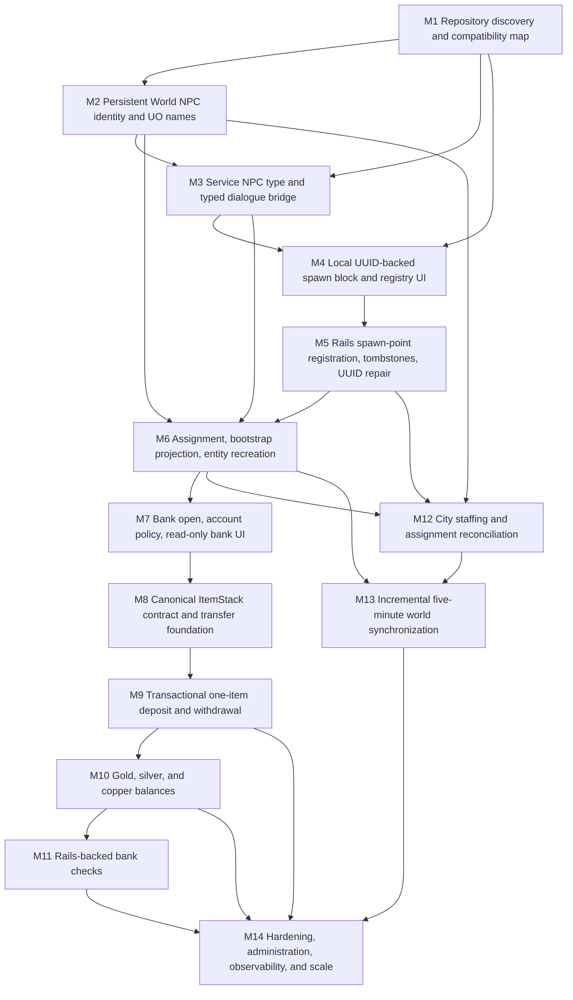

# UltimaCraft Persistent Banking and Service NPC Implementation Playbook

**Source design:** *UltimaCraft Persistent Banking, Service NPCs, Spawn Blocks, and City Population — Cohesive Technical Design Specification, revision 2.0*  
**Purpose:** Convert the cohesive design into a sequence of independently reviewable Codex milestones.  
**Target stack:** Ruby on Rails 8, PostgreSQL, NeoForge 1.21.1  
**Planning rule:** One milestone, one branch, one reviewed commit or small commit series. Codex must stop after each milestone.

---

# Section A: Architecture interpretation

## A.1 Architectural boundary

UltimaCraft should use Rails as the durable control plane and Minecraft as the live simulation runtime.

Rails owns persistent NPC identity, permanent NPC names, shard and city associations, service-NPC type definitions, dialogue and typed service capabilities, mirrored Service NPC Spawn Point registrations, NPC-to-post assignments, city staffing decisions, player bank ownership, serialized bank records, currency balances, bank checks, immutable audit records, and versioned bootstrap/synchronization state.

Minecraft owns the physical block entity, loaded entity instances, chunk-aware creation and removal, movement, pathfinding, animation, local interaction validation, client screens, inventory mutation, canonical ItemStack serialization and reconstruction, and temporary or crash-recovery state that must exist close to the game inventory.

Rails must never become a per-tick NPC AI engine. Minecraft must never become the authority for persistent identity or banked value.

## A.2 Persistent data versus runtime data

Persistent records include:

- A World NPC UUID, permanent name, city, profession, service type, status, dialogue binding, service capabilities, and definition revision.
- A Service NPC Spawn Point UUID and its mirrored shard, world, dimension, coordinates, city, service type, configuration revision, enabled state, last-seen state, and removal tombstone.
- A separate spawn assignment connecting one World NPC to one spawn point.
- Bank accounts, bank items, currency balances, bank checks, transfer operations, audit records, and published world-state changes.

Runtime state includes:

- The currently loaded `ServiceNpcEntity` and its transient AI state.
- The player’s Minecraft inventory.
- Open menu and dialogue sessions.
- Local cached bootstrap definitions.
- Pending registration/removal retry records.
- Durable Minecraft transfer receipts used to finish or reconcile cross-system inventory operations after a crash.

A missing Minecraft entity is not a missing NPC. It is a runtime projection that must be recreatable from Rails-backed persistent state.

## A.3 Service NPC Spawn Block interpretation

The Service NPC Spawn Block is a first-class persistent infrastructure subsystem, not merely an entity spawner.

- The server generates a UUID only when a genuinely new block is created.
- The UUID identifies the physical post, such as a bank counter, stable desk, healer shrine, or travel office.
- The UUID does not identify the employee.
- Rails mirrors the block as a spawn-point record.
- Rails stores the current employee assignment separately.
- The block can remain unchanged while Rails replaces, unassigns, or later reassigns an NPC.
- The block UI uses registry-backed dropdowns for city and Service NPC type. Free text is prohibited.
- The block exposes registration, assignment, revision, and error information.
- Configuration survives Rails outages as pending local work.
- Breaking the block produces a durable removal tombstone.
- Cloning, pick-block, structure placement, and copied NBT must not silently duplicate a UUID.
- Piston movement is disabled in the first implementation.

The first release should support one active assignment per post. Future multi-position capacity should introduce explicit slots instead of weakening uniqueness constraints.

## A.4 World NPC and assignment interpretation

A World NPC is a persistent person. It exists independently of chunk state, entity ID, current post, or current quest interaction.

A spawn assignment is a versioned relationship between a World NPC and a Service NPC Spawn Point. The implementation must enforce:

- At most one active assignment per World NPC.
- At most one active assignment per spawn point.
- Compatible shard, city, profession, and service type.
- Assignment closure rather than destructive deletion.
- Stable NPC identity when posts are changed, removed, disabled, or temporarily unsupported by the population engine.

The early vertical slice should use an explicit or administrative assignment. Automatic economic staffing should arrive only after manual assignment, bootstrap delivery, entity recreation, and banking are proven.

## A.5 Dialogue and services interpretation

The existing quest dialogue system should be extended, not duplicated. Dialogue options need stable action types such as navigation, quest action, typed service invocation, and close. Rails validates which service keys may be assigned to content. Minecraft contains a closed dispatcher of known handlers. An unknown service key is disabled and logged, never dynamically executed.

The existing Quest Trader must remain operational throughout the migration. A compatibility bridge may temporarily allow both the legacy quest-specific path and the generic Service NPC path to use shared dialogue/rendering components.

## A.6 Banking ownership-transfer interpretation

A bank item changes ownership across systems that cannot share a transaction. Therefore, inventory transfer must use a prepare-confirm-cancel protocol.

For a deposit:

1. Minecraft serializes and fingerprints the exact ItemStack.
2. Rails authenticates the server, resolves the account, validates the active teller assignment, validates payload/version/weight, and creates a prepared operation with reserved capacity.
3. Minecraft removes the exact stack from the player inventory.
4. Minecraft confirms the operation.
5. Rails makes the bank item available and writes the audit record.

For a withdrawal:

1. Rails reserves one available bank item.
2. Minecraft persists a local transfer receipt before ownership is exposed to the player.
3. Minecraft reconstructs and inserts the stack.
4. Minecraft confirms.
5. Rails marks the item withdrawn and audits the movement.

A retry must return the original result. A crash after possible insertion must never cause Rails to make the item available automatically. Such cases enter reconciliation-required state until the durable Minecraft receipt resolves them.

Gold, silver, and copper use the same ownership protocol but become integer balances rather than bank-item rows. Currency cannot become negative. Currency is not silently converted between denominations.

Bank checks are Rails-backed value instruments. The Minecraft item carries a check UUID and display metadata, but Rails is authoritative for amount and redemption status. A check can be redeemed once.

## A.7 Population engine interpretation

The population engine is a batch reconciliation system driven by existing city-economic truth. It determines desired staffing, compares it with enabled spawn capacity, preserves valid assignments, reuses unassigned or displaced NPCs, and creates new persistent NPCs only as a final option.

It must distinguish:

- Resident or statistical population.
- Persistent named World NPC population.
- Currently loaded Minecraft entity population.

The population engine should run on the existing job system with per-city or per-shard locking. The five-minute Minecraft process is a version/delta poll, not a full population calculation. The suggested population calculation cadence is slower and should align with the existing economy cadence.

## A.8 Important risks and ambiguities

The following items must be resolved from repository inspection or explicitly decided by a human. Codex must not silently guess them:

1. Existing Rails shard/city models, stable keys, and server-to-shard mapping.
2. Existing Quest Trader, spawn block, menu, networking, dialogue, bootstrap, job, authentication, GCS asset, and player identity conventions.
3. Exact UO XML source path and structure, plus the accepted name uniqueness scope.
4. The canonical NeoForge 1.21.1 registry-aware ItemStack codec already compatible with UltimaCraft data components.
5. Whether nested containers, quest-bound items, temporary items, bank checks, or unsupported-mod items may be banked.
6. The authoritative or validated item-weight source.
7. Spawn-block edit permission, heartbeat policy, and stale timeout.
8. Bank-check minimum/maximum and whether only gold checks are in the first release.
9. Whether every resident eventually receives a World NPC row or only materialized named NPCs do.
10. Region or dimension partitioning strategy for large bootstrap payloads.
11. Local durable receipt format and storage lifecycle on the Minecraft server.
12. Exact API versioning conventions and compatibility window.

**Inferred sequencing decision:** The design’s “smallest vertical slice” mentions a one-item deposit early. This playbook deliberately establishes the transfer-operation and serialization contracts before enabling inventory mutation. That ordering is safer and still produces an end-to-end banking slice without ever merging an unsafe single-request transfer.

---

# Section B: Dependency graph



Readable dependency tree:

```text
Repository discovery
├── Persistent NPC identity and names
│   ├── Generic Service NPC and dialogue actions
│   │   ├── UUID-backed spawn block UI
│   │   │   └── Rails spawn registration and UUID repair
│   │   │       └── Assignment + bootstrap + entity recreation
│   │   │           ├── Bank open + account policy + read-only UI
│   │   │           │   └── Item serialization + transfer foundation
│   │   │           │       └── Transactional item transfer
│   │   │           │           ├── Currency balances
│   │   │           │           │   └── Bank checks
│   │   │           │           └── Recovery/observability hardening
│   │   │           ├── Population staffing reconciliation
│   │   │           │   └── Incremental five-minute sync
│   │   │           └── Incremental five-minute sync
│   │   └── Existing quest compatibility remains active
│   └── Population NPC reuse and stable names
└── Repository-specific decisions feed every later milestone
```

---

# Section C: Milestone roadmap

## Milestone 1: Repository discovery and compatibility map

**Goal:** Produce a verified map of the Rails and NeoForge systems that this feature must extend, plus an architecture decision record and milestone-specific naming map. No production feature implementation.

**Why now:** Every later milestone depends on real class names, schemas, serializers, packet conventions, authentication, jobs, and test frameworks. Guessing here would create a parallel architecture.

**Dependencies:** None.

**Rails work:** Inspect models, migrations, controllers, serializers, services, jobs, authentication, quest CMS/dialogue, bootstrap, shard/city/economy/player models, GCS asset resolution, and test conventions.

**Minecraft work:** Inspect Quest Trader, existing spawn blocks, block entities, menus/screens, packets, cache/bootstrap client, entity persistence, item data components, coin items, serializers, local storage, and tests.

**Database work:** None.

**API work:** Document current endpoints, authentication, versioning, and payload conventions. No endpoint changes.

**Tests:** Run representative existing Rails and Minecraft test suites to establish a baseline. Record failures that predate the feature.

**Acceptance criteria:** A committed compatibility map names the exact extension points, unresolved decisions, baseline tests, and recommended class/table names. No speculative implementation is merged.

**Risks:** Incomplete inspection, overlooking a second bootstrap path, or mistaking legacy code for the authoritative path.

**Complexity:** Medium.

## Milestone 2: Persistent World NPC identity and UO name import

**Goal:** Establish durable World NPC identity and permanent UO-derived names while preserving existing quest behavior.

**Why now:** Spawn assignments, dialogue, entity recreation, population, and teller validation all require persistent identity.

**Dependencies:** Milestone 1 compatibility map.

**Rails work:** Add or extend World NPC persistence; add idempotent UO XML name import; add seedable transactional name selection; create a minimal banker fixture/record path; bridge existing quest NPC content where required without replacing it.

**Minecraft work:** Add a compatible persistent World NPC public-ID field/definition representation where needed, but do not yet implement generic spawn-block recreation.

**Database work:** One migration theme for World NPC identity and, only if needed, imported name records. Use additive columns/tables, indexes, foreign keys, and rollback-safe backfill strategy.

**API work:** Add a versioned minimal World NPC definition only if an existing endpoint requires it for tests; otherwise defer projection to Milestone 6.

**Tests:** Import idempotency, stable name persistence, uniqueness policy, deterministic selection, quest regression tests, and no name regeneration on reload.

**Acceptance criteria:** A World NPC retains the same public UUID and name through reloads and status changes. Existing quest NPC interactions still pass.

**Risks:** Name uniqueness deadlocks, unsafe backfills, and accidental hard coupling between World NPC and one quest or entity instance.

**Complexity:** Large.

## Milestone 3: Service NPC type registry and typed dialogue bridge

**Goal:** Generalize the existing quest interaction path enough to support a Bank Teller service type and typed dialogue actions without breaking quest actions.

**Why now:** The spawn block dropdown and entity projection need a stable service-type registry and dialogue capability model.

**Dependencies:** Milestones 1 and 2.

**Rails work:** Add or extend Service NPC type definitions, service keys, and dialogue option action types. Seed or publish `bank_teller`, `bank.open`, `bank.create_check`, and the initial teller dialogue. Reuse existing CMS structures.

**Minecraft work:** Introduce a closed typed-service dispatcher and a generic Service NPC definition layer. Refactor shared Quest Trader UI/interaction code only where necessary. Keep the legacy Quest Trader operational.

**Database work:** One additive migration theme for registry/dialogue fields if existing structures cannot represent typed service actions.

**API work:** Extend the appropriate registry/bootstrap contract with explicit schema versioning. Unknown service keys remain inert.

**Tests:** Existing quest navigation/actions, teller dialogue rendering, service-key allow-list validation, unknown-key rejection, and server-side interaction validation.

**Acceptance criteria:** A test Service NPC can display the bank teller conversation and dispatch a stubbed typed action; quest functionality remains unchanged.

**Risks:** Over-refactoring the quest system, arbitrary dynamic action execution, or coupling the dialogue renderer to banking internals.

**Complexity:** Large.

## Milestone 4: Local UUID-backed Service NPC Spawn Block and configuration UI

**Goal:** Add the generic Minecraft block, block entity, server-generated UUID lifecycle, cached-registry dropdowns, permissions, and local pending state without yet requiring successful Rails persistence.

**Why now:** This isolates world-save and UI compatibility before network registration and assignment are introduced.

**Dependencies:** Milestones 1 and 3.

**Rails work:** Ensure city and service-type registries are available through the existing bootstrap/cache path. No spawn-point persistence yet.

**Minecraft work:** Implement the block, block entity, menu, screen, registry-backed city/type dropdowns, enabled toggle, status fields, server-side packet validation, UUID generation/retention, clone-safe handling, and piston immovability. Add a durable local pending-registration/removal queue interface, even if remote delivery is deferred.

**Database work:** None.

**API work:** No mutating spawn API yet. Registry payload may be extended/versioned if Milestone 3 did not already do so.

**Tests:** UUID survives save/reload; new placements differ; pick-block and normal block items do not preserve UUID; supported clone/template paths receive new UUID or enter conflict-repair state; unauthorized edits fail; invalid registry keys fail; piston movement is blocked.

**Acceptance criteria:** The block can be configured from valid cached registries, persists its physical-post UUID, and clearly reports unconfigured/pending state.

**Risks:** Minecraft save incompatibility, client-trusted configuration, UUID copying through an untested world-edit path, or local queue data loss.

**Complexity:** Very large.

## Milestone 5: Rails spawn-point registration, tombstones, and duplicate UUID recovery

**Goal:** Mirror configured spawn blocks in Rails with authenticated, revision-aware upsert/removal APIs and end-to-end duplicate UUID repair.

**Why now:** Assignment and entity recreation require a reliable persistent post registry.

**Dependencies:** Milestone 4 and Milestone 1 authentication conventions.

**Rails work:** Add Service NPC Spawn Point persistence and services for register/update/remove/conflict detection. Validate shard, city, service type, server/world ownership, revision monotonicity, and active coordinate uniqueness. Preserve removal tombstones.

**Minecraft work:** Connect the durable local queue to the APIs, implement retry/backoff, render registration status/errors, regenerate a UUID only when Rails confirms a collision at a different canonical location, and retry safely.

**Database work:** One migration theme for spawn points, partial unique indexes, statuses, revisions, last-seen, and removal timestamps.

**API work:** Versioned authenticated PUT/upsert, DELETE/tombstone, and optional targeted diagnostic GET. Document error codes and idempotent retry behavior.

**Tests:** Registration, update, stale revision rejection, invalid city/type, cross-shard rejection, coordinate conflict, UUID conflict response, Minecraft UUID replacement/retry, offline pending registration, durable break tombstone, disable versus remove.

**Acceptance criteria:** A configured block is durably mirrored in Rails; duplicate UUIDs cannot remain active at two coordinates; offline changes eventually converge.

**Risks:** Original block losing its canonical UUID, out-of-order revisions, destructive deletes, replay attacks, and retry storms.

**Complexity:** Very large.

## Milestone 6: Manual assignment, bootstrap projection, and chunk-load entity recreation

**Goal:** Prove the complete persistent NPC path from Rails assignment to cached Minecraft definition to exact entity recreation after unload/restart.

**Why now:** Banking must validate and operate through a real persistent assigned teller, not a temporary test entity.

**Dependencies:** Milestones 2, 3, and 5.

**Rails work:** Add spawn assignments with active uniqueness constraints; add an explicit assignment service/admin/test path; project only assigned/relevant World NPCs, spawn points, assignments, types, and dialogue through a versioned bootstrap payload.

**Minecraft work:** Add registries/caches, generic Service NPC entity projection, persistent identity fields, chunk-load reconciler, home-post association, stale/duplicate entity repair, no-natural-despawn behavior, and cached startup snapshot.

**Database work:** One migration theme for assignments. Add revision fields/indexes needed by the bootstrap projection.

**API work:** Extend bootstrap schema version. Optionally add assignment diagnostic endpoint. Player-specific bank data remains excluded.

**Tests:** One active assignment per NPC/post, compatibility validation, same named teller after chunk unload and server restart, stale entity removal, duplicate entity canonical selection, assignment replacement without changing block UUID, disabled/removed post behavior, cached startup while Rails is offline.

**Acceptance criteria:** A manually assigned persistent banker returns with the same UUID/name after reload and only one canonical entity exists.

**Risks:** Entity duplication, sending every World NPC to Minecraft, bootstrap breaking older clients, or treating entity NBT as authoritative.

**Complexity:** Very large.

## Milestone 7: Bank open, shard banking policy, and read-only bank UI

**Goal:** Allow an authenticated player to invoke `bank.open` through the assigned teller and receive a Rails-resolved global or city-local account summary with 250-stone capacity and zero/current balances.

**Why now:** This establishes authorization, account ownership, and client UI before any inventory mutation.

**Dependencies:** Milestone 6.

**Rails work:** Add shard banking policy fields if absent, bank accounts, account resolution, empty/initial currency balance representation, bank-open authorization, pagination contract, and account revision.

**Minecraft work:** Implement the bank service handler, server-side proximity/menu/entity checks, API client, read-only bank screen shell, teller/city/header/weight/currency display, and service-unavailable state.

**Database work:** One migration theme for account policy/account identity. Currency rows may be lazily created or added here if that matches repository conventions, but no currency mutation yet.

**API work:** Versioned `banking/open` endpoint with authenticated server context and strict teller/spawn assignment/capability validation.

**Tests:** Global account reuse, city-local separation, missing city rejection, player UUID identity, inactive teller/post rejection, wrong shard/server rejection, 250-stone default, offline Rails disables banking but leaves cached dialogue visible.

**Acceptance criteria:** The correct account opens through a real assigned teller with no inventory mutation and no player-specific data in world bootstrap.

**Risks:** Trusting client-supplied player/NPC data, duplicate accounts under concurrency, or exposing another player’s account.

**Complexity:** Large.

## Milestone 8: Canonical ItemStack contract and banking transfer foundation

**Goal:** Establish the complete versioned serialization, eligibility, weight, fingerprint, operation-state, and audit contracts before moving any item.

**Why now:** The next milestone must not discover serializer or transaction-model flaws while ownership is already changing.

**Dependencies:** Milestone 7 and the serializer findings from Milestone 1.

**Rails work:** Add Bank Item, Bank Transfer Operation, and immutable Bank Transaction foundations; model allowed transitions; capacity reservations; payload/version/size validation; idempotency uniqueness; expiry/reconciliation states; and weight recalculation service.

**Minecraft work:** Implement or wrap the canonical registry-aware ItemStack serializer/deserializer, semantic equality test helpers, fingerprint generation, item eligibility checks, payload limits, and durable pending-transfer store abstraction. Do not expose deposit/withdraw controls yet.

**Database work:** One related banking-storage migration theme, or two carefully ordered migrations if operation/audit tables must be independently reversible. Include constraints and indexes.

**API work:** Define and document prepare/confirm/cancel schemas and error codes, but handlers may remain test-only or disabled until Milestone 9.

**Tests:** Wine bottle semantic round trip preserving all gameplay-relevant components, unknown schema rejection, corrupt/oversized payload rejection, negative/non-finite/implausible weight rejection, state-machine tests, capacity reservation, idempotency uniqueness, audit immutability, nested/quest-bound restriction policy tests.

**Acceptance criteria:** The project can prove exact serialization and Rails persistence semantics without mutating a player inventory.

**Risks:** Partial serialization, unstable fingerprints, double-counted weight, excessive payloads, and ambiguous recovery states.

**Complexity:** Very large.

## Milestone 9: Transactional one-item deposit and withdrawal vertical slice

**Goal:** Safely deposit and withdraw one arbitrary eligible custom item, including the custom wine bottle, using prepare-confirm-cancel, idempotency, durable receipts, and crash recovery.

**Why now:** All identity, authorization, UI, serialization, and operation foundations are available.

**Dependencies:** Milestone 8.

**Rails work:** Implement item deposit/withdrawal prepare-confirm-cancel services and endpoints; row locking; capacity reservation; item availability/reservation states; audit writes; expiry handling; and administrative reconciliation state.

**Minecraft work:** Implement the transfer coordinator, exact-slot validation, inventory removal/insertion, durable receipt state transitions, retries, cancel paths, startup reconciliation, pending-state UI, and full-inventory behavior without world drops.

**Database work:** Only small additive corrections discovered from implementation; avoid a new unrelated schema theme.

**API work:** Activate and document item transfer endpoints with idempotency keys, operation revisions, supported serialization versions, and safe retry semantics.

**Tests:** Happy-path wine deposit/withdrawal, duplicate prepare/confirm/cancel, disconnects at every boundary, removal failure, reconstruction failure, full inventory, crash after insertion before confirmation, expired operation behavior, overweight rejection, concurrent requests, exact component equality, and audit/weight correctness.

**Acceptance criteria:** Retrying or crashing at any tested boundary cannot duplicate or destroy the wine bottle; Rails owns the banked item in exactly one state.

**Risks:** Item duplication or loss. This is the highest-risk milestone and must not merge without adversarial testing.

**Complexity:** Very large.

## Milestone 10: Gold, silver, and copper balance transfers

**Goal:** Route supported coin stacks to separate integer balances and permit safe balance withdrawals using the same transactional protocol.

**Why now:** The safe cross-system ownership coordinator has been proven with items.

**Dependencies:** Milestone 9.

**Rails work:** Add/finalize currency balances with nonnegative constraints; implement deposit/withdraw reservations, row locking, idempotency, and audit entries.

**Minecraft work:** Map existing coin items to stable currency keys, bypass item-vault storage, remove exact deposited stacks, construct withdrawal stacks, handle full inventory without dropping, and refresh the currency UI.

**Database work:** One migration theme for currency balances/check constraints if not already created in Milestone 7.

**API work:** Activate currency prepare-confirm-cancel endpoints. No silent denomination conversion.

**Tests:** Each denomination, concurrent withdrawals, insufficient funds, nonnegative constraint, duplicate requests, full inventory, disconnect recovery, coin stacks absent from Bank Items, and currency consuming no bank weight.

**Acceptance criteria:** Gold, silver, and copper balances are independently correct and retries cannot duplicate currency.

**Risks:** Negative balances, denomination confusion, integer overflow, and item/balance double credit.

**Complexity:** Large.

## Milestone 11: Rails-backed bank checks

**Goal:** Issue and redeem single-use gold bank checks through the teller using transactional value reservation and authoritative Rails validation.

**Why now:** Currency balances and safe physical-item delivery are available.

**Dependencies:** Milestone 10.

**Rails work:** Add Bank Check states and issue/redeem services; configure minimum/maximum; reserve/debit/restore gold safely; validate single redemption; audit every transition.

**Minecraft work:** Add the physical check item data component, check-creation screen, durable issuance receipt, inventory insertion handling, and redemption interaction. Treat display amount as non-authoritative.

**Database work:** One migration theme for bank checks and operation links/constraints.

**API work:** Versioned prepare-confirm-cancel issuance and idempotent redeem endpoint. Explicit error codes for unknown, cancelled, voided, or redeemed checks.

**Tests:** Issue, cancel, full inventory, crash recovery, duplicate issue/redeem, forged display amount, wrong UUID, concurrent redemption, balance restoration, and audit trail.

**Acceptance criteria:** A check transfers value exactly once and its displayed metadata cannot alter Rails-owned value.

**Risks:** Double redemption, bearer/ownership-policy ambiguity, and value loss during issuance.

**Complexity:** Very large.

## Milestone 12: City population staffing and spawn-capacity reconciliation

**Goal:** Automatically determine banker demand from existing economic/civic inputs and fill compatible posts while preserving existing NPC identities.

**Why now:** Manual assignment and the banker service are stable, so automatic staffing can be introduced without obscuring earlier bugs.

**Dependencies:** Milestones 2, 5, and 6.

**Rails work:** Add population state and staffing rules only where equivalent models do not exist; isolate desired staffing, spawn capacity, planning, and application services; add per-city locking, dry-run/preview, deficits/vacancies, and assignment stability policy.

**Minecraft work:** No population algorithm. Consume resulting assignments through existing cache/bootstrap paths. Display vacant or changed assignment state correctly.

**Database work:** One migration theme for population state/staffing rules, unless existing economy models already provide equivalents.

**API work:** No new player API. Publish assignment/population changes through the world-state abstraction or bootstrap revision hooks.

**Tests:** Preserve compatible occupants; reuse local unassigned/displaced banker; create only when necessary; close surplus assignment without deleting NPC; enforce capacity; record deficits; prevent overlapping reconciliation; deterministic plan; rollback on partial failure.

**Acceptance criteria:** Britain can gain or lose required banker capacity without identity churn, duplicate assignments, or Minecraft-side population logic.

**Risks:** Oscillating assignments, duplicate economic truth, long transactions, job overlap, or creating huge NPC volumes unintentionally.

**Complexity:** Very large.

## Milestone 13: Versioned incremental world sync and five-minute reconciliation

**Goal:** Deliver spawn, assignment, NPC, dialogue, and registry changes through monotonic deltas and a persistent Minecraft cache with safe full-bootstrap fallback.

**Why now:** There are now meaningful assignment changes to synchronize periodically.

**Dependencies:** Milestones 6 and 12.

**Rails work:** Add atomic world-state version/change publication, changes-since service, retention/pruning job, full-bootstrap-required fallback, and scale-aware filtering to assigned/relevant NPCs.

**Minecraft work:** Add five-minute version polling, delta application, atomic cache snapshots, last-good local persistence, schema negotiation, full-bootstrap recovery, and entity reconciliation after changes.

**Database work:** One migration theme for world-state changes/versioning if absent.

**API work:** Versioned world-sync endpoint with monotonic from/to versions, schema version, supported-version negotiation, and explicit fallback response.

**Tests:** Atomic publication, monotonic versions, no missing changes under concurrency, idempotent delta application, corrupted local snapshot fallback, pruned-delta fallback, Rails outage startup, assignment replacement, dialogue revision change, and no unassigned shard-wide NPC dump.

**Acceptance criteria:** Minecraft converges within the configured poll interval and can recover from missed/pruned deltas without duplicating entities.

**Risks:** Version gaps, payload growth, partial cache writes, downgrade incompatibility, and synchronized polling spikes.

**Complexity:** Very large.

## Milestone 14: Hardening, administration, observability, and scale

**Goal:** Add the operational controls needed to run, diagnose, recover, and scale the completed system safely.

**Why now:** Admin and telemetry should be grounded in real workflows and failure states, not speculative dashboards.

**Dependencies:** All previous milestones.

**Rails work:** Permissioned admin views/actions for spawn points, assignments, NPCs, population, banks, pending transfers, checks, audits, and recovery; weight reconciliation; stale-point policy; structured logging; metrics; rate/payload limits; retention jobs; performance tuning.

**Minecraft work:** Structured logs/metrics, registration queue health, transfer-receipt inspection/reconciliation command, cache diagnostics, duplicate-entity metrics, and safe operator recovery tools.

**Database work:** Add only operational indexes, retention metadata, or constraints justified by measured queries. Use concurrent/index-safe production procedures where supported.

**API work:** Harden authentication/replay protection, rate limits, request-size limits, pagination, compression, and region/dimension filtering. Preserve compatibility.

**Tests:** Authorization, audit of admin actions, stale recovery, weight mismatch correction, large bootstrap/delta fixtures, target NPC/account/item volumes, concurrent jobs/transfers, payload limits, authentication failures, and disaster-recovery exercises.

**Acceptance criteria:** Operators can diagnose and recover pending registrations, stale posts, reconciliation-required transfers, assignment deficits, and sync lag without direct database edits. Load tests meet the project’s defined targets.

**Risks:** Dangerous admin adjustments, logging sensitive payloads, premature complexity, and schema changes based on unmeasured assumptions.

**Complexity:** Very large.

---
# Section D: Ready-to-use Codex prompts

## Codex Prompt 1: Repository discovery and compatibility map

```text
You are implementing Milestone 1 of the UltimaCraft persistent banking and Service NPC program.

MILESTONE OBJECTIVE
Inspect the complete Rails 8 application and NeoForge 1.21.1 mod and produce a committed compatibility map. Do not implement the new banking, World NPC, Service NPC Spawn Point, assignment, or population features in this milestone.

COMPLETED ARCHITECTURE CONTEXT
Nothing from the new architecture has been implemented yet. The intended boundary is that Rails will own durable NPC identity, names, shard/city associations, service definitions, spawn-point mirrors, assignments, population decisions, banking ownership, audit state, and versioned synchronization. Minecraft will own physical blocks, loaded entities, movement/AI, screens, proximity checks, inventory mutation, canonical ItemStack serialization/reconstruction, and temporary recovery state. The generic spawn-block UUID will identify a physical post, not an NPC. Existing quest behavior must remain intact.

REQUIRED REPOSITORY INSPECTION
Find and document the exact paths, classes, tables, and conventions for all of the following:

Rails:
- Shard/world/server models and server-to-shard authentication/authorization.
- City models, stable keys/public IDs, and shard relationships.
- City economy models, snapshots, scheduled jobs, and locking conventions.
- Player identity and Minecraft account linkage.
- Quest CMS models/controllers/admin UI, dialogue models, dialogue publication/revisions, conditions/effects/actions.
- Bootstrap and any incremental synchronization endpoints, serializers, caches, schema-version conventions, and authentication.
- Existing NPC/trader persistence, if any.
- Existing service-object, job, transaction, idempotency, audit, and API error conventions.
- Existing GCS asset resolution used by quest/NPC interfaces.
- Test frameworks, factories/fixtures, request helpers, and baseline commands.

Minecraft:
- Quest Trader entity, renderer, interaction handler, dialogue UI, and persistent data.
- Existing trader/NPC spawn blocks, block entities, menus, screens, configuration packets, permissions, and cloning/save behavior.
- Networking/API clients, authentication/signing, retry/backoff, bootstrap cache, local snapshot persistence, and threading model.
- Entity registration, chunk-load hooks, save/reload behavior, no-despawn behavior, and duplicate detection patterns.
- ItemStack data components, custom wine bottle attributes, quality/crafter/hue/blessed data, and the canonical registry-aware NeoForge serialization path.
- Gold, silver, and copper item classes/registry keys and any conversion logic.
- Existing item weight source.
- Local durable-data facilities appropriate for pending registration and banking transfer receipts.
- Unit, integration, GameTest, or manual test conventions and baseline commands.

DELIVERABLES
Create a repository document in the project’s established documentation location. It must include:
1. A Rails compatibility map with exact paths and responsibilities.
2. A Minecraft compatibility map with exact paths and responsibilities.
3. A data-authority matrix.
4. A sequence diagram of current quest dialogue interaction and current spawn-block configuration.
5. A list of code that should be extended, code that should be wrapped temporarily, and code that must not be replaced.
6. A naming map that recommends repository-consistent names for World NPC, Service NPC type, Service NPC Spawn Point, assignment, bootstrap cache, transfer operation, and audit concepts.
7. A migration-compatibility strategy for preserving quest behavior and world saves.
8. A baseline test report with exact commands and pre-existing failures.
9. An explicit decision log for unresolved items, including UO XML path, name uniqueness scope, canonical ItemStack codec, nested-container policy, weight source, spawn edit permission, heartbeat/stale policy, check limits, population materialization scope, sync partitioning, and transfer-receipt storage.
10. A refined dependency graph for Milestones 2–14. Change later sequencing only when repository evidence requires it, and explain every change.

NON-NEGOTIABLE CONSTRAINTS
- Do not remove working quest functionality.
- Do not perform unrelated refactoring.
- Do not rename unrelated classes or files.
- Do not create parallel systems when existing code can be extended.
- Do not guess class names, table names, file locations, or serializers that repository inspection can reveal.
- Prefer small, reversible future changes.
- Preserve migration and save compatibility.
- Do not introduce speculative abstractions.
- Rails must not become a per-tick AI engine.
- Minecraft clients are never trusted for authorization or value ownership.
- Do not implement future milestones early.

TEST REQUIREMENTS
Run representative Rails tests and the available Minecraft compile/test suite. Record the exact commands, versions, duration only if the tools report it, and results. Distinguish pre-existing failures from failures introduced by documentation-only changes.

STOP CONDITION
Stop after the compatibility document and any documentation index updates are complete. Do not add migrations, models, blocks, entities, endpoints, or feature code.

COMPLETION REPORT
Provide:
- Summary of findings.
- Files created.
- Files modified.
- Migrations added: none expected.
- Tests run and results.
- Baseline failures.
- Open decisions requiring human approval.
- Any recommended milestone-order changes.
- Suggested commit message.
- Whether this documentation-only milestone is safe to merge.
```

## Codex Prompt 2: Persistent World NPC identity and UO names

```text
You are implementing Milestone 2 of the UltimaCraft persistent banking and Service NPC program.

MILESTONE OBJECTIVE
Add durable World NPC identity and permanent Ultima Online-derived names in Rails, with the smallest compatibility bridge needed for existing quest NPCs. Existing quest behavior must continue to work. Do not implement the generic Service NPC Spawn Block, spawn assignments, banking, or population reconciliation yet.

COMPLETED ARCHITECTURE CONTEXT
Milestone 1 produced a compatibility map containing the real Rails/Minecraft class names, database conventions, UO XML location, test commands, authentication conventions, and migration strategy. Use that document as authoritative. Rails owns persistent NPC identity and names. A World NPC represents a person independent of a chunk, Minecraft entity ID, current post, or quest. An existing persistent NPC must never receive a newly generated name merely because it respawns or changes posts.

PREREQUISITE CHECK
Before editing, read:
- The complete architecture design document.
- The Milestone 1 compatibility map.
- The existing quest NPC/trader models and entity persistence code.
- The UO XML source and any existing import-task conventions.
- Existing public-ID/UUID, normalization, optimistic-locking, and status conventions.

IMPLEMENTATION SCOPE
Rails:
1. Add or extend the repository’s appropriate persistent NPC model. Use existing models if they already represent the concept; do not create a duplicate merely to match a proposed name.
2. Ensure each World NPC has a stable public UUID, shard, city, permanent display name, normalized name, profession, optional service type, lifecycle status, definition revision, and timestamps needed by existing conventions.
3. Keep current quest relationships compatible. Use additive nullable references or a compatibility adapter where a full backfill would be risky.
4. Add an idempotent UO XML importer following existing task/service conventions.
5. Add a seedable, transaction-safe name selector. Implement only the uniqueness scope approved from Milestone 1. If it remains unresolved, stop before enforcing a guessed scope and report the decision blocker.
6. Add one test fixture/factory or supported seed path for a Britain banker without introducing spawn assignment.
7. Reuse existing GCS visual references. Do not add portrait binaries or a new portrait subsystem.

Minecraft:
1. Add only the minimal compatible field/definition support necessary for an existing quest NPC entity to carry or display a Rails World NPC public ID without altering current quest interaction.
2. Do not implement a new generic Service NPC entity yet unless the compatibility map proves the existing entity already is the shared base and the change is strictly additive.

DATABASE AND MIGRATION SAFETY
- Prefer one migration theme for World NPC identity and imported name records.
- Use additive tables/columns, explicit indexes, foreign keys, and constraints that match current production practices.
- Avoid long blocking backfills in a single migration. Provide a staged backfill plan when existing rows need IDs.
- Preserve rollback ability until all old readers are compatible.
- Do not hard-delete existing NPC content.

INVARIANTS
- Public NPC identity is stable.
- Name generation occurs only at new World NPC creation.
- Spawn/reload/post changes never regenerate a name.
- Every persistent NPC belongs to the correct shard and city.
- Existing quest records and interactions remain functional.
- Lifecycle changes close or transition records; they do not erase historical identity.

TEST REQUIREMENTS
Add and run tests for:
- UO XML import idempotency.
- Normalization and duplicate-source handling.
- Seeded deterministic selection.
- Approved uniqueness scope under concurrent creation.
- Name persistence across reload and lifecycle status changes.
- Public UUID stability.
- Shard/city validation.
- Existing quest model, API, and Minecraft interaction regressions.
- Migration/backfill behavior on representative legacy rows.

NON-NEGOTIABLE CONSTRAINTS
- Do not remove working quest functionality.
- Do not perform unrelated refactoring or renaming.
- Extend existing systems instead of replacing them.
- Maintain backwards compatibility during migrations.
- Add tests before changing old behavior.
- Clearly document any deprecated compatibility path.
- Do not implement service-type registry, spawn blocks, assignments, banking, or population logic.
- Rails remains durable control plane only; Minecraft remains runtime.

STOP CONDITION
Stop when durable World NPC identity, permanent names, the approved import path, and compatibility tests are complete. Do not begin Milestone 3.

COMPLETION REPORT
Provide:
- Summary of changes.
- Files created and modified.
- Migrations added and rollback/backfill notes.
- Tests added, commands run, and results.
- Manual verification steps for importing names and observing stable quest NPC identity.
- Known limitations and unresolved decisions.
- Suggested commit message.
- Whether the milestone is safe to merge.
```

## Codex Prompt 3: Service NPC types and typed dialogue actions

```text
You are implementing Milestone 3 of the UltimaCraft persistent banking and Service NPC program.

MILESTONE OBJECTIVE
Extend the existing quest dialogue and Quest Trader interaction architecture so it can represent a generic Service NPC type and dispatch typed service actions. Introduce the Bank Teller definition and dialogue, but only stub the banking handlers. Preserve all existing quest functionality.

COMPLETED ARCHITECTURE CONTEXT
Milestone 1 documented the real quest CMS, dialogue, bootstrap, Quest Trader, GCS visual, and test architecture. Milestone 2 added durable World NPC public identity and permanent names. Rails owns service-type definitions, allowed service keys, dialogue content, and NPC capability bindings. Minecraft owns interaction validation, rendering, and a closed dispatcher of known handlers. Unknown service keys must be disabled and logged, never dynamically evaluated. Banking ownership and transfer are not implemented yet.

PREREQUISITE CHECK
Read the design document, compatibility map, Milestone 2 changes, current quest dialogue models, CMS publication path, Quest Trader entity/UI, and bootstrap serializers before proposing code.

IMPLEMENTATION SCOPE
Rails:
1. Reuse or minimally extend the existing dialogue schema to represent action types equivalent to navigate, quest action, invoke service, and close.
2. Add a stable Service NPC type registry using the repository’s content/seed/publication conventions. Do not create a database table if an existing versioned registry is the correct extension point.
3. Add the initial `bank_teller` definition with profession `banker`, generic Service NPC entity presentation, default teller dialogue, and allowed service keys `bank.open` and `bank.create_check`.
4. Add validation that a dialogue option’s service key is known and permitted for the assigned Service NPC type.
5. Preserve legacy quest action payloads and readers. Use additive fields or translation adapters.
6. Publish service types, service definitions, and teller dialogue through the appropriate versioned registry/bootstrap contract, using the project’s versioning convention.

Minecraft:
1. Extract or introduce the smallest shared Service NPC definition/view model needed to render existing quest dialogue and teller dialogue through the same visual language.
2. Add a closed `NpcServiceDispatcher`-equivalent mapped to compile-time-known handlers.
3. Add stub handlers for `bank.open` and `bank.create_check` that return an explicit “not available yet” response and do not mutate inventory or call nonexistent banking APIs.
4. Keep all quest navigation, quest actions, conditions, effects, portraits, and existing screens working.
5. Validate player proximity, entity identity, and current menu/session server-side before dispatch.

DATABASE AND API CHANGES
- Use one additive migration theme only if the current dialogue/content model cannot represent typed actions.
- Document the extended payload, schema version, compatibility behavior, and unknown-key behavior.
- Do not expose arbitrary class names, scripts, method names, or executable code in content.

INVARIANTS
- Existing quest dialogue remains functional.
- A Service NPC type is a stable content key, not free text supplied by the client.
- Rails validates content capabilities.
- Minecraft executes only known handlers.
- World NPC identity remains stable and separate from service type.
- No bank value or player inventory mutation exists in this milestone.

TEST REQUIREMENTS
Add and run tests for:
- Existing quest dialogue navigation/actions and publication.
- Bank Teller type validation and registry serialization.
- Bank Teller dialogue with exactly the intended choices.
- Allowed and disallowed service-key binding.
- Unknown action/service key disabled and logged.
- Quest Trader regression behavior.
- Server-side proximity/session/entity validation.
- Older payload compatibility where supported.

NON-NEGOTIABLE CONSTRAINTS
- Do not remove working quest functionality.
- Do not perform unrelated refactoring or rename unrelated classes/files.
- Do not replace the quest CMS or duplicate the dialogue renderer.
- Prefer composition over a unique Java subclass for every service role.
- Do not implement spawn blocks, assignments, account models, inventory transfer, or population.
- Clearly document any temporary adapter and deprecation path.

STOP CONDITION
Stop when the generic type/action bridge and stubbed Bank Teller dialogue are complete and all quest regressions pass. Do not begin the spawn-block milestone.

COMPLETION REPORT
Provide all changed files, migrations, payload changes, tests/results, manual teller-dialogue verification, known limitations, open decisions, a suggested commit message, and a safe-to-merge assessment.
```

## Codex Prompt 4: Local UUID-backed Service NPC Spawn Block

```text
You are implementing Milestone 4 of the UltimaCraft persistent banking and Service NPC program.

MILESTONE OBJECTIVE
Implement the Minecraft-side generic Service NPC Spawn Block as persistent physical infrastructure: block, block entity, configuration menu/screen, server-generated UUID lifecycle, registry-backed city and Service NPC type dropdowns, permissions, local status, and durable pending-work storage. Do not yet create Rails spawn-point persistence or remote mutating APIs.

COMPLETED ARCHITECTURE CONTEXT
Milestone 1 identified the real block/menu/network/cache conventions. Milestone 2 added persistent World NPC identity. Milestone 3 added the Service NPC type registry and typed dialogue bridge, including `bank_teller`. Rails-provided city and service-type registries are available in the Minecraft cache. The block UUID identifies a physical post, never an NPC. NPC assignment will be a separate Rails record in a later milestone.

PREREQUISITE CHECK
Inspect the existing trader/NPC spawn blocks, block-entity save/load code, menu/screens, packet validation, server permissions, structure cloning behavior, bootstrap cache, local persistence, and test conventions. Reuse their established UI and registration patterns where safe.

IMPLEMENTATION SCOPE
Minecraft:
1. Add the generic Service NPC Spawn Block and block entity using repository naming conventions.
2. Generate a persistent UUID server-side for each genuinely new placement.
3. Persist the UUID, city key, service type key, enabled state, local configuration revision, registration state, assignment display cache fields, and last error code.
4. Implement registry-backed dropdowns. Store stable city/service keys. Prohibit free-text values.
5. Filter inactive/non-spawnable definitions according to cached Rails metadata.
6. Add an enabled toggle. Disabling does not delete or replace the UUID.
7. Show read-only UUID, local registration status, assigned NPC display fields, configuration revision, assignment revision, last successful sync when available, and error message.
8. Validate every configuration packet server-side: operator/approved permission, distance, block existence, menu identity, city key, service key, and service spawnability.
9. Increment revisions monotonically for accepted local configuration changes.
10. Add local durable pending registration/update/removal records using the storage mechanism approved in Milestone 1. Remote delivery can be a disabled interface/stub in this milestone.
11. Prevent piston movement.
12. Ensure normal dropped block items and pick-block do not carry the UUID.
13. For supported structure/template/clone paths, strip UUIDs or deliberately mark copied data for conflict repair. Do not silently preserve the original UUID.
14. Preserve world-save compatibility and handle absent/new fields with safe defaults.

Rails:
- Only make the minimum versioned registry/bootstrap change needed to provide cities and Service NPC types if Milestone 3 did not already supply it.
- Do not add spawn-point tables or mutating endpoints.

REGISTRATION STATES
Use repository-consistent equivalents for:
UNCONFIGURED, PENDING_REGISTRATION, REGISTERED, PENDING_UPDATE, ERROR, and DISABLED. In this milestone, remote-success states may only be test fixtures; the block must not falsely report Rails registration.

INVARIANTS
- UUID generation is server-side.
- A normal new block receives a new UUID.
- Save/reload preserves the same UUID.
- The UUID identifies the post, not an employee.
- The client cannot submit arbitrary city/type values.
- No assignment is invented locally.
- Offline configuration is durable pending work.
- Piston movement is disabled.

TEST REQUIREMENTS
Add and run the strongest available tests for:
- New UUID generation and uniqueness.
- Save/unload/reload stability.
- Normal block item, pick-block, and supported clone/template behavior.
- Legacy/missing block-entity data defaults.
- City/type dropdown population from cache.
- Invalid/inactive keys rejected server-side.
- Unauthorized, distant, wrong-menu, and missing-block packets rejected.
- Revision monotonicity.
- Enabled/disabled persistence.
- Durable pending-work persistence across restart.
- Piston immovability.

NON-NEGOTIABLE CONSTRAINTS
- Do not remove or rewrite existing spawn blocks unless a tiny shared extraction is necessary and fully regression-tested.
- Do not rename unrelated files/classes.
- Do not add Rails spawn-point persistence, assignments, entities, or banking.
- Do not bind a World NPC UUID into permanent block identity.
- Avoid speculative future fields such as schedules, multi-capacity, buildings, or shifts.

STOP CONDITION
Stop when the local block subsystem and tests are complete. The block may remain pending because Rails registration is intentionally Milestone 5.

COMPLETION REPORT
Provide changed files, registry/resources added, tests and results, world-save/manual verification steps, clone paths tested, known untested clone paths, local queue format, limitations, suggested commit message, and merge-safety assessment.
```

## Codex Prompt 5: Rails spawn-point registration, tombstones, and UUID repair

```text
You are implementing Milestone 5 of the UltimaCraft persistent banking and Service NPC program.

MILESTONE OBJECTIVE
Persist Minecraft Service NPC Spawn Blocks in Rails through authenticated, revision-aware, idempotent registration/update/removal APIs. Complete end-to-end duplicate UUID detection and repair. Do not add NPC assignments or automatic entity spawning yet.

COMPLETED ARCHITECTURE CONTEXT
Milestone 1 documented the actual Rails API/authentication conventions. Milestone 2 added durable World NPC identity. Milestone 3 added Service NPC type and dialogue registries. Milestone 4 added the Minecraft Service NPC Spawn Block, server-generated physical-post UUID, registry-backed configuration, permission checks, local revisions/status, durable pending work, clone-safe behavior, and piston immovability. The block UUID identifies the physical post, not an NPC. Assignment remains a separate future record.

PREREQUISITE CHECK
Read the design, compatibility map, Milestone 4 queue/state implementation, existing authenticated Minecraft APIs, shard/server ownership mapping, city/type registries, error-response conventions, and production migration practices.

IMPLEMENTATION SCOPE
Rails:
1. Add or extend a Service NPC Spawn Point model representing the mirrored block.
2. Store stable public UUID, shard, city, service type, Minecraft server, world, dimension, coordinates, orientation if supported, enabled/status, configuration revision, registered/last-seen/disabled/removed timestamps, and minimal metadata.
3. Enforce active coordinate uniqueness with all world-instance dimensions required by repository reality.
4. Implement service objects for register/update, remove/tombstone, and UUID conflict detection.
5. Validate authenticated server ownership, shard, city-shard consistency, active/spawnable service type, coordinate bounds, payload limits, and monotonic revision behavior.
6. Define exact idempotency semantics: retrying the same UUID/location/revision/payload returns the existing success; an older revision cannot overwrite newer configuration.
7. If an active UUID already exists at another canonical location, return a stable conflict code, canonical location, and `replacement_uuid_required=true`. Never reassign the original UUID to the newer location.
8. DELETE/removal must timestamp a tombstone and close the active local status without destroying history. There is no assignment to close yet.
9. Distinguish disable from remove.
10. Add structured logs without complete sensitive payload dumps.

Minecraft:
1. Connect the durable pending queue to the versioned registration/update/removal APIs.
2. Use bounded exponential backoff/jitter consistent with project networking.
3. Update block registration state, last-sync data, revision, and error code from server-authoritative responses.
4. On confirmed UUID conflict at another location, generate a replacement UUID server-side for the conflicting copied block, persist it, reset appropriate local revision/state, and retry. The original block remains unchanged.
5. Ensure out-of-order callbacks cannot roll local state backward.
6. Breaking a block records and retries a durable tombstone even if Rails is offline.
7. Do not invent an NPC or assignment from a successful registration response.

DATABASE AND MIGRATION SAFETY
- Prefer one migration theme for spawn-point persistence.
- Add unique public-ID index and active-coordinate partial unique index.
- Use statuses/timestamps rather than destructive deletion.
- Validate any index creation/backfill strategy against production table size.
- Document rollback behavior and how pending Minecraft queues behave if the Rails deployment is rolled back.

API CONTRACT
Implement repository-consistent versioned equivalents of:
- PUT/upsert by spawn-point UUID.
- DELETE/tombstone by spawn-point UUID.
- Optional diagnostic read only if justified by current patterns.
Document request/response examples, revisions, idempotency, conflict codes, authentication, and supported schema version.

INVARIANTS
- One physical post UUID cannot be active at two locations.
- The original canonical post retains its UUID.
- The client cannot choose an unauthorized shard/city/type.
- Retrying cannot create duplicate rows or reverse revisions.
- Breaking creates a durable removal event.
- Rails downtime creates pending work, not lost configuration.
- No NPC assignment exists in this milestone.

TEST REQUIREMENTS
Rails model/service/request tests:
- New registration and idempotent retry.
- Same-location update and monotonic revisions.
- Stale revision rejection.
- Invalid city/type, cross-shard server, coordinate conflict, payload limit, and authentication failures.
- UUID collision at another location with canonical-location response.
- Disable/re-enable and remove/tombstone behavior.
- Active-coordinate partial uniqueness.

Minecraft tests:
- Pending registration retries after outage.
- Successful state update.
- UUID conflict generates new UUID only for copied block and retries.
- Stale/out-of-order responses do not overwrite newer local state.
- Break while offline persists tombstone through restart and later delivery.
- Retry backoff remains bounded.

NON-NEGOTIABLE CONSTRAINTS
- Preserve existing quest and spawn-block behavior.
- No unrelated refactoring or renaming.
- No hard deletion of spawn-point history.
- No assignments, generic entity reconciliation, banking, or population.
- Do not weaken UUID/coordinate constraints to accommodate copied blocks; repair the copied block.

STOP CONDITION
Stop when registration, update, tombstone, conflict repair, documentation, and tests pass. Do not begin assignment/bootstrap entity work.

COMPLETION REPORT
List all files, migrations and rollback notes, endpoints/payload docs, tests/results, manual offline/conflict verification, known limitations, security decisions, suggested commit message, and merge-safety assessment.
```

## Codex Prompt 6: Assignment, bootstrap projection, and persistent entity recreation

```text
You are implementing Milestone 6 of the UltimaCraft persistent banking and Service NPC program.

MILESTONE OBJECTIVE
Create a manually controlled NPC-to-spawn-point assignment, project the relevant persistent state through versioned bootstrap, and reliably recreate exactly one generic Service NPC entity after chunk unload or server restart. Automatic population staffing and banking remain out of scope.

COMPLETED ARCHITECTURE CONTEXT
Milestone 2 added stable World NPC UUIDs and permanent names. Milestone 3 added Service NPC types, typed dialogue, and a Bank Teller definition with stub service handlers. Milestone 4 added the UUID-backed spawn block and local UI/cache. Milestone 5 added Rails spawn-point registration, tombstones, revisions, retry, and duplicate UUID repair. A spawn-point UUID identifies a physical post. A separate assignment links one persistent World NPC to one post. Rails is authoritative for identity and assignment; Minecraft only materializes loaded entities.

PREREQUISITE CHECK
Read all prior milestone docs/diffs, the current bootstrap API/client, entity registration and persistence code, Quest Trader rendering/AI, chunk hooks, local snapshot storage, and admin/service conventions.

IMPLEMENTATION SCOPE
Rails:
1. Add or extend an NPC Spawn Assignment model with stable public UUID, World NPC, Service NPC Spawn Point, status, revision, assigned/unassigned timestamps, reason, and minimal metadata.
2. Enforce at the database level at most one active assignment per World NPC and at most one active assignment per spawn point.
3. Validate shard, city, service type, profession, enabled/not-removed post, active NPC, and capability compatibility.
4. Implement explicit create/close/reassign services. Avoid callbacks containing reconciliation logic.
5. Add a narrowly scoped admin, task, seed, or test-supported path to assign the existing Britain banker manually. Do not add the population engine.
6. Extend the existing world bootstrap contract with a new schema version containing:
   - Required city/type/dialogue registries.
   - Active registered spawn points relevant to the authenticated Minecraft server.
   - Active assignments for those points.
   - Only the World NPC definitions referenced by those assignments.
7. Include definition/configuration/assignment revisions and stable IDs.
8. Exclude all player-specific banking data and unassigned shard-wide NPC records.

Minecraft:
1. Add or extend versioned registries/caches for World NPCs, spawn points, assignments, service types, and dialogues.
2. Persist the last complete valid bootstrap snapshot atomically to local disk.
3. Introduce the generic Service NPC entity or adapt the approved shared entity architecture. Store World NPC UUID, spawn-point UUID, assignment UUID, service type, definition revision, and assignment revision in persistent entity data.
4. Add a chunk-load/startup reconciler:
   - Read the block UUID and cached assignment.
   - Find nearby or indexed entities matching the assigned World NPC/post.
   - Keep one canonical entity matching current assignment and highest relevant revision.
   - Spawn the assigned entity if absent.
   - Remove stale entities tied to the post or duplicate instances of the same World NPC.
5. Ensure no natural despawn and preserve the home-post relationship. Movement/pathfinding remain local Minecraft concerns.
6. On assignment closure/change, remove or replace stale runtime entities without changing the block UUID.
7. When Rails is unavailable at startup, load the last valid snapshot and render cached NPC/dialogue. Banking stubs remain unavailable.

DATABASE AND MIGRATION SAFETY
- Prefer one migration theme for assignments.
- Use partial unique indexes for active assignment uniqueness.
- Do not weaken constraints for future multi-capacity posts; future capacity must use explicit slots.
- Use additive bootstrap versioning and maintain the compatibility window identified in Milestone 1.

INVARIANTS
- One active assignment per post and per World NPC.
- A missing entity is recreated from persistent state.
- An entity reload never generates a new NPC name or identity.
- Changing employee does not change the block UUID.
- Rails does not track per-tick movement/AI.
- Minecraft does not treat NBT as authoritative over a newer assignment.
- Bootstrap sends only assigned/relevant NPCs.

TEST REQUIREMENTS
Rails:
- Active uniqueness constraints and concurrent assignment attempts.
- Compatibility validation.
- Assignment closure/reassignment history.
- Bootstrap filtering, schema version, revisions, and old-client behavior.
- Removed/disabled point cannot receive active assignment.

Minecraft:
- Bootstrap cache/load and atomic snapshot persistence.
- Chunk unload/reload returns the same named/UUID teller.
- Full server restart returns the same teller.
- Missing entity respawn.
- Duplicate entity repair and canonical selection.
- Stale assignment/entity replacement.
- Block UUID unchanged when occupant changes.
- Cached offline startup.
- Existing Quest Trader regression.

MANUAL END-TO-END VERIFICATION
Register a Britain Bank Teller post, manually create/choose a persistent banker, assign it, bootstrap the server, load/unload the chunk, restart the server, and verify exactly one entity with the same permanent name/UUID returns.

NON-NEGOTIABLE CONSTRAINTS
- No population algorithm, periodic delta sync, bank account, or inventory mutation.
- Preserve quests and legacy entities.
- No unrelated refactoring.
- Do not send every World NPC to Minecraft.
- Do not store bank data in entity NBT.

STOP CONDITION
Stop after manual assignment, versioned bootstrap, cache, entity reconciliation, tests, and manual verification are complete.

COMPLETION REPORT
Include files, migrations, payload docs, tests/results, manual scenario, duplicate-entity strategy, offline behavior, known limitations, open questions, suggested commit message, and merge-safety assessment.
```

## Codex Prompt 7: Bank open, account policy, and read-only UI

```text
You are implementing Milestone 7 of the UltimaCraft persistent banking and Service NPC program.

MILESTONE OBJECTIVE
Allow a player interacting with a valid assigned Bank Teller to invoke `bank.open`, have Rails resolve the correct global or city-local bank account, and display a read-only bank interface with account identity, city context, weight capacity, and gold/silver/copper balances. Do not permit deposits, withdrawals, or checks yet.

COMPLETED ARCHITECTURE CONTEXT
A persistent banker now exists in Rails, is assigned separately to a registered physical spawn post, is projected through versioned bootstrap, and is recreated as exactly one Minecraft Service NPC entity after unload/restart. Typed teller dialogue exists with `bank.open`, `bank.create_check`, and close; bank handlers were stubs. Rails owns account policy and value. Minecraft owns interaction validation and screen rendering. Player-specific bank data must be fetched on demand, never included in world bootstrap.

PREREQUISITE CHECK
Inspect the existing shard configuration, player identity linkage, server authentication, pagination, API error conventions, GUI/menu session validation, and prior teller assignment contract.

IMPLEMENTATION SCOPE
Rails:
1. Add or extend shard banking policy with supported values equivalent to `global` and `city_local`, plus default bank weight limit 250 stones. Use existing shard settings infrastructure if present.
2. Add or extend Bank Account persistence with stable public UUID, player, shard, optional city, weight limit, cached/current weight representation, status, revision/locking, and timestamps.
3. Enforce unique global account per player/shard where city is null and unique city-local account per player/shard/city where city is present.
4. Implement a concurrency-safe account resolver. Rails, not Minecraft, decides whether city participates.
5. Implement `bank.open` authorization validating authenticated Minecraft server, shard ownership, stable player identity, active World NPC, current assignment, enabled active spawn point, city consistency, teller service type, and `bank.open` capability.
6. Return account ID, banking mode, city where applicable, current/limit weight, gold/silver/copper balances as integers, empty/paginated item collection contract, and account revision.
7. Decide whether zero currency balances are materialized rows or represented by the query layer according to repository conventions. No mutation yet.
8. Ensure concurrent first-open requests cannot create duplicate accounts.

Minecraft:
1. Replace the `bank.open` stub with an authenticated server API call.
2. Revalidate proximity, entity/assignment identity, player state, and current dialogue/menu session immediately before the call.
3. Implement the read-only Bank Screen/ViewModel using existing UI patterns:
   - Bank/teller name.
   - City in city-local mode.
   - `0 / 250 stones` or current equivalent.
   - Gold, silver, copper balances.
   - Empty item-vault placeholder/pagination-ready area.
   - Disabled deposit, withdrawal, and check controls with clear not-yet-available state.
4. On Rails outage or authorization failure, keep cached teller/dialogue visible but show the diegetic ledger-unavailable response. Do not open stale authoritative bank data.
5. Do not cache bank contents as part of world bootstrap.

DATABASE AND MIGRATION SAFETY
- Prefer one migration theme for shard bank policy and bank account identity.
- Use partial unique indexes and database constraints.
- Stage non-null/default/backfill changes safely for existing shards.
- Document rollback behavior if the new client calls an endpoint unavailable after rollback.

API DOCUMENTATION
Document the versioned open request/response, stable error codes, authentication, pagination placeholder, account revision, and decimal/string representation for weight.

INVARIANTS
- Mutable username is never the account key.
- Rails resolves global versus city-local policy.
- A teller can open only an account authorized by its current assignment/city.
- Player-specific data is not in world bootstrap.
- Default capacity is 250 stones.
- No inventory or balance mutation exists yet.

TEST REQUIREMENTS
Rails:
- Global account reuse and concurrent creation.
- City-local account separation.
- Missing city in city-local mode.
- Wrong shard/server/player/NPC/post/capability.
- Inactive/removed/disabled/stale assignment rejection.
- Default and overridden weight limit.
- API schema/version and pagination contract.

Minecraft:
- Valid teller opens correct read-only UI.
- Wrong/distant/stale entity session rejected.
- Global versus city-local labels.
- Rails outage behavior.
- No bank data written to entity/block NBT or bootstrap cache.
- Existing quest/teller dialogue regression.

NON-NEGOTIABLE CONSTRAINTS
- No deposits, withdrawals, checks, item serialization, or inventory mutation.
- No client authority over player/account/city.
- No unrelated refactor or duplicate account subsystem.
- Preserve all prior compatibility.

STOP CONDITION
Stop after safe account resolution, open endpoint, read-only screen, docs, and tests pass.

COMPLETION REPORT
List files, migrations/rollback notes, endpoint docs, tests/results, manual global and city-local verification, security checks, limitations, suggested commit message, and merge-safety assessment.
```

## Codex Prompt 8: Canonical ItemStack and transfer foundations

```text
You are implementing Milestone 8 of the UltimaCraft persistent banking and Service NPC program.

MILESTONE OBJECTIVE
Build and prove the canonical ItemStack serialization contract and the Rails banking storage/operation/audit foundations before enabling any inventory mutation. The UI must remain read-only at the end of this milestone.

COMPLETED ARCHITECTURE CONTEXT
Players can open a Rails-authorized global or city-local account through a real assigned persistent teller. The bank screen displays the 250-stone capacity and currency balances but cannot transfer value. Rails will own banked items. Minecraft will serialize/reconstruct ItemStacks and mutate inventory. Because Rails and Minecraft cannot share a transaction, later transfer must use prepare-confirm-cancel, idempotency, explicit reservation states, and durable Minecraft receipts.

PREREQUISITE CHECK
Read the Milestone 1 serializer/weight findings, current NeoForge 1.21.1 registry setup, all UltimaCraft item data components, the custom wine bottle implementation, existing binary/JSON API utilities, Rails payload storage practices, and security/payload-limit conventions. Do not guess the codec.

IMPLEMENTATION SCOPE
Minecraft:
1. Implement or wrap the approved canonical registry-aware ItemStack serialization/deserialization path. It must preserve registry identity, count, all data components/custom data, custom name, lore, damage, enchantments, quality, crafter, hue, blessed/insured state, custom wine fields, and future UltimaCraft components supported by the codec.
2. Add an explicit serialization schema/version and supported-version negotiation metadata.
3. Add deterministic fingerprinting over the canonical semantic payload using an approved stable representation. Document whether count participates.
4. Add semantic equality test helpers comparing every gameplay-relevant component, not merely item key/count.
5. Implement eligibility-policy hooks for nested containers, quest/soulbound/temporary items, unsupported mods, currency, checks, corrupt versions, and payload size. Use only decisions approved from Milestone 1; unresolved policies must default safely to rejection and be documented.
6. Implement weight calculation through the approved trusted source and reject non-finite, negative, or implausible values.
7. Add a durable pending-transfer store abstraction and schema for future receipts, but do not yet remove or insert any inventory item.

Rails:
1. Add or extend Bank Item storage with stable UUID, account, registry key, payload format/version, quantity, unit/total weight, display summary, fingerprint, ownership/status, canonical opaque payload, timestamps, and optimistic locking where appropriate.
2. Choose one payload representation, JSON or binary, based on the canonical codec. Do not populate both without a documented need.
3. Add Bank Transfer Operation with stable UUID, account/player/teller references where appropriate, operation type, state, idempotency key, linked resource identifiers, request/result summaries, expiry, and confirmation/cancellation/reconciliation timestamps.
4. Add immutable Bank Transaction/audit foundation with transaction/resource types, deltas, idempotency key, actor context, and structured metadata excluding full item payload.
5. Implement allowed operation/item state transitions and reject invalid transitions.
6. Implement account capacity reservation logic using available plus reserved weight and the 250-stone limit.
7. Implement payload/version/quantity/size/weight validation and account-locking strategy.
8. Implement idempotency uniqueness scoped according to the approved account/API convention.
9. Add weight-recalculation logic, but do not expose destructive correction without audit.

API WORK
Define and document disabled or test-only prepare/confirm/cancel contracts for item deposit/withdrawal. Include schema version, idempotency key, transfer ID, revisions, errors, expiry, and cancellation semantics. Do not activate UI controls or production inventory mutation.

DATABASE AND MIGRATION SAFETY
- Prefer one coherent banking-storage migration theme; split only when necessary for safe rollback.
- Add database checks for positive quantities/weights where compatible, unique IDs/idempotency, and useful status/account indexes.
- Do not make large opaque payloads part of ordinary logs or indexes.
- Document payload retention and future migration/version strategy.

INVARIANTS
- Item serialization is complete and versioned.
- Rails treats payload as mostly opaque and never reconstructs game items.
- Banked ownership states are explicit.
- Capacity includes reserved deposits.
- Retrying a future request will not create a second operation.
- No inventory mutation occurs in this milestone.
- Currency items and bank checks do not become normal Bank Item rows.

TEST REQUIREMENTS
Minecraft:
- Exact custom wine bottle round trip.
- Representative damaged, enchanted, named, lore-bearing, quality/crafter/hue/blessed items.
- Stack count behavior.
- Unsupported/corrupt version and oversized payload rejection.
- Fingerprint stability and semantic equality.
- Weight validation.
- Pending-transfer store persistence format round trip.

Rails:
- Model constraints and state transitions.
- Idempotency uniqueness/concurrency.
- Capacity reservation and overweight rejection.
- Payload/version/size/quantity/weight validation.
- Opaque payload persistence and retrieval.
- Audit immutability/no full-payload logging.
- Weight recalculation.

NON-NEGOTIABLE CONSTRAINTS
- Do not manually serialize a selected shortlist of fields.
- Do not expose deposit/withdraw buttons or mutate inventory.
- Do not implement currency/check transfers.
- Preserve existing quests, items, and APIs.
- Report uncertainty rather than inventing serializer details.

STOP CONDITION
Stop when serialization exactness, storage/operation/audit foundations, disabled API contracts, docs, and tests pass.

COMPLETION REPORT
Include exact codec used and why, fields/components proven, payload format/version, files/migrations, tests/results, policy decisions, unsupported items, rollback notes, manual serialization verification, suggested commit message, and merge-safety assessment.
```

## Codex Prompt 9: Transactional custom-item deposit and withdrawal

```text
You are implementing Milestone 9 of the UltimaCraft persistent banking and Service NPC program.

MILESTONE OBJECTIVE
Enable safe deposit and withdrawal of one eligible arbitrary custom ItemStack, including the UltimaCraft custom wine bottle, through the existing teller and bank UI. Use prepare-confirm-cancel, idempotency, explicit ownership states, durable Minecraft receipts, and recovery. This milestone must never ship an unsafe one-request ownership transfer.

COMPLETED ARCHITECTURE CONTEXT
Persistent teller identity, physical spawn posts, separate assignments, versioned bootstrap, entity recreation, teller authorization, account resolution, and read-only bank UI are complete. Milestone 8 proved the canonical registry-aware ItemStack codec, semantic equality, weight source, eligibility policy, opaque Rails Bank Item storage, transfer-operation state machine, audit foundation, and durable Minecraft receipt abstraction. Rails owns banked value. Minecraft owns inventory mutation and reconstruction.

PREREQUISITE CHECK
Read all Milestone 8 contracts/tests and verify the exact ownership/status transitions before editing. Identify every point where a disconnect or process crash can occur. Produce a short implementation plan mapping each failure point to cancel, retry, confirm, or reconciliation-required behavior. Do not proceed with code until that plan is consistent with the invariants below.

IMPLEMENTATION SCOPE
Rails item deposit:
1. Prepare: authenticate server/player/teller/assignment/account; validate item payload/version/fingerprint/eligibility/quantity/weight; lock account as needed; reserve capacity; create one pending Bank Item and one prepared operation; return stable original result for duplicate idempotency key.
2. Confirm: idempotently transition the prepared operation and pending item to confirmed/available; update cached weight safely; write immutable audit record in the same Rails transaction.
3. Cancel: idempotently release reservation and close/cancel the pending item/operation when Minecraft has not removed the item.
4. Expiry: cancel only when inventory removal is known not to have happened. Ambiguous states must not credit the bank automatically.

Rails item withdrawal:
1. Prepare: authenticate and lock one available Bank Item; reserve it for the transfer; return canonical payload/fingerprint/version.
2. Confirm: idempotently mark the item withdrawn, update account weight, and audit.
3. Cancel: restore availability only when Minecraft reports reconstruction/insertion did not happen.
4. Expiry after possible insertion must become reconciliation-required; never automatically restore availability.

Minecraft transfer coordinator:
1. Bind every operation to the active player, menu session, bank account, teller assignment, and exact inventory slot/stack snapshot where applicable.
2. Deposit: prepare first, revalidate the exact slot/fingerprint/count, remove only the exact accepted amount, persist local mutation/receipt state, confirm, and retry confirmation safely after transient failure.
3. If removal cannot occur, cancel. If removal occurred and confirmation is unavailable, retain a durable receipt and do not restore the item locally.
4. Withdrawal: prepare first, validate supported serialization, persist a durable receipt before inserting ownership into the inventory, reconstruct, simulate/validate insertion if supported, insert without dropping to the world, mark local state, confirm, and retry confirmation after restart.
5. If reconstruction or insertion definitely failed, cancel. If insertion may have succeeded, do not cancel; reconcile/confirm from the durable receipt.
6. Add startup/login reconciliation for incomplete receipts. Do not allow a second transfer for the same local receipt/idempotency key.
7. Expose pending/failed/reconciliation state in the bank UI and disable conflicting actions.
8. Support item-list refresh and account revision conflict handling.

SECURITY AND LIMITS
- Revalidate proximity, active assignment, service capability, player identity, payload size, supported schema version, account status, and menu session for every prepare.
- Confirm/cancel must be authorized for the same server/player/account/operation context.
- Never trust client-provided registry value, weight, ownership state, or operation status without server verification.
- Do not log complete serialized payloads.

DATABASE/API WORK
Activate and document versioned item deposit/withdrawal prepare-confirm-cancel endpoints. Preserve prior API compatibility. Add only small additive schema corrections that are proven necessary; do not mix unrelated migrations.

INVARIANTS
- A banked item exists authoritatively in exactly one ownership state.
- Retrying prepare/confirm/cancel cannot duplicate value.
- Weight reservation prevents concurrent over-capacity deposits.
- A withdrawal with possible insertion is never made available automatically.
- Full inventory never causes an automatic world drop.
- The wine bottle returns semantically identical.
- Rails outage fails banking safely while cached NPC/dialogue may remain visible.

TEST REQUIREMENTS
Automate failure injection at each boundary:
- Deposit happy path.
- Duplicate prepare, confirm, and cancel.
- Prepare response lost.
- Inventory slot changes after prepare.
- Removal failure.
- Crash after removal before confirm.
- Confirm response lost and retried after restart.
- Overweight and concurrent near-limit deposits.
- Withdrawal happy path.
- Reconstruction failure.
- Full inventory/insertion failure.
- Crash before insertion, during receipt persistence, after insertion before confirm, and after confirm response loss.
- Expired unambiguous versus ambiguous transfers.
- Concurrent withdrawal of the same Bank Item.
- Authentication/session/teller/assignment changes mid-flow.
- Exact custom wine semantic equality and fingerprint.
- Correct weight and audit records.

MANUAL END-TO-END VERIFICATION
Deposit a custom wine bottle, restart the Minecraft server at controlled transfer boundaries, confirm the bank or inventory owns exactly one copy, then withdraw and compare every gameplay-relevant component.

NON-NEGOTIABLE CONSTRAINTS
- No single-request item transfer.
- No automatic compensation that can create a duplicate.
- No currency or bank checks in this milestone.
- No unrelated refactor or population work.
- Preserve existing quest and prior NPC behavior.

STOP CONDITION
Stop when the custom-item vertical slice, adversarial tests, recovery flow, API docs, and manual verification are complete. Do not begin currency work.

COMPLETION REPORT
Provide files, any migrations, endpoint docs, exact state diagrams, tests/results including injected failures, manual crash tests, known reconciliation cases, security review, suggested commit message, and a conservative safe-to-merge assessment.
```

## Codex Prompt 10: Gold, silver, and copper balances

```text
You are implementing Milestone 10 of the UltimaCraft persistent banking and Service NPC program.

MILESTONE OBJECTIVE
Add transactional deposits and withdrawals for existing gold, silver, and copper coin items as three separate Rails integer balances. Coin stacks must bypass Bank Item storage and consume no bank weight. Use the already proven prepare-confirm-cancel and durable-receipt coordinator.

COMPLETED ARCHITECTURE CONTEXT
Milestone 9 safely transfers arbitrary custom items with idempotency, ownership states, audit records, durable Minecraft receipts, and crash recovery. The bank UI and teller authorization are operational. Rails owns balances; Minecraft owns physical coin stacks and inventory mutation. No denomination conversion is permitted unless separately designed.

PREREQUISITE CHECK
Inspect the exact existing gold/silver/copper registry items, stack limits, custom components, item tags, and any current economic conversion code. Confirm the stable currency keys approved in the design and ensure no existing feature relies on banking coins as ordinary items.

IMPLEMENTATION SCOPE
Rails:
1. Add or finalize Bank Currency Balance persistence keyed uniquely by bank account and stable currency key.
2. Use integer amounts and a database constraint preventing negative balances.
3. Implement concurrency-safe prepare/confirm/cancel for currency deposits:
   - Prepare validates currency key/amount/context and creates an idempotent operation.
   - Confirm increments the balance exactly once and writes audit.
   - Cancel closes a definitely unmutated operation.
4. Implement concurrency-safe currency withdrawals:
   - Prepare locks/reserves available amount so simultaneous withdrawals cannot overspend.
   - Confirm debits exactly once and audits.
   - Cancel restores reservation only when physical insertion definitely failed.
   - Ambiguous insertion follows durable-receipt reconciliation rules.
5. Return updated balances and account revision.
6. Do not create Bank Item rows or weight deltas for currency.
7. Reject unknown denominations and amounts <= 0 or beyond approved limits.

Minecraft:
1. Add a server-side Currency Item Registry mapping only the existing approved coin item types to `gold`, `silver`, and `copper`.
2. When a supported coin stack is deposited, route it to the currency protocol instead of item serialization/Bank Item.
3. Revalidate the exact slot/item/count after prepare, remove the exact amount, persist receipt state, and confirm.
4. Add withdrawal controls for currency and build physical stacks respecting item stack limits.
5. Simulate/validate inventory capacity before insertion where possible. Never drop overflow into the world.
6. Persist receipt before insertion and reconcile ambiguous outcomes exactly as in item withdrawal.
7. Refresh all three balances in the UI. Keep denominations separate.
8. Ensure ordinary non-coin items still use the Milestone 9 path.

DATABASE AND MIGRATION SAFETY
- Prefer one migration theme for currency balances and required operation fields if not already present.
- Add unique account/currency index and nonnegative check constraint.
- Consider bigint overflow and approved maximum transaction/account values.
- Document rollback behavior with existing balances.

API WORK
Activate and document versioned currency deposit and withdrawal prepare-confirm-cancel endpoints. Include currency key, amount, idempotency, operation state, updated balances, and stable errors.

INVARIANTS
- Currency balances cannot be negative.
- Gold, silver, and copper remain separate.
- Coin stacks do not become Bank Item rows.
- Currency consumes no bank weight.
- A physical coin amount and the Rails balance are never both credited by a retry.
- Full inventory does not cause a world drop.

TEST REQUIREMENTS
- Deposit and withdraw each denomination.
- Partial stack deposit and stack-limit-aware withdrawal.
- Duplicate prepare/confirm/cancel.
- Concurrent withdrawal/insufficient funds.
- Nonnegative database constraint.
- Unknown or counterfeit-looking non-registry items rejected.
- Crash after removal/insertion before confirm.
- Full inventory.
- Large amount/overflow limits.
- Coin deposits absent from Bank Items and account weight.
- Audit records and account revisions.
- Existing custom-item transfer regressions.

MANUAL VERIFICATION
Deposit mixed gold/silver/copper stacks, restart during one operation, verify separate balances and exactly correct physical stacks, then withdraw until one balance reaches zero without becoming negative.

NON-NEGOTIABLE CONSTRAINTS
- No automatic exchange rates or denomination normalization.
- No bank checks yet.
- No unsafe compensation or single-request flow.
- Preserve prior item, quest, NPC, and account behavior.

STOP CONDITION
Stop after all three balances, transactional flows, UI controls, docs, and tests pass. Do not begin bank checks.

COMPLETION REPORT
Provide files, migrations/constraints, endpoint docs, registry mapping, tests/results, crash/manual verification, limits, known issues, suggested commit message, and merge-safety assessment.
```

## Codex Prompt 11: Rails-backed bank checks

```text
You are implementing Milestone 11 of the UltimaCraft persistent banking and Service NPC program.

MILESTONE OBJECTIVE
Implement first-release Rails-backed gold bank checks: transactional issuance as a physical item and authoritative single redemption. The displayed amount on the Minecraft item is informative only. Silver/copper checks are out of scope unless the approved design was explicitly changed.

COMPLETED ARCHITECTURE CONTEXT
Persistent teller authorization, account resolution, custom-item transfers, and separate gold/silver/copper balances are complete. The transfer coordinator supports prepare-confirm-cancel, idempotency, durable receipts, full-inventory safety, audit logging, and recovery. Rails owns all value. Minecraft owns physical item delivery and interaction.

PREREQUISITE DECISIONS
Read the Milestone 1 decision log and obtain the approved minimum/maximum check amount, bearer/issued-to policy, redemption interaction, and first-release currency. If a required product decision remains unresolved, implement no guessed economic policy; document the blocker and limit work to noncontroversial model/test scaffolding only.

IMPLEMENTATION SCOPE
Rails:
1. Add Bank Check persistence with stable UUID, source account, issued-to player according to approved policy, optional redeemed-by player, currency key, authoritative amount, state, and issued/redeemed/cancelled/voided timestamps.
2. Enforce amount > 0 and approved minimum/maximum in services; default to gold only.
3. Implement transactional check issuance using a transfer operation:
   - Prepare validates teller/account/gold availability and reserves the amount.
   - Minecraft creates/inserts the physical check only after prepare.
   - Confirm debits/resolves the reserved amount exactly once, marks check issued, and audits.
   - Definite insertion failure cancels and releases the reservation.
   - Ambiguous insertion uses durable receipt/reconciliation and must not issue a second check.
4. Implement idempotent redemption under row lock. Validate check UUID, state, currency, player policy, shard/account context, and physical interaction. Credit exactly once and audit.
5. Define safe handling for cancelled, voided, unknown, already redeemed, or malformed checks.
6. Add operator recovery for reconciliation-required issuance only if consistent with existing admin patterns; full admin UI can remain Milestone 14.

Minecraft:
1. Add or extend a Bank Check item/data component storing check UUID and display-only currency, amount, and issuer text.
2. Add the teller check-creation screen showing current gold balance, approved min/max, numeric validation, confirm, and cancel.
3. Use the transfer coordinator and persist a durable issuance receipt before inventory insertion.
4. Never treat the item’s displayed amount as authoritative.
5. Implement the approved redemption interaction and authenticated API call. Revalidate physical item UUID and exact stack before consuming it.
6. Consume or invalidate the physical check only according to a protocol that cannot lose value if the API response is interrupted. Use a receipt/idempotency strategy analogous to deposits.
7. Clearly render invalid/redeemed/cancelled outcomes without modifying value locally.

DATABASE AND MIGRATION SAFETY
- Prefer one migration theme for checks and any necessary operation links.
- Add unique public UUID and state/query indexes.
- Preserve check history; do not hard-delete redeemed or voided checks.
- Document rollback with physical checks already in circulation.

API WORK
Implement and document versioned prepare/confirm/cancel issuance and idempotent redemption. Include stable error codes and authoritative response fields.

INVARIANTS
- A check UUID identifies one Rails value instrument.
- The check’s displayed amount cannot alter value.
- A check can be redeemed at most once.
- Issuance retries cannot create multiple physical checks or multiple debits.
- Redemption retries cannot credit twice.
- Gold balance cannot become negative.

TEST REQUIREMENTS
- Minimum, maximum, below/above limits.
- Successful issue and redeem.
- Full inventory and cancellation.
- Crash after physical insertion before confirm.
- Duplicate issue prepare/confirm and duplicate redemption.
- Forged display amount/currency/issuer.
- Unknown/malformed UUID.
- Concurrent redemption by two players/servers.
- Cancelled/voided/already redeemed states.
- Issuance/redeem audit and balance correctness.
- Rollback/compatibility behavior for physical checks.
- Prior currency/item regressions.

MANUAL VERIFICATION
Issue a gold check, inspect its display data, alter display metadata in a controlled test without changing UUID, prove Rails still uses the authoritative amount, redeem once, and prove every later attempt fails without credit.

NON-NEGOTIABLE CONSTRAINTS
- No value authority in item display data.
- No silver/copper checks without an explicit product decision.
- No unrelated population/sync/admin refactor.
- Preserve all existing transfer safety.

STOP CONDITION
Stop after gold check issuance/redemption, recovery, docs, tests, and manual verification pass.

COMPLETION REPORT
Provide files, migration/rollback notes, product decisions used, endpoint docs, state machine, tests/results, manual forgery/concurrency verification, limitations, suggested commit message, and merge-safety assessment.
```

## Codex Prompt 12: City staffing and assignment reconciliation

```text
You are implementing Milestone 12 of the UltimaCraft persistent banking and Service NPC program.

MILESTONE OBJECTIVE
Add a Rails-owned city staffing reconciliation engine that determines Bank Teller demand from existing city-economic/civic truth, respects enabled physical spawn capacity, preserves valid NPC identities/assignments, reuses unassigned or displaced NPCs, and creates a new World NPC only when necessary. Minecraft must not receive population algorithms.

COMPLETED ARCHITECTURE CONTEXT
World NPCs have stable names/UUIDs. Spawn blocks are registered physical posts with separate manual assignments. Minecraft can recreate assigned entities from persistent state. Banking through an assigned teller is operational. The five-minute incremental world-sync implementation is not complete yet; this milestone may publish through the existing bootstrap/revision abstraction and prepare change events for Milestone 13.

PREREQUISITE CHECK
Inspect the actual existing city economy, city population concepts, scheduled jobs, locking utilities, admin preview patterns, and assignment services. Determine whether population state or staffing-rule equivalents already exist. Extend them rather than duplicate economic truth.

IMPLEMENTATION SCOPE
Rails domain services:
1. Isolate an Economic Snapshot adapter that reads existing authoritative inputs and records only a versioned reproducibility snapshot where needed.
2. Add or extend staffing rules for stable service type/profession keys, minimum/maximum, residents-per-NPC if approved, priority, and economic requirements.
3. Add or extend City Population State for resident/statistical count, persistent named count, assigned service count, profession/service summaries, calculation details, version, and calculated timestamp.
4. Implement Desired Staffing, Spawn Capacity, Current Assignments, Plan Assignments, Apply Plan, and Reconcile City/Shard services using repository conventions.
5. For each city/service type:
   - Preserve current compatible assignments first.
   - Remove only invalid/incompatible assignments first.
   - Fill required vacancies from compatible unassigned local NPCs.
   - Reactivate compatible displaced NPCs before generation.
   - Generate a new World NPC/name only as the final option.
   - Limit assignments to enabled compatible post capacity.
   - Record vacancies/capacity deficits when demand exceeds posts.
   - Leave surplus posts registered and vacant.
6. When demand falls, preserve long-standing valid occupants, unassign planned/newer candidates first, mark displaced before retired, and do not hard-delete identity.
7. Apply each city plan transactionally or with a documented safe batch boundary. Publish assignment/NPC/population revision changes atomically with successful application.
8. Add dry-run/preview output before mutation.
9. Use per-city or per-shard locks to prevent overlapping reconciliation.
10. Queue immediate scoped reconciliation after relevant spawn registration/configuration changes only if consistent with job architecture; avoid synchronous heavy work in controllers/callbacks.

Minecraft:
1. Do not implement desired staffing or economic logic.
2. Ensure existing cache/bootstrap projection handles a vacant post, newly assigned existing NPC, and closed assignment correctly.
3. Add only minimal presentation updates needed for assignment changes before incremental sync exists.

DATABASE AND MIGRATION SAFETY
- Prefer one migration theme for population state/staffing rules only if existing tables are insufficient.
- Do not copy all economy data into generic JSON as a second source of truth.
- Add indexes for city/service/status queries and uniqueness where appropriate.
- Avoid generating a massive population during migration or seed.

SCHEDULING
Use the established job framework. Align population cadence with the existing economy cadence; do not equate the later five-minute sync poll with population recalculation. Add manual/scoped job entry points and lock behavior. Do not guess production cadence if the compatibility map requires human approval.

INVARIANTS
- Population changes preserve existing NPC identities whenever possible.
- One active assignment per NPC/post remains enforced.
- Physical posts cap materialized service staffing.
- Rails does not control per-tick AI.
- Minecraft does not receive every unassigned NPC.
- Staffing algorithms do not live in controllers or Active Record callbacks.
- Generation is the final fallback, not the first choice.

TEST REQUIREMENTS
- Desired staffing from representative economic/civic inputs.
- Capacity lower/equal/higher than demand.
- Preserve compatible assignment.
- Reuse unassigned local NPC.
- Reactivate displaced NPC.
- Generate only when no reusable NPC exists.
- Close surplus without deleting NPC/post.
- Invalid city/type assignment cleanup.
- Deterministic stability ordering.
- Dry-run matches applied plan.
- Capacity deficit/vacancy reporting.
- Concurrent/overlapping job locking.
- Transaction rollback/partial failure.
- No quest/bank identity regression.
- Scale fixture with many cities/posts/NPCs and bounded query count.

MANUAL VERIFICATION
Change Britain’s approved economic/civic input to require a banker, reconcile, verify an existing compatible banker is reused/assigned; lower demand, verify the block remains and NPC identity is preserved unassigned/displaced; restore demand and verify the same banker returns before any replacement is generated.

NON-NEGOTIABLE CONSTRAINTS
- Do not implement per-tick Rails simulation.
- Do not retire/delete NPCs automatically without approved lifecycle policy.
- Do not add incremental five-minute polling yet.
- Do not rewrite working banking or quest systems.
- Report unresolved product/economic rules instead of guessing.

STOP CONDITION
Stop after staffing rules, planning/application, jobs/locks, revision publication hooks, docs, tests, and manual identity-stability verification are complete.

COMPLETION REPORT
Provide files, migrations, economic inputs used, algorithm/stability policy, job/lock behavior, tests/results/query counts, manual scenario, deficits/limitations, suggested commit message, and merge-safety assessment.
```

## Codex Prompt 13: Incremental five-minute world synchronization

```text
You are implementing Milestone 13 of the UltimaCraft persistent banking and Service NPC program.

MILESTONE OBJECTIVE
Add versioned incremental world synchronization so Minecraft receives registry, dialogue, World NPC, spawn-point, and assignment changes without full bootstrap on every update. Poll approximately every five minutes using the project scheduler, persist a last-good cache, and fall back safely to a full bootstrap when deltas are unavailable or incompatible.

COMPLETED ARCHITECTURE CONTEXT
Rails already provides a versioned bootstrap containing relevant registries, active spawn points, assignments, and only assigned World NPCs. Minecraft can persist/load a last-good bootstrap snapshot and recreate entities. The population engine now changes assignments while preserving identities. Banking data remains player-specific and must never enter world sync. The five-minute process is a version/delta check, not population recomputation.

PREREQUISITE CHECK
Inspect the current bootstrap versioning, cache write strategy, HTTP scheduler/threading, server authentication, shard/world filters, and population/assignment publication hooks. Confirm the approved retention and partitioning decisions from Milestone 1. Produce a concurrency design for atomic version increment plus change insertion before coding.

IMPLEMENTATION SCOPE
Rails:
1. Add or extend a World State Change log keyed by shard and monotonic version, containing change type, resource type, stable resource ID/key, resource revision, minimal payload, and timestamp.
2. Increment shard/world version and insert the corresponding change atomically with each published durable change. No version may be visible without its change record.
3. Implement a `changes since` service and authenticated versioned endpoint with `from_version`, `to_version`, ordered changes, schema version, and server/shard filtering.
4. Publish changes for service-type/dialogue revisions, spawn-point changes/removals, World NPC definition changes, assignment create/update/close, and relevant population presentation state.
5. Do not publish player bank accounts/items/currency/checks/transfers.
6. Filter World NPC payloads to assigned or otherwise explicitly region-relevant records. Do not return all persistent NPCs.
7. When the requested version is older than retained deltas or schema negotiation fails safely, return `full_bootstrap_required` and current version.
8. Add retention/pruning job using the approved policy. Avoid pruning data required by still-supported clients.
9. Add structured metrics/logging for sync size, lag, version gaps, and fallback frequency.

Minecraft:
1. Add a scheduler using the approved server lifecycle that polls at the configured interval with jitter. Do not block the game tick thread on network or disk I/O.
2. Send current local world-state version and supported schema versions.
3. Validate response shard/server/schema/from-version/to-version ordering before application.
4. Apply each change idempotently by resource revision into an isolated candidate cache, then atomically replace the active cache/snapshot only after the full batch succeeds.
5. Persist the new last-good snapshot/version atomically.
6. If any change is invalid, out of order, unsupported, or fails application, retain the prior active cache and request a full bootstrap according to policy.
7. On `full_bootstrap_required`, fetch/validate/store the complete relevant snapshot and reconcile runtime entities.
8. After successful delta or bootstrap, reconcile only affected spawn points/entities where practical.
9. Preserve cached NPC rendering/static dialogue during Rails outage; transactional services remain unavailable.
10. Prevent older responses from overwriting newer local state.

DATABASE AND MIGRATION SAFETY
- Prefer one migration theme for world-state changes/version fields if absent.
- Add unique shard/version index and resource lookup indexes justified by queries.
- Use safe production index/backfill procedures.
- Document retention, rollback, and compatibility when old code does not publish changes.

API DOCUMENTATION
Document request authentication, supported schema versions, change ordering, resource revisions, tombstone payloads, full-bootstrap fallback, retention window, filtering, and response-size limits.

INVARIANTS
- World versions are monotonic and gap-free within retained history.
- Version increment and change publication are atomic.
- Delta application is idempotent.
- A failed cache update cannot corrupt the last-good snapshot.
- Banking data is never included.
- Minecraft does not receive all unassigned NPCs.
- Five-minute sync does not run population calculations.
- Runtime entity reconciliation cannot duplicate an NPC.

TEST REQUIREMENTS
Rails:
- Atomic publication under concurrency.
- Ordered/gap-free versions.
- Filtering by shard/server/resource relevance.
- Tombstones and assignment closure.
- Retention/pruned-version fallback.
- Supported/unsupported schema behavior.
- No banking payload leakage.
- Query count and payload-size fixtures.

Minecraft:
- Successful ordered delta application.
- Duplicate response/idempotent replay.
- Out-of-order/older response rejection.
- Unsupported schema and malformed change fallback.
- Crash/corruption during snapshot write retains last good.
- Full-bootstrap recovery after pruning.
- Rails outage and later convergence.
- Assignment replacement/entity reconciliation without duplicates.
- Jittered scheduling and no tick-thread blocking.

MANUAL VERIFICATION
Change a Bank Teller assignment and dialogue revision in Rails, wait/run one sync cycle, verify Minecraft replaces only the affected runtime state, retains the same post UUID, does not duplicate entities, and persists the new version across restart. Then prune the delta and verify full-bootstrap recovery.

NON-NEGOTIABLE CONSTRAINTS
- No full population recomputation every five minutes.
- No player bank data in world sync.
- No unversioned destructive payload changes.
- No overwriting last-good cache before validation.
- Preserve all prior quest/NPC/banking behavior.

STOP CONDITION
Stop after incremental sync, fallback, retention, cache atomicity, docs, tests, and manual convergence verification are complete. Do not begin broad admin/scale enhancements.

COMPLETION REPORT
Provide files, migrations, endpoint/schema docs, publication transaction design, retention policy, cache strategy, tests/results, manual convergence/fallback steps, measured payload/query observations, limitations, suggested commit message, and merge-safety assessment.
```

## Codex Prompt 14: Hardening, administration, observability, and scale

```text
You are implementing Milestone 14, the final planned milestone of the UltimaCraft persistent banking and Service NPC program.

MILESTONE OBJECTIVE
Harden the completed architecture for production operation. Add permissioned administration, recovery tooling, observability, security limits, retention, and measured scale improvements. Do not redesign stable domains or introduce speculative distributed services.

COMPLETED ARCHITECTURE CONTEXT
The system now has persistent World NPC identities/names, typed Service NPC dialogue, UUID-backed registered physical posts with tombstones and duplicate repair, separate assignments, bootstrap and incremental sync, chunk-aware entity recreation, global/city-local bank accounts, exact canonical ItemStack storage, transactional item and currency transfers, durable Minecraft receipts, bank checks, immutable audits, and Rails-owned population staffing. Rails is a modular durable control plane. Minecraft is the live runtime. All prior invariants and compatibility requirements remain in force.

PREREQUISITE CHECK
Review production deployment conventions, authorization roles, admin framework, metrics/logging stack, rate limiting, HMAC/replay protection, job dashboard, data-retention rules, database query statistics, realistic target volumes, and operational runbooks. Gather measurements before adding indexes, caching, compression, or partitioning.

IMPLEMENTATION SCOPE
Rails administration:
1. Add permissioned views/actions for Service NPC Spawn Points: filter, status, coordinates, revisions, last seen, assignment, enable/disable, stale review, UUID conflict history, and capacity deficits.
2. Add World NPC views/actions: search, shard/city/profession/type/status, assignment history, dialogue/services, explicit unassign/displace/retire with confirmation and audit.
3. Add Population views/actions: economic snapshot, desired staffing, physical capacity, plan preview, deficits/vacancies, scoped reconciliation, job/lock status.
4. Add Banking views/actions: account summary, weight/currencies, item summaries without unsafe payload display, immutable audit, pending/expired/reconciliation-required operations, checks, and carefully permissioned audited adjustments/recovery.
5. Every value-changing admin action must require authorization, explicit reason, idempotency where applicable, immutable audit, and safe transactional service objects. Avoid direct model mutation from controllers.

Rails recovery and integrity:
1. Add expired-transfer processing with conservative ambiguous-state handling.
2. Add bank-weight reconciliation comparing authoritative item states to cached weight; corrections must be audited and alertable.
3. Add stale-spawn-point policy and operator workflow. Do not close a post solely because a short heartbeat window was missed.
4. Add world-state retention/pruning monitoring and safe manual full-bootstrap reset tools.
5. Add check/assignment/integrity diagnostics and database consistency reports.

Minecraft operations:
1. Add operator diagnostics for registration queue, removal tombstones, world cache version, failed sync, duplicate-entity repair counts, and pending/reconciliation transfer receipts.
2. Add safe commands or admin screens to retry registration/sync/confirmation where the protocol permits. Do not add commands that mint value or bypass Rails authority.
3. Add receipt retention/cleanup only after Rails-confirmed terminal state and the approved safety window.
4. Add structured logs and metrics with stable IDs but no complete item payloads or secrets.

Security hardening:
1. Verify TLS and per-server shard-scoped credentials.
2. Implement or strengthen request signatures/HMAC, timestamps, nonce/replay protection where required by current auth design.
3. Add endpoint-specific rate limits, request-size limits, stack/quantity/text/nesting limits, and supported schema/content types.
4. Revalidate server ownership, player identity, teller assignment, menu/proximity context, and operation ownership on every mutation.
5. Ensure admin access to bank contents and adjustments is logged.

Measured scale work:
1. Define target fixtures for shards, cities, registered posts, persistent NPCs, active assignments, accounts, bank items, transfers, and change-log volume.
2. Measure query count, query plans, memory, payload size, serialization time, and job duration using project tooling.
3. Add only justified indexes/eager loading/batching/upserts/compression.
4. Add region/dimension filtering and pagination where measurements show need, while preserving the existing versioned contract.
5. Add per-city/shard job concurrency controls and retry/dead-letter behavior.
6. Keep the population module inside Rails unless measured deployment requirements and a separately approved architecture decision justify extraction. Do not extract it in this milestone.

OBSERVABILITY
Add metrics/structured logs for registered/pending/stale/conflicting posts, vacancies/deficits, active persistent and loaded NPCs, duplicate repairs, reconciliation duration/changes, sync lag/payload/fallback, bank-open latency, transfer outcomes/expiry/reconciliation, weight mismatches, check issuance/redemption, and authentication failures. Use stable IDs and never log complete item payloads by default.

DATABASE AND MIGRATION SAFETY
- Add only measured operational indexes/metadata/constraints.
- Use concurrent or low-lock production procedures where available.
- Avoid broad table rewrites.
- Include rollback and operational fallback for every migration.
- Test with production-like volumes.

TEST REQUIREMENTS
- Admin authorization and immutable audit.
- Recovery actions cannot duplicate value or assignments.
- Weight correction and alert behavior.
- Stale-post review policy.
- Authentication/replay/rate/payload limits.
- Large-volume bootstrap/delta/pagination/filtering.
- Population job concurrency and query bounds.
- Banking transfer/check contention and recovery.
- Receipt cleanup safety.
- Disaster exercises: Rails outage, Minecraft restart during transfer, lost/pruned delta, stale post, duplicate entity, duplicate UUID, and database/job retry.
- Full regression suites for quests, NPCs, banking, and world sync.

HUMAN-RUNBOOK DELIVERABLES
Create operational documentation covering:
- How to diagnose a missing/duplicate teller.
- How to resolve a UUID conflict.
- How to inspect/retry pending registration or removal.
- How to resolve reconciliation-required banking transfers without guessing.
- How to reconcile account weight.
- How to revoke a compromised Minecraft server credential.
- How to force a full bootstrap safely.
- How to review population deficits and run a dry-run reconciliation.
- How to roll back or disable transactional banking safely.

NON-NEGOTIABLE CONSTRAINTS
- No direct database-edit workflow as the normal recovery path.
- No value-changing admin action without audit.
- No logging secrets or complete item payloads.
- No speculative microservice extraction.
- No weakening of uniqueness, nonnegative, idempotency, or single-redemption constraints.
- No unrelated visual redesign or broad refactor.

STOP CONDITION
Stop after the approved hardening/admin/observability/scale work, runbooks, production-like tests, and full regression suite are complete. Do not begin unrelated future services such as stablemasters or guildmasters.

COMPLETION REPORT
Provide files, migrations and production rollout/rollback steps, admin permissions/actions, metrics/log fields, security controls, recovery tools, load fixtures/results/query plans, all tests/results, remaining capacity limits, known operational risks, suggested commit message, and a conservative final safe-to-merge assessment.
```

---

# Section E: Human review gates

## Gate 1: Discovery map

Review whether Codex found the authoritative systems rather than only the first similarly named class. Confirm baseline tests, production authentication, the actual bootstrap path, the canonical ItemStack codec candidate, and the unresolved-decision list. Reject any feature code or speculative replacement architecture.

## Gate 2: World NPC identity and names

Review migration lock risk, backfill strategy, UUID generation, foreign keys, name uniqueness policy, importer idempotency, and quest compatibility. Confirm a name cannot be regenerated by an entity reload or reassignment. Verify no portrait binary or duplicate city/NPC model was added.

## Gate 3: Service NPC and dialogue bridge

Review every legacy quest action path. Confirm service actions use a closed allow-listed dispatcher, not reflection or arbitrary content execution. Verify bootstrap compatibility, CMS validation, and rollback behavior. Reject large UI or quest-engine rewrites.

## Gate 4: Local spawn block

Review Minecraft world-save compatibility, server-side permission/distance/menu validation, UUID generation, clone/pick-block/template behavior, local pending-store durability, and piston immovability. Test a copied world or structure workflow relevant to UltimaCraft builders.

## Gate 5: Spawn registration

Review authenticated server/shard ownership, revision monotonicity, idempotent retries, partial unique indexes, coordinate identity, tombstones, and duplicate-UUID response semantics. Confirm the copied block receives the replacement UUID and the original canonical block never changes.

## Gate 6: Assignment and entity recreation

Review active uniqueness constraints, assignment compatibility, bootstrap scope, old-client behavior, entity persistent fields, chunk hooks, duplicate repair, and no-natural-despawn behavior. Restart the server and inspect entity count/NBT. Confirm Rails is not storing movement/AI state.

## Gate 7: Bank open

Review account partial unique indexes, concurrent creation, player UUID linkage, teller/assignment/city authorization, and global versus city-local behavior. Inspect the API for account enumeration or cross-player access. Confirm no inventory action is possible yet.

## Gate 8: Serialization and transfer foundation

This is a mandatory architecture/security gate. Review the exact codec and semantic round-trip tests, especially custom wine data and all UltimaCraft components. Confirm payload/version limits, fingerprint stability, weight source, item eligibility decisions, operation state machine, idempotency scope, capacity reservation, and audit immutability. Reject a manually selected field serializer.

## Gate 9: Item transfer

Treat this as the highest-risk merge. Independently run failure injection and crash tests at every prepare/mutate/confirm boundary. Inspect locking and state transitions. Confirm ambiguous withdrawal never restores availability automatically, full inventory never drops the item, duplicate retries do not create value, and exactly one wine bottle exists after every scenario.

## Gate 10: Currency

Review mapping to the exact registered coin items, separate denominations, bigint bounds, nonnegative constraints, locking, reservation semantics, stack construction, and full-inventory recovery. Confirm currency creates neither Bank Items nor bank weight.

## Gate 11: Bank checks

Review product decisions on limits and bearer/issued-to behavior. Attempt forged display metadata and concurrent redemption. Confirm Rails uses only the UUID/authoritative row, redemption is single-use, issuance recovery cannot mint two checks, and rollback accounts for checks already circulating.

## Gate 12: Population

Review whether the engine reads existing economy truth rather than duplicating it. Inspect query counts, locks, transaction boundaries, deterministic stability policy, dry-run accuracy, and creation volume. Confirm it preserves identities, reuses displaced/unassigned NPCs, records capacity deficits, and never places algorithms in controllers/callbacks/Minecraft.

## Gate 13: Incremental sync

Review atomic version/change publication, gap-free ordering, filtering, retention, fallback, cache atomicity, schema negotiation, and tick-thread isolation. Test assignment replacement after missed/pruned deltas. Confirm no bank data or all-unassigned-NPC payload leaks into sync.

## Gate 14: Operations and scale

Review admin authorization and audit, especially value adjustments and transfer recovery. Inspect runbooks for conservative recovery. Confirm metrics omit secrets/item payloads. Require measured evidence for new indexes, compression, pagination, or partitioning. Run full regressions and realistic load fixtures before release.

---

# Section F: Recommended execution workflow

1. Create a branch named for one milestone only, such as `feature/service-npc-m05-spawn-registration`.
2. Give Codex the complete cohesive design document, the current milestone prompt, and the Milestone 1 compatibility map.
3. For Milestone 2 onward, also provide the commit hash or diff summary of completed prerequisite milestones. Do not rely on Codex remembering a prior chat.
4. Ask Codex to inspect the current repository state and present a file-level implementation plan before editing. Compare the plan with the prompt’s scope and stop it if it begins future milestones.
5. Allow implementation only after the plan identifies the exact existing extension points, tests, migration approach, and unresolved decisions.
6. Run the tests independently in a clean environment. For high-risk milestones, run failure-injection/manual scenarios without relying solely on Codex’s report.
7. Review the complete diff for scope creep, duplicated architecture, unsafe migrations, API compatibility, save compatibility, security, and missing tests.
8. Commit only the current milestone. A milestone may use a small commit series when migrations, Rails, Minecraft, and tests benefit from separation, but the branch must remain one reviewable unit.
9. Merge or rebase the milestone before starting the next one so Codex inspects the actual integrated repository state.
10. Start the next milestone in a fresh Codex context when practical. Supply the design, current prompt, compatibility map, relevant commit hashes, exact test output, and repository-specific class names discovered earlier.

## What to give Codex

### Always provide

- The complete cohesive design document, because later prompts intentionally summarize rather than repeat every product detail.
- The current milestone prompt only. Do not provide all future milestone prompts as executable instructions.
- The Milestone 1 compatibility map.
- Current branch/commit state and exact test commands.

### Provide when relevant

- Previous milestone commit hashes or a concise diff summary, so Codex can verify what “completed context” means.
- Current failing test output, including whether it predates the branch.
- Existing class/table/file names discovered in Milestone 1 when they differ from proposed design names.
- Production constraints for migration size, PostgreSQL version, job backend, and server deployment.
- Approved decisions from the open-decision log.
- For Milestones 8–11, representative serialized test items and a custom wine bottle fixture.
- For Milestones 12–14, realistic city/NPC/account volume targets and measured query/payload data.

## When to pause rather than implement

Pause for human review when repository evidence conflicts with the design, a migration would rewrite a large table, the canonical serializer remains uncertain, an economic/product rule is unresolved, an API compatibility break appears necessary, or a banking failure state lacks an unambiguous ownership outcome. Codex should report the blocker and complete all safe work within the milestone rather than silently invent a decision.

---

# Section G: Master implementation checklist

## Discovery and compatibility

- [ ] Rails shard, city, economy, player, quest, dialogue, bootstrap, auth, jobs, GCS, and test systems mapped.
- [ ] Minecraft Quest Trader, spawn blocks, menus, networking, cache, entities, items, coins, serializer, weight, local persistence, and tests mapped.
- [ ] Baseline test results recorded.
- [ ] Open decisions assigned to human owners.
- [ ] Architecture and naming map committed.

## Persistent NPC identity

- [ ] World NPC stable public UUID exists.
- [ ] Shard/city/profession/status associations validated.
- [ ] UO XML importer is idempotent.
- [ ] Name selection is seedable and transaction-safe.
- [ ] Approved uniqueness scope enforced.
- [ ] Existing NPC names never regenerate on respawn/reassignment.
- [ ] Quest compatibility tests pass.
- [ ] No new portrait binary storage exists.

## Service NPC and dialogue

- [ ] Service NPC type registry exists.
- [ ] `bank_teller` definition published.
- [ ] Typed action model supports navigate, quest action, service invocation, and close.
- [ ] `bank.open` and `bank.create_check` are stable allow-listed keys.
- [ ] Unknown keys are disabled/logged.
- [ ] Existing Quest Trader behavior remains operational.
- [ ] GCS asset resolution is reused.

## Service NPC Spawn Block

- [ ] Generic block/block entity/menu/screen implemented.
- [ ] New physical post UUID is generated server-side.
- [ ] Save/reload preserves UUID.
- [ ] Pick-block/normal item/clone paths do not silently duplicate UUID.
- [ ] City dropdown uses cached active city registry.
- [ ] Service type dropdown uses cached spawnable registry.
- [ ] Free-text city/type prohibited.
- [ ] Enabled toggle and status/revision/error fields displayed.
- [ ] Server validates permission, distance, block, menu, and keys.
- [ ] Pending registration/removal state is durable.
- [ ] Piston movement disabled.

## Spawn-point persistence

- [ ] Rails spawn-point mirror exists.
- [ ] Authenticated server/shard ownership validated.
- [ ] Active coordinate uniqueness enforced.
- [ ] Configuration revisions are monotonic.
- [ ] Retry is idempotent.
- [ ] Disable differs from remove.
- [ ] Removal creates tombstone.
- [ ] UUID conflict identifies canonical location.
- [ ] Copied block receives replacement UUID and retries.
- [ ] Original post retains original UUID.

## Assignments and runtime entities

- [ ] Separate assignment model exists.
- [ ] One active assignment per post enforced.
- [ ] One active assignment per World NPC enforced.
- [ ] Assignment compatibility validated.
- [ ] Bootstrap is schema-versioned.
- [ ] Bootstrap includes only assigned/relevant NPCs.
- [ ] Last-good Minecraft snapshot persisted atomically.
- [ ] Assigned NPC recreates after chunk unload/restart.
- [ ] Duplicate/stale entities reconcile safely.
- [ ] Occupant can change without block UUID changing.
- [ ] Rails does not own movement/pathfinding/tick AI.

## Bank open and account policy

- [ ] Shard supports global/city-local policy.
- [ ] Rails resolves effective account.
- [ ] Unique global and city-local indexes enforced.
- [ ] Stable player UUID/account linkage used.
- [ ] Teller/post/assignment/capability authorization enforced.
- [ ] Default capacity is 250 stones.
- [ ] Account revision returned.
- [ ] Bank UI shows teller/city/weight/currencies.
- [ ] Player-specific data excluded from bootstrap.
- [ ] Rails outage keeps cached dialogue but disables banking.

## Item serialization and storage

- [ ] Canonical registry-aware NeoForge codec identified and used.
- [ ] Serialization format/version documented.
- [ ] Registry identity, count, components, custom data, name, lore, damage, enchantments, quality, crafter, hue, blessed/insured, wine data preserved.
- [ ] Semantic equality tests exist.
- [ ] Fingerprint is stable and documented.
- [ ] Payload/quantity/text/nesting/version limits enforced.
- [ ] Eligibility policy defined for nested, quest-bound, temporary, unsupported, currency, and check items.
- [ ] Trusted weight source documented and validated.
- [ ] Rails stores opaque canonical payload and summary.

## Banking transfer safety

- [ ] Transfer operation state machine exists.
- [ ] Prepare-confirm-cancel implemented.
- [ ] Idempotency uniqueness enforced.
- [ ] Account/item locking strategy documented.
- [ ] Capacity includes reserved weight.
- [ ] Deposit removes exact accepted stack before confirm.
- [ ] Withdrawal persists durable receipt before insertion.
- [ ] Full inventory never drops value into world.
- [ ] Ambiguous withdrawal becomes reconciliation-required.
- [ ] Startup/login receipt reconciliation exists.
- [ ] Immutable audit record written for every value movement.
- [ ] Weight recalculation exists.
- [ ] Wine bottle survives exact end-to-end round trip.
- [ ] Failure injection proves no duplication/loss.

## Currency balances

- [ ] Gold/silver/copper map to exact approved coin items.
- [ ] Balances use integers/bigints.
- [ ] Nonnegative database constraint exists.
- [ ] Denominations remain separate.
- [ ] Coin deposits bypass Bank Items.
- [ ] Currency consumes no bank weight.
- [ ] Deposit/withdraw use safe transfer protocol.
- [ ] Concurrent withdrawal cannot overspend.
- [ ] Full-inventory recovery works.

## Bank checks

- [ ] Product limits and holder policy approved.
- [ ] First release currency explicitly defined.
- [ ] Check UUID/value/status authoritative in Rails.
- [ ] Physical item carries display-only metadata.
- [ ] Issuance is prepare-confirm-cancel with durable receipt.
- [ ] Redemption is idempotent and row-locked.
- [ ] Forged display amount cannot change value.
- [ ] A check redeems at most once.
- [ ] Cancelled/voided/redeemed history retained.
- [ ] Rollback plan covers checks in circulation.

## Population and staffing

- [ ] Existing economic truth reused.
- [ ] Resident, persistent named, and active entity counts distinguished.
- [ ] Staffing rules are stable and versioned.
- [ ] Desired staffing and spawn capacity calculated separately.
- [ ] Valid assignments preserved.
- [ ] Unassigned/displaced NPCs reused before generation.
- [ ] New NPC generated only when necessary.
- [ ] Surplus assignment closes without deleting identity/post.
- [ ] Capacity deficits/vacancies recorded.
- [ ] Dry-run plan available.
- [ ] Per-city/shard lock prevents overlap.
- [ ] Reconciliation not placed in controllers/callbacks.
- [ ] Minecraft contains no population algorithm.

## Incremental synchronization

- [ ] World-state version/change publication is atomic.
- [ ] Versions are monotonic/gap-free within retention.
- [ ] Delta endpoint is authenticated and versioned.
- [ ] Resource revisions support idempotent application.
- [ ] Tombstones/assignment closures represented.
- [ ] Pruned/unsupported delta requests require full bootstrap.
- [ ] Five-minute poll uses jitter and avoids tick-thread blocking.
- [ ] Candidate cache is validated before atomic replacement.
- [ ] Last-good snapshot survives failed writes.
- [ ] Entity reconciliation runs after relevant changes.
- [ ] No player bank data or all-unassigned-NPC dump appears.

## Security, operations, and scale

- [ ] TLS and per-server shard-scoped credentials verified.
- [ ] Signatures/timestamps/replay protection applied where required.
- [ ] Mutation endpoints enforce player/teller/post/menu/proximity context.
- [ ] Rate and payload limits exist.
- [ ] Complete item payloads and secrets are not logged.
- [ ] Spawn/NPC/population/banking admin access is permissioned.
- [ ] Every value-changing admin action is audited.
- [ ] Pending/reconciliation transfer recovery is conservative.
- [ ] Stale spawn-point policy requires durable evidence/review.
- [ ] Metrics cover registration, assignments, sync, banking, checks, recovery, and auth failures.
- [ ] Operational runbooks exist.
- [ ] Production-like load fixtures and query plans reviewed.
- [ ] Indexing/batching/filtering/compression changes are measurement-driven.
- [ ] Full quest/NPC/banking/sync regression suite passes.
- [ ] Final rollback and banking-disable procedure tested.

---

# Final execution note

The milestone sequence is intentionally conservative. The implementation should prove persistent identity and physical-post registration before introducing value, and it should prove serialization and transfer state machines before mutating inventory. The most important human gates are Milestones 5, 6, 8, 9, 11, and 13 because they protect persistent world identity, entity uniqueness, item exactness, value ownership, single-redemption guarantees, and synchronization convergence.
