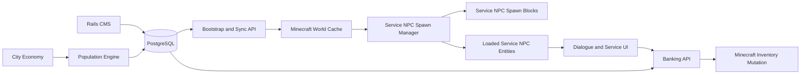
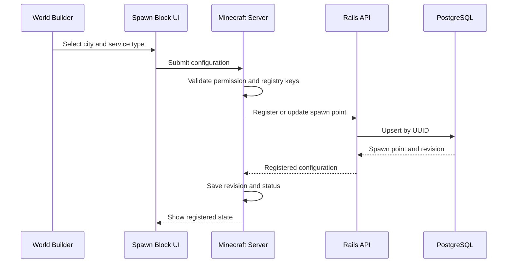
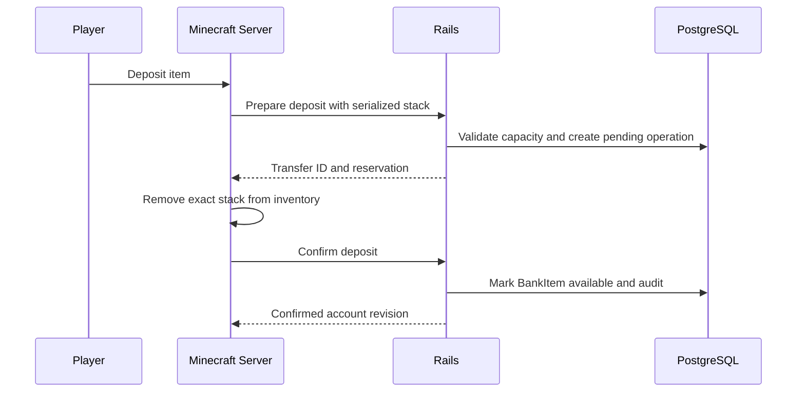

# UltimaCraft Persistent Banking, Service NPCs, Spawn Blocks, and City Population

## Cohesive Technical Design Specification

**Project:** UltimaCraft  
**Primary platforms:** Ruby on Rails 8, PostgreSQL, NeoForge 1.21.1  
**Document status:** Proposed architecture and implementation guide  
**Revision:** 2.0 — cohesive rewrite with the Service NPC Spawn Block system  
**Audience:** UltimaCraft maintainers, Rails developers, NeoForge developers, technical designers, and Codex  
**Primary objective:** Create a persistent, shard-aware banking and service-NPC platform in which Rails owns durable world records and economic decisions, while Minecraft owns loaded entities, real-time behavior, rendering, and player interaction.

---

# 1. Executive Summary

UltimaCraft needs a persistent banking system inspired by Ultima Online. Players must be able to deposit arbitrary custom items, preserve every gameplay-relevant item attribute, withdraw those items later, and maintain separate balances for gold, silver, and copper. A bank account must support a default capacity of **250 stones**. Each shard may choose either:

- **Global banking**, where all bank tellers on the shard open the same player account; or
- **City-local banking**, where each city maintains a separate account for the player.

A bank is opened by interacting with a persistent **Bank Teller**, implemented as a reusable **Service NPC**. The player first sees a dialogue screen based on the existing quest-giver interface. The initial bank teller dialogue offers:

1. Open my bank box
2. Create a bank check
3. Goodbye

The banking requirement exposes a broader persistence problem. Existing Minecraft entities can lose their names, identity, dialogue, and interaction behavior when chunks unload or entities are recreated. UltimaCraft also needs city populations and service roles to respond to economic conditions across multiple shards.

This design addresses those concerns with four major systems:

1. **Persistent World NPC records in Rails**
2. **A reusable Service NPC interaction framework in Minecraft**
3. **A UUID-backed Service NPC Spawn Block**
4. **A city population engine that assigns persistent NPCs to available spawn blocks**

The Service NPC Spawn Block is central to the design. It is a world-builder-authored block with a persistent UUID. Its configuration interface contains dropdowns for:

- City
- Service NPC type

The block itself is the physical service location. Rails stores a mirrored record for that block and may assign a persistent NPC to it. The UUID identifies the post, counter, office, altar, stable desk, or other service position—not the individual currently filling it.

This separation permits a block to remain in place while the assigned NPC changes. For example, the Britain bank counter can remain the same permanent location even if William the banker retires and Thomas becomes the new teller.

Rails is **not** intended to run real-time NPC movement, pathfinding, combat, animation, or per-tick artificial intelligence. Rails acts as the durable world-state and economic control plane:

- It stores who exists.
- It stores which city supports each NPC.
- It generates names and persistent identities.
- It determines which professions a city currently supports.
- It assigns service NPCs to registered spawn blocks.
- It stores bank ownership and transactions.
- It publishes bootstrap and incremental synchronization data.

Minecraft remains the active simulation runtime:

- It loads chunks.
- It creates and removes live entity instances.
- It performs movement and pathfinding.
- It renders NPCs and screens.
- It validates proximity and player interaction.
- It mutates Minecraft inventories.
- It reconstructs serialized items.
- It recreates service NPCs when chunks load.

This boundary scales substantially better than treating Rails as the per-tick brain for every NPC. PostgreSQL can persist hundreds of thousands of NPC records, while background jobs can update city populations in batches. Only the NPCs assigned to loaded or relevant world regions need to become active Minecraft entities.

---

# 2. Confirmed Product Requirements

## 2.1 Banking

The system must:

1. Support multiple shards.
2. Allow each shard to select `global` or `city_local` banking.
3. Create the effective bank account from player, shard, and optional city.
4. Store arbitrary custom item stacks persistently in Rails.
5. Preserve all item attributes required to reconstruct the exact item.
6. Remove a deposited item from the Minecraft inventory.
7. Add a withdrawn item back to the Minecraft inventory.
8. Prevent item duplication during retries, failures, and disconnects.
9. Enforce a default maximum bank weight of 250 stones.
10. Store gold, silver, and copper as balances rather than bank inventory rows.
11. Display those balances prominently in the banking interface.
12. Support creating Rails-backed bank checks.
13. Audit all movements of items and currency.
14. Treat Rails as the authority for bank ownership.

## 2.2 Service NPCs

The system must:

1. Generalize the current Quest Trader entity into a reusable Service NPC.
2. Preserve existing quest-giver behavior during migration.
3. Support bank tellers initially.
4. Support future guildmasters, stablemasters, healers, travel agents, town criers, innkeepers, and other service roles.
5. Use the existing quest-style dialogue screen as the starting visual language.
6. Load dialogue definitions from Rails-managed content.
7. Invoke typed service actions from dialogue options.
8. Preserve NPC names and identity across chunk unloading and server restarts.

## 2.3 Service NPC Spawn Blocks

The system must:

1. Add a new generic Service NPC Spawn Block.
2. Give every placed block a persistent UUID.
3. Store the block UUID in its block entity data.
4. Provide a configuration interface consistent with existing UltimaCraft spawn blocks.
5. Use a dropdown for city selection.
6. Use a dropdown for Service NPC type selection.
7. Avoid free-text city or service fields.
8. Register the block and its coordinates with Rails.
9. Permit Rails to assign a persistent NPC to the block.
10. Recreate the assigned NPC after chunk unloading or server restart.
11. Display registration and assignment status in the block interface.
12. Detect and repair accidental duplicate block UUIDs.

## 2.4 City Population

The system must:

1. Maintain population state for every city on every shard.
2. Generate persistent NPC identities and names.
3. Associate every generated NPC with a shard and city.
4. Determine profession demand from city economic conditions.
5. Match service-profession demand to available Service NPC Spawn Blocks.
6. Preserve existing NPC identities whenever staffing changes.
7. Publish population changes during bootstrap and periodic synchronization.
8. Support a five-minute Minecraft synchronization interval.
9. Avoid per-tick Rails simulation.

---

# 3. Architectural Position

## 3.1 Rails is the control plane, not the game loop

The phrase “Rails is the brain” is too broad and may lead to an unsafe implementation. The correct distinction is:

### Rails owns durable truth and slow-changing decisions

Rails owns:

- Shard configuration
- City configuration
- City economic snapshots
- Population calculations
- Persistent NPC identities
- NPC generated names
- NPC city and profession
- Service NPC type
- Dialogue content and service bindings
- Registered Service NPC Spawn Blocks
- NPC-to-spawn-block assignments
- Player bank accounts
- Serialized bank assets
- Currency balances
- Bank checks
- Audit ledgers
- Published world-state versions

### Minecraft owns real-time simulation

Minecraft owns:

- Loaded chunks
- Active entity instances
- Movement
- Pathfinding
- Animation
- Combat
- Local schedules that require tick-level behavior
- Player proximity checks
- Right-click interaction
- Client interfaces
- Inventory slot mutation
- Item reconstruction
- Temporary runtime state

Rails never needs to update an NPC every tick. A persistent NPC may have one database row for months while its Minecraft entity is repeatedly loaded and unloaded.

## 3.2 Why Rails remains appropriate at large scale

Tens or hundreds of thousands of NPC records are not inherently a reason to avoid Rails. The scale concern depends on workload.

A database row containing identity, city, profession, status, and assignment is inexpensive compared with simulating an entity every game tick. The architecture remains practical when it follows these rules:

- Population calculations run asynchronously and in batches.
- Queries are scoped by shard and city.
- Frequently filtered columns are indexed.
- World synchronization uses versions and deltas.
- Minecraft does not request every NPC on every interaction.
- Bootstrap payloads are shard-scoped and eventually region-scoped.
- Only visible or assigned NPCs are materialized as Minecraft entities.
- Rails processes economic decisions at minute-scale intervals, not tick intervals.
- Banking mutations use short, transactional API calls.
- Population logic is isolated behind a module boundary so it can be extracted later.

A separate population service may eventually be justified, but the first implementation should remain inside Rails as a well-bounded domain. Extraction should be a deployment decision, not a redesign.

## 3.3 Recommended deployment boundary

Use a modular monolith initially:

```text
Rails Application
├── World Content
├── NPC Registry
├── Spawn Point Registry
├── Population Engine
├── Dialogue and Services
├── Banking
├── World Synchronization
└── Administration
```

Keep each subsystem behind service objects, jobs, API serializers, and explicit interfaces. Do not allow controllers or Active Record callbacks to contain the population algorithm.

If scale later requires extraction, the likely first candidate is the population reconciliation worker—not banking and not the CMS.

---

# 4. Core Concepts and Terminology

## 4.1 World NPC

A persistent person in the UltimaCraft world.

A World NPC has:

- Stable UUID
- Name
- Shard
- Home city
- Profession
- Service NPC type when applicable
- Status
- Dialogue assignment
- Service capabilities
- Optional current spawn assignment

A World NPC exists even when no Minecraft entity is loaded.

## 4.2 Service NPC

A World NPC that exposes one or more player-facing services through the generic dialogue and service framework.

Examples:

- Bank Teller
- Guildmaster
- Stablemaster
- Healer
- Travel Agent
- Town Crier
- Innkeeper
- Quest Giver

## 4.3 Service NPC type

A stable content key describing the expected role at a Service NPC Spawn Block.

Examples:

```text
bank_teller
guildmaster
stablemaster
healer
travel_agent
town_crier
quest_giver
```

The type maps to:

- Required profession
- Default dialogue
- Allowed service actions
- Minecraft entity presentation
- Population staffing rule
- Spawn compatibility

## 4.4 Service NPC Spawn Block

A configurable Minecraft block representing one physical service position.

Examples:

- A bank counter
- A guild office desk
- A stable counter
- A healer shrine
- A ship booking desk

The block has a UUID and is registered with Rails.

The block itself is the service location. No additional abstract location concept is required in Minecraft.

## 4.5 Spawn point record

The Rails mirror of a placed Service NPC Spawn Block.

The record exists so Rails can:

- Know which physical service posts exist
- Associate them with a shard and city
- Know their service type
- Assign a persistent NPC
- Detect capacity shortages
- Publish assignments back to Minecraft

Recommended Rails model name:

```text
ServiceNpcSpawnPoint
```

## 4.6 Spawn assignment

A relationship between one World NPC and one Service NPC Spawn Point.

The block UUID remains stable when the assigned NPC changes.

## 4.7 Active entity

The temporary Minecraft entity representing a World NPC in a loaded chunk.

## 4.8 Abstract population

Population represented statistically rather than as a unique loaded entity.

## 4.9 Materialized population

Persistent named NPCs represented by World NPC rows and optionally assigned to Minecraft spawn points.

UltimaCraft may persist every named NPC while still avoiding simultaneous active entities for all of them.

---

# 5. High-Level Architecture



## 5.1 Data authority matrix

| Data | Rails authority | Minecraft authority |
|---|---:|---:|
| NPC identity | Yes | Cached copy |
| NPC name | Yes | Cached display |
| NPC profession | Yes | Cached display/behavior |
| Spawn block UUID | Mirrored | Generated and stored in block entity |
| Spawn coordinates | Mirrored | Source from world |
| Spawn assignment | Yes | Cached and enacted |
| Loaded entity | No | Yes |
| NPC movement | No | Yes |
| Dialogue definition | Yes | Cached renderer |
| Bank items | Yes | Temporary during transfer |
| Player inventory | No | Yes |
| Currency balances | Yes | Displayed copy |
| City economy | Yes | Optional display copy |
| Population target | Yes | No |
| Tick-level AI | No | Yes |

---

# 6. Shards, Cities, and Banking Policy

## 6.1 Shard model

Each shard is an independently configurable world and economy.

Suggested migration:

```ruby
create_table :shards do |t|
  t.uuid :public_id, null: false
  t.string :name, null: false
  t.string :key, null: false

  t.string :banking_mode, null: false, default: "global"
  t.decimal :default_bank_weight_limit,
            precision: 10,
            scale: 2,
            null: false,
            default: 250

  t.boolean :population_engine_enabled, null: false, default: true
  t.bigint :world_state_version, null: false, default: 1

  t.timestamps
end

add_index :shards, :public_id, unique: true
add_index :shards, :key, unique: true
```

Recommended banking modes:

```ruby
enum :banking_mode, {
  global: "global",
  city_local: "city_local"
}
```

## 6.2 Global banking

A player has one account per shard.

Identity:

```text
player + shard + city NULL
```

A teller in any city opens the same account.

## 6.3 City-local banking

A player has one account per city on the shard.

Identity:

```text
player + shard + city
```

The bank teller’s assigned city determines which account is opened.

Minecraft must not decide this policy. Rails resolves the effective account.

## 6.4 City model

Use the existing city model when available. Do not create a second city registry.

Required concepts:

- Stable public key
- Shard association
- Name
- Active state
- Economic state or access to the existing economy subsystem
- Population version

Example additions:

```ruby
add_column :cities, :public_id, :uuid, null: false
add_column :cities, :key, :string, null: false
add_column :cities, :population_version, :bigint, null: false, default: 1

add_index :cities, :public_id, unique: true
add_index :cities, [:shard_id, :key], unique: true
```

---

# 7. Service NPC Spawn Block System

## 7.1 Recommended name

Minecraft classes:

```text
ServiceNpcSpawnBlock
ServiceNpcSpawnBlockEntity
ServiceNpcSpawnMenu
ServiceNpcSpawnScreen
ServiceNpcSpawnBlockRenderer
```

Rails model:

```text
ServiceNpcSpawnPoint
```

API resources may use:

```text
service_npc_spawn_points
```

This wording is concrete. It avoids suggesting that Rails owns a separate imaginary building or room. The Rails record is simply the registered mirror of the block.

## 7.2 Why the block UUID identifies the post, not the NPC

Binding the block UUID directly and permanently to a World NPC creates unnecessary coupling.

Suppose the block at the Britain bank counter is permanently tied to William. When William is retired, displaced, or replaced, the world block must be rewritten. That makes population changes mutate Minecraft world configuration.

Instead:

```text
Spawn Block UUID -> Service NPC Spawn Point -> Current Spawn Assignment -> World NPC
```

The permanent object is the bank counter. The occupant may change.

Benefits:

- Economic changes can replace occupants without editing the world.
- Retired NPC identities remain historically intact.
- A vacant service post can remain visible and registered.
- Administrators can reassign an NPC from Rails.
- A new NPC can inherit the same physical work location.
- Population reconciliation does not need to rewrite block NBT.
- World builders place capacity; Rails fills that capacity.

## 7.3 Block entity state

The block entity should persist:

```java
UUID spawnPointId;
String cityKey;
String serviceNpcTypeKey;
boolean enabled;
long configurationRevision;
RegistrationState registrationState;
@Nullable UUID assignedNpcId;
long assignmentRevision;
@Nullable String lastErrorCode;
```

Coordinates, dimension, and orientation are derived from the Minecraft world but included in registration payloads.

Recommended registration states:

```text
UNCONFIGURED
PENDING_REGISTRATION
REGISTERED
PENDING_UPDATE
ERROR
DISABLED
```

`assignedNpcId` is a cached display and reconciliation field. Rails remains authoritative.

## 7.4 UUID generation

The Minecraft server generates the UUID when a genuinely new block is placed.

Rules:

1. UUID generation occurs server-side.
2. The UUID is stored in the block entity’s persistent data.
3. A normal placed block item must not carry an existing UUID.
4. Structure templates should strip UUIDs by default.
5. Pick-block and cloning should create a new UUID.
6. A copied NBT payload must be checked for collision.
7. The same UUID must not identify two coordinates simultaneously.

## 7.5 Duplicate UUID recovery

Duplicate UUIDs can occur through world editing tools, structure cloning, or manual data manipulation.

On registration, Rails compares:

- Shard
- Dimension
- Coordinates
- Existing active record

If the UUID is already active at another location, Rails returns:

```json
{
  "error": "spawn_point_uuid_conflict",
  "canonical_location": {
    "dimension": "minecraft:overworld",
    "x": 100,
    "y": 64,
    "z": 200
  },
  "replacement_uuid_required": true
}
```

Minecraft then:

1. Generates a new UUID for the conflicting block.
2. Saves it to the block entity.
3. Retries registration.
4. Shows the new registered state.

The original location retains the original identity.

## 7.6 Configuration interface

The block interface should follow existing UltimaCraft spawn block patterns.

### Editable fields

#### City dropdown

- Populated from the shard’s cached city registry.
- Displays city names.
- Stores stable city keys or public IDs.
- Does not permit free text.
- Filters out inactive cities unless an administrator enables them.
- Includes an unconfigured placeholder.

#### Service NPC type dropdown

- Populated from the cached Service NPC Type registry.
- Displays human-readable labels.
- Stores stable service type keys.
- Does not permit free text.
- Includes only types allowed to be spawned by this block.
- Initial values include Bank Teller.

#### Enabled toggle

- Determines whether the post may receive an assignment.
- Disabling the block does not delete its UUID.
- Rails is notified and the active assignment is suspended or removed.

### Read-only fields

- Spawn Point UUID
- Registration status
- Assigned NPC name
- Assigned NPC UUID
- Last successful synchronization
- Configuration revision
- Assignment revision
- Error message when registration fails

### Optional future fields

- Priority
- Shift or schedule key
- Facing override
- Interaction radius
- Indoor/outdoor tag
- Building key
- Required economic tier
- Multiple-position capacity

These should not be required for the first release.

## 7.7 Permissions

Only authorized players should edit the block.

Recommended:

- Server operator permission initially
- Dedicated permission node later
- Server-side validation on every configuration packet
- Distance check
- Block existence check
- Menu/container identity check

The client must not be trusted to assign arbitrary city or service type values.

## 7.8 Configuration save flow



If Rails is unavailable:

1. Save the local block configuration.
2. Mark registration as pending.
3. Queue a retry.
4. Do not invent a Rails assignment.
5. Permit the block interface to show the failure.
6. Re-register when connectivity returns.

## 7.9 Rails spawn point schema

```ruby
create_table :service_npc_spawn_points do |t|
  t.uuid :public_id, null: false

  t.references :shard, null: false, foreign_key: true
  t.references :city, null: false, foreign_key: true

  t.string :service_npc_type_key, null: false
  t.string :minecraft_server_key, null: false
  t.string :world_key, null: false
  t.string :dimension_key, null: false

  t.integer :x, null: false
  t.integer :y, null: false
  t.integer :z, null: false

  t.decimal :yaw, precision: 7, scale: 3
  t.decimal :pitch, precision: 7, scale: 3

  t.boolean :enabled, null: false, default: true
  t.string :status, null: false, default: "registered"

  t.bigint :configuration_revision, null: false, default: 1
  t.datetime :registered_at, null: false
  t.datetime :last_seen_at
  t.datetime :disabled_at
  t.datetime :removed_at

  t.jsonb :metadata, null: false, default: {}

  t.timestamps
end

add_index :service_npc_spawn_points, :public_id, unique: true

add_index :service_npc_spawn_points,
          [:shard_id, :city_id, :service_npc_type_key, :enabled],
          name: "idx_service_spawn_capacity"

add_index :service_npc_spawn_points,
          [:minecraft_server_key, :dimension_key, :x, :y, :z],
          unique: true,
          where: "removed_at IS NULL",
          name: "idx_active_service_spawn_coordinates"
```

The exact coordinate uniqueness policy must account for separate world instances if `world_key` is not sufficient.

## 7.10 Assignment schema

```ruby
create_table :npc_spawn_assignments do |t|
  t.uuid :public_id, null: false

  t.references :world_npc, null: false, foreign_key: true
  t.references :service_npc_spawn_point, null: false, foreign_key: true

  t.string :status, null: false, default: "active"
  t.bigint :revision, null: false, default: 1

  t.datetime :assigned_at, null: false
  t.datetime :unassigned_at
  t.string :assignment_reason
  t.jsonb :metadata, null: false, default: {}

  t.timestamps
end

add_index :npc_spawn_assignments, :public_id, unique: true

add_index :npc_spawn_assignments,
          :world_npc_id,
          unique: true,
          where: "status = 'active'",
          name: "idx_one_active_spawn_per_npc"

add_index :npc_spawn_assignments,
          :service_npc_spawn_point_id,
          unique: true,
          where: "status = 'active'",
          name: "idx_one_active_npc_per_spawn"
```

If future blocks support more than one NPC, introduce capacity and slot records rather than weakening these constraints.

## 7.11 Spawn point lifecycle

### Placement

1. Minecraft creates a new UUID.
2. Block begins in `UNCONFIGURED`.
3. Builder selects city and Service NPC type.
4. Minecraft registers with Rails.
5. Rails creates the spawn point.
6. Population reconciliation may assign an NPC.
7. Assignment is returned through immediate response or world sync.

### Configuration change

1. Builder changes city or type.
2. Minecraft increments local configuration revision.
3. Rails updates the spawn point.
4. Existing incompatible assignment is closed.
5. Population reconciliation evaluates the new requirement.
6. Minecraft removes the stale entity and creates the new assigned entity when available.

### Block break

1. Minecraft marks the block removed locally.
2. Minecraft sends a removal request.
3. Rails timestamps `removed_at`.
4. Active assignment is closed.
5. The World NPC remains persistent and may become unassigned, displaced, or available for another compatible spawn point.

If Rails is offline, Minecraft writes a durable removal tombstone and retries.

### Block disable

Disabling is not deletion. The record remains registered and can later be re-enabled.

### World move

Piston movement should be disabled for this block in the first release. Moving persistent infrastructure through pistons creates coordinate and registration ambiguity.

## 7.12 Registration API

### Create or update

```http
PUT /api/v1/service_npc_spawn_points/:uuid
```

Example request:

```json
{
  "shard_key": "britannia-primary",
  "minecraft_server_key": "prod-01",
  "world_key": "britannia",
  "dimension_key": "minecraft:overworld",
  "position": {
    "x": 142,
    "y": 68,
    "z": -315
  },
  "facing": {
    "yaw": 180.0,
    "pitch": 0.0
  },
  "city_key": "britain",
  "service_npc_type_key": "bank_teller",
  "enabled": true,
  "configuration_revision": 4
}
```

### Remove

```http
DELETE /api/v1/service_npc_spawn_points/:uuid
```

Deletion should create a tombstone rather than destroy the row.

### Read assignment

```http
GET /api/v1/service_npc_spawn_points/:uuid/assignment
```

Normal assignment delivery should use bootstrap or sync. This endpoint is useful for diagnostics and targeted recovery.

## 7.13 Chunk-load entity reconciliation

When a chunk containing a Service NPC Spawn Block loads:

1. Read the block UUID.
2. Confirm the block is configured.
3. Read the current cached assignment by spawn point UUID.
4. Search the local area for an entity with the assigned World NPC UUID.
5. If the correct entity exists, reconcile display and revision.
6. If no entity exists, spawn it.
7. If a stale entity exists for the block, remove it.
8. If duplicate entities exist for the same World NPC, keep one canonical instance.
9. Write NPC UUID, spawn point UUID, and assignment revision into the entity’s persistent data.

When the chunk unloads, the active entity may unload normally. No permanent identity is lost.

## 7.14 Entity-to-block behavior

The assigned entity should know its home spawn point UUID.

Minecraft may enforce:

- Home radius
- Return-to-post behavior
- Teleport-back recovery if pathfinding becomes irrecoverable
- Interaction only while assigned
- No natural despawn
- No conversion to unrelated vanilla entity state

Real-time behavior remains Minecraft-owned.

---

# 8. Persistent World NPC Model

## 8.1 Purpose

A World NPC record represents a persistent person, not an active entity.

It is independent of:

- Chunk state
- Minecraft entity ID
- Current server process
- Current spawn assignment
- Current dialogue screen
- A particular quest

## 8.2 Suggested schema

```ruby
create_table :world_npcs do |t|
  t.uuid :public_id, null: false

  t.references :shard, null: false, foreign_key: true
  t.references :city, null: false, foreign_key: true

  t.string :name, null: false
  t.string :normalized_name, null: false

  t.string :profession_key, null: false
  t.string :service_npc_type_key
  t.string :status, null: false, default: "active"

  t.string :dialogue_set_key
  t.jsonb :service_configuration, null: false, default: {}
  t.jsonb :traits, null: false, default: {}
  t.jsonb :metadata, null: false, default: {}

  t.datetime :generated_at, null: false
  t.datetime :activated_at
  t.datetime :displaced_at
  t.datetime :retired_at

  t.bigint :definition_revision, null: false, default: 1
  t.integer :lock_version, null: false, default: 0

  t.timestamps
end

add_index :world_npcs, :public_id, unique: true
add_index :world_npcs, [:shard_id, :city_id, :status]
add_index :world_npcs, [:city_id, :profession_key, :status]
add_index :world_npcs, [:city_id, :service_npc_type_key, :status]
```

Use existing Rails models and conventions if equivalent fields already exist.

## 8.3 Statuses

Recommended:

```text
planned
active
unassigned
displaced
inactive
retired
```

Do not hard-delete NPCs when city staffing declines.

## 8.4 Assets and portraits

Do not store portrait image binaries in the database.

UltimaCraft already stores relevant visual assets in Google Cloud Storage. Reuse the existing asset-resolution system. The NPC definition should store only the minimum key already required by the current quest interface, if any.

Do not create a new portrait table as part of this feature.

The persistent name is mandatory. Additional visual keys are implementation-dependent and should reuse existing content systems.

---

# 9. Ultima Online Name Generation

## 9.1 Source

Import names from the original Ultima Online XML source into Rails.

The Minecraft server should not independently parse the XML for normal operation.

## 9.2 Name records

```ruby
create_table :npc_names do |t|
  t.string :value, null: false
  t.string :normalized_value, null: false

  t.string :gender_key
  t.string :culture_key
  t.string :source_key, null: false, default: "ultima_online_xml"

  t.boolean :active, null: false, default: true
  t.jsonb :metadata, null: false, default: {}

  t.timestamps
end

add_index :npc_names,
          [:source_key, :normalized_value],
          unique: true
```

Only add gender or culture dimensions if the XML or current design supports them.

## 9.3 Generation rules

1. Generate a name when creating a new World NPC.
2. Persist the selected value on the World NPC.
3. Never regenerate an existing NPC’s name during spawn.
4. Never regenerate merely because the NPC changes posts.
5. Perform uniqueness selection transactionally.
6. Use shard- or city-scoped uniqueness according to available name volume.
7. Make random selection seedable for tests.

Recommended first policy:

```text
Unique among active NPCs on the same shard, with fallback to city-scoped uniqueness if the source list is too small.
```

## 9.4 Import service

```ruby
Npcs::Names::ImportUltimaXml
Npcs::Names::Select
Npcs::Generate
```

The importer should be idempotent.

---

# 10. Service NPC Type Registry

## 10.1 Purpose

A Service NPC type connects:

- Spawn block configuration
- Population requirements
- NPC profession
- Default dialogue
- Allowed services
- Minecraft presentation
- Compatibility validation

## 10.2 Suggested schema

```ruby
create_table :service_npc_types do |t|
  t.string :key, null: false
  t.string :display_name, null: false

  t.string :profession_key, null: false
  t.string :default_dialogue_set_key
  t.string :minecraft_entity_type_key, null: false

  t.jsonb :service_keys, null: false, default: []
  t.jsonb :default_configuration, null: false, default: {}

  t.boolean :spawnable, null: false, default: true
  t.boolean :active, null: false, default: true

  t.timestamps
end

add_index :service_npc_types, :key, unique: true
```

Initial bank teller definition:

```yaml
key: bank_teller
display_name: Bank Teller
profession_key: banker
default_dialogue_set_key: bank_teller_default
minecraft_entity_type_key: ultimacraft:service_npc
service_keys:
  - bank.open
  - bank.create_check
```

## 10.3 Registry synchronization

Service NPC types are included in bootstrap.

The block dropdown uses the cached registry. Rails validates every submitted key.

---

# 11. Service NPC Entity Framework

## 11.1 Refactor direction

Do not create a unique base entity for every service unless behavior truly requires it.

Prefer composition:

```text
ServiceNpcEntity
  + WorldNpcDefinition
  + ServiceCapabilities
  + DialogueDefinition
  + Runtime AI Goal Set
```

A single generic entity can support many roles.

Specialized Java subclasses are acceptable only where rendering, animation, or AI is materially different.

## 11.2 Entity persistent data

Store:

```text
world_npc_public_id
service_spawn_point_public_id
spawn_assignment_public_id
definition_revision
assignment_revision
service_npc_type_key
```

Do not store authoritative bank balances or bank items in entity NBT.

## 11.3 Minecraft components

Recommended:

```text
ServiceNpcEntity
ServiceNpcDefinition
ServiceNpcTypeDefinition
NpcServiceDispatcher
NpcDialogueController
NpcInteractionHandler
NpcEntityReconciler
ServiceNpcSpawnManager
```

## 11.4 Interaction flow

1. Player right-clicks the entity.
2. Server validates that the entity has an active assignment.
3. Server validates player distance and state.
4. Server loads the cached World NPC and dialogue definition.
5. Client opens the dialogue screen.
6. Player selects an option.
7. Server dispatches the typed action.
8. Dynamic services call Rails as required.

---

# 12. Dialogue and Service Actions

## 12.1 Generalization of quest dialogue

The existing quest dialogue system should be generalized rather than duplicated.

A dialogue option may:

- Navigate to another node
- Invoke a quest action
- Invoke a service action
- Close the conversation

Suggested concepts:

```text
DialogueSet
DialogueNode
DialogueOption
DialogueCondition
DialogueEffect
```

Reuse existing tables where practical.

## 12.2 Suggested option fields

```ruby
create_table :dialogue_options do |t|
  t.references :dialogue_node, null: false, foreign_key: true
  t.references :next_dialogue_node,
               foreign_key: { to_table: :dialogue_nodes }

  t.string :label, null: false
  t.string :action_type, null: false
  t.string :service_key
  t.jsonb :action_payload, null: false, default: {}
  t.jsonb :conditions, null: false, default: {}
  t.integer :position, null: false, default: 0

  t.timestamps
end
```

Action types:

```text
navigate
quest_action
invoke_service
close
```

## 12.3 Service registry

Stable service keys:

```text
bank.open
bank.create_check
guild.create
guild.manage
stable.deposit_pet
stable.withdraw_pet
healer.resurrect
travel.book_passage
town_crier.read_news
inn.rent_room
quest.list
quest.continue
```

Rails validates content assignments.

Minecraft maps known service keys to handlers. Unknown keys are disabled and logged, not executed dynamically.

## 12.4 Bank teller dialogue

```yaml
key: bank_teller_default
entry_node: greeting

nodes:
  greeting:
    body: "Welcome to the bank of %{city_name}. How may I assist you?"
    options:
      - label: "Open my bank box."
        action_type: invoke_service
        service_key: bank.open

      - label: "I would like to create a bank check."
        action_type: invoke_service
        service_key: bank.create_check

      - label: "Goodbye."
        action_type: close
```

## 12.5 Dialogue interface

Reuse the quest-giver screen structure:

- NPC portrait or existing GCS-resolved visual on the left
- NPC name and profession
- Dialogue text in the center
- Action options on the right or bottom

Initial dialogue definitions should be cached. Banking data remains on-demand.

---

# 13. City Population Engine

## 13.1 Responsibilities

The population engine determines:

- How many NPCs a city supports
- Which professions are required
- Which persistent NPCs should exist
- Which Service NPC Spawn Blocks should be occupied
- Which existing NPCs should remain assigned
- Which NPCs become unassigned or displaced

It does not control movement or tick-level behavior.

## 13.2 Scale model

Three separate counts should be recognized:

1. **Resident population** — economic/statistical population
2. **Persistent NPC population** — named World NPC records
3. **Active entity population** — currently loaded Minecraft entities

These counts may differ.

A city can have:

```text
10,000 residents
1,200 persistent named NPCs
75 active loaded entities
```

This separation is essential for scale.

If UltimaCraft ultimately requires every resident to have a persistent name and record, PostgreSQL can store those rows. Minecraft should still activate only the relevant subset.

## 13.3 Population state

```ruby
create_table :city_population_states do |t|
  t.references :city, null: false, foreign_key: true

  t.integer :resident_population, null: false, default: 0
  t.integer :persistent_npc_population, null: false, default: 0
  t.integer :assigned_service_population, null: false, default: 0

  t.jsonb :profession_counts, null: false, default: {}
  t.jsonb :service_counts, null: false, default: {}
  t.jsonb :economic_inputs_snapshot, null: false, default: {}
  t.jsonb :calculation_details, null: false, default: {}

  t.bigint :version, null: false, default: 1
  t.datetime :calculated_at

  t.timestamps
end

add_index :city_population_states, :city_id, unique: true
```

## 13.4 Economic inputs

The engine may consider:

- Food supply
- Housing capacity
- Wealth
- Trade volume
- Wood supply
- Metal supply
- Security
- Player activity
- Business count
- Civic tier
- Existing infrastructure
- Available spawn block capacity

Use existing city economy models. Do not duplicate economic truth into unrelated JSON unless it is a versioned snapshot for reproducibility.

## 13.5 Staffing rules

```ruby
create_table :city_staffing_rules do |t|
  t.string :key, null: false
  t.string :service_npc_type_key, null: false
  t.string :profession_key, null: false

  t.integer :minimum_count, null: false, default: 0
  t.integer :maximum_count
  t.integer :residents_per_npc

  t.integer :priority, null: false, default: 0
  t.jsonb :economic_requirements, null: false, default: {}
  t.boolean :active, null: false, default: true

  t.timestamps
end

add_index :city_staffing_rules, :key, unique: true
```

Example:

```yaml
key: civic_banker
service_npc_type_key: bank_teller
profession_key: banker
minimum_count: 1
maximum_count: 3
residents_per_npc: 2500
priority: 100
economic_requirements:
  minimum_civic_tier: 1
```

## 13.6 Spawn capacity

The physical world limits how many service NPCs can be assigned.

For each city and Service NPC type:

```text
desired staffing
available enabled spawn blocks
currently assigned compatible NPCs
```

Assignment capacity:

```text
assignable count = min(desired staffing, available compatible spawn blocks)
```

If desired staffing exceeds available blocks, Rails records a capacity deficit for administrators.

If blocks exceed desired staffing, lower-priority posts remain vacant.

## 13.7 Reconciliation algorithm

For each city:

1. Read the latest economic snapshot.
2. Calculate desired staffing by Service NPC type.
3. Load enabled compatible spawn points.
4. Load existing active assignments.
5. Preserve compatible assignments whenever possible.
6. Fill vacant required posts with existing unassigned NPCs.
7. Reactivate displaced NPCs before generating replacements.
8. Generate new World NPCs only when necessary.
9. Close surplus assignments according to stability policy.
10. Update population state.
11. Publish world-state changes.
12. Increment city and shard versions.

Pseudo-code:

```ruby
class Population::ReconcileCity
  def call(city:)
    desired = Population::DesiredStaffing.call(city:)
    capacity = Population::SpawnCapacity.call(city:)
    current = Population::CurrentAssignments.call(city:)

    plan = Population::PlanAssignments.call(
      city:,
      desired:,
      capacity:,
      current:
    )

    Population::ApplyPlan.call(city:, plan:)
    WorldState::PublishPopulationChanges.call(city:)
  end
end
```

## 13.8 Assignment stability policy

Avoid making the city feel as though every employee changes every few minutes.

When staffing declines:

1. Remove invalid assignments.
2. Preserve long-standing compatible occupants.
3. Unassign planned or newly created NPCs first.
4. Move an NPC only if another city has a compatible vacancy.
5. Mark displaced before retired.
6. Retire only under an explicit lifecycle policy.

When staffing grows:

1. Reassign unassigned local NPCs.
2. Reactivate displaced NPCs.
3. Generate a new NPC as the final option.

## 13.9 Scheduling

Recommended:

- Economic snapshot cadence: use the existing economy cadence
- Population reconciliation: every 15 minutes
- Minecraft world-version poll: every 5 minutes
- Immediate reconciliation after a spawn block registration may be queued
- Manual reconciliation from Rails administration

The five-minute sync is a version check, not a full population recomputation.

## 13.10 Job execution

Use the project’s established Rails job system. Encapsulate jobs so execution can later move to dedicated workers.

Recommended jobs:

```text
Population::ReconcileShardJob
Population::ReconcileCityJob
SpawnPoints::ReconcileAssignmentsJob
WorldState::PruneChangesJob
```

Use per-shard or per-city locking to prevent overlapping reconciliation.

---

# 14. Bootstrap and Incremental Synchronization

## 14.1 Synchronization categories

### Static or slowly changing definitions

- Cities
- Service NPC types
- Service keys
- Published dialogue
- Item serialization schema versions
- Shard banking mode

### Persistent world state

- World NPC definitions
- Service NPC Spawn Points
- Spawn assignments
- Population presentation state

### Player-specific transactional state

- Bank account
- Bank items
- Currency balances
- Bank checks
- Pending transfers

Player-specific data is never included in world bootstrap.

## 14.2 Bootstrap endpoint

```http
GET /api/v1/world_bootstrap
```

Request context:

```text
authenticated Minecraft server
shard key
Minecraft server key
supported schema versions
last local snapshot version
```

Example response:

```json
{
  "schema_version": 2,
  "shard": {
    "key": "britannia-primary",
    "banking_mode": "city_local",
    "default_bank_weight_limit": "250.0",
    "world_state_version": 1847
  },
  "cities": [],
  "service_npc_types": [],
  "service_definitions": [],
  "dialogue_sets": [],
  "world_npcs": [],
  "service_npc_spawn_points": [],
  "spawn_assignments": [],
  "generated_at": "2026-07-14T17:00:00Z"
}
```

## 14.3 Scale-aware bootstrap

A full shard bootstrap is acceptable for the first vertical slice if the data volume is modest. The API contract should still permit partitioning.

Future-compatible options:

```http
GET /api/v1/world_bootstrap?region_key=britain
GET /api/v1/world_bootstrap?dimension_key=minecraft:overworld
GET /api/v1/world_regions/:region_key/state
```

For very large populations, bootstrap should include:

- All registries required for dropdowns and dialogue
- Active service spawn points for this Minecraft server
- Assigned NPCs for those spawn points
- Not every unassigned NPC on the shard

The population engine may store hundreds of thousands of records without sending them all to Minecraft.

## 14.4 Incremental world sync

```http
GET /api/v1/world_sync?since_version=1842
```

Example:

```json
{
  "from_version": 1842,
  "to_version": 1847,
  "changes": [
    {
      "type": "service_spawn_point.updated",
      "id": "uuid",
      "revision": 4,
      "payload": {}
    },
    {
      "type": "spawn_assignment.created",
      "id": "uuid",
      "revision": 1,
      "payload": {}
    },
    {
      "type": "world_npc.updated",
      "id": "uuid",
      "revision": 7,
      "payload": {}
    },
    {
      "type": "dialogue_set.updated",
      "key": "bank_teller_default",
      "revision": 9,
      "payload": {}
    }
  ]
}
```

If the delta is no longer available:

```json
{
  "full_bootstrap_required": true,
  "current_version": 1847
}
```

## 14.5 World-state changes

```ruby
create_table :world_state_changes do |t|
  t.references :shard, null: false, foreign_key: true

  t.bigint :version, null: false
  t.string :change_type, null: false
  t.string :resource_type, null: false

  t.uuid :resource_public_id
  t.string :resource_key
  t.bigint :resource_revision

  t.jsonb :payload, null: false, default: {}

  t.timestamps
end

add_index :world_state_changes,
          [:shard_id, :version],
          unique: true
```

Version increments and change insertion must occur atomically.

## 14.6 Minecraft cache

Recommended components:

```text
WorldDefinitionCache
WorldBootstrapClient
WorldSyncClient
WorldStateReconciler
ServiceNpcTypeRegistry
DialogueRegistry
SpawnPointRegistry
SpawnAssignmentRegistry
WorldNpcRegistry
```

Write the last successful snapshot to local disk.

If Rails is unavailable during startup:

- Load the most recent valid snapshot.
- Render cached Service NPCs.
- Permit cached static dialogue.
- Disable transactional services such as banking.
- Display a diegetic service-unavailable message.

---

# 15. Banking Domain

## 15.1 Bank account model

```ruby
create_table :bank_accounts do |t|
  t.uuid :public_id, null: false

  t.references :player, null: false, foreign_key: true
  t.references :shard, null: false, foreign_key: true
  t.references :city, foreign_key: true

  t.decimal :weight_limit,
            precision: 10,
            scale: 2,
            null: false,
            default: 250

  t.decimal :cached_weight,
            precision: 12,
            scale: 4,
            null: false,
            default: 0

  t.string :status, null: false, default: "active"
  t.integer :lock_version, null: false, default: 0

  t.timestamps
end

add_index :bank_accounts, :public_id, unique: true

add_index :bank_accounts,
          [:player_id, :shard_id],
          unique: true,
          where: "city_id IS NULL",
          name: "idx_global_bank_accounts_unique"

add_index :bank_accounts,
          [:player_id, :shard_id, :city_id],
          unique: true,
          where: "city_id IS NOT NULL",
          name: "idx_city_bank_accounts_unique"
```

## 15.2 Account resolution

```ruby
class Banking::ResolveAccount
  def call(player:, shard:, city:)
    case shard.banking_mode
    when "global"
      BankAccount.find_or_create_by!(
        player:,
        shard:,
        city: nil
      )
    when "city_local"
      raise MissingCity if city.nil?

      BankAccount.find_or_create_by!(
        player:,
        shard:,
        city:
      )
    else
      raise UnsupportedBankingMode
    end
  end
end
```

## 15.3 Bank item model

```ruby
create_table :bank_items do |t|
  t.uuid :public_id, null: false
  t.references :bank_account, null: false, foreign_key: true

  t.string :item_registry_key, null: false
  t.string :payload_format, null: false
  t.integer :serialization_version, null: false

  t.integer :quantity, null: false
  t.decimal :unit_weight, precision: 12, scale: 4, null: false
  t.decimal :total_weight, precision: 12, scale: 4, null: false

  t.string :display_name
  t.string :fingerprint, null: false
  t.string :status, null: false, default: "deposit_pending"

  t.jsonb :item_summary, null: false, default: {}
  t.jsonb :item_payload

  t.binary :binary_payload

  t.datetime :deposited_at
  t.datetime :withdrawn_at

  t.integer :lock_version, null: false, default: 0
  t.timestamps
end

add_index :bank_items, :public_id, unique: true
add_index :bank_items, [:bank_account_id, :status]
add_index :bank_items, :fingerprint
```

Choose either JSON or binary payload according to the canonical NeoForge serializer. Do not populate both without a reason.

## 15.4 Item serialization authority

Minecraft is responsible for serializing and reconstructing an ItemStack because it has the mod registry and data component codecs.

Rails stores:

- Versioned canonical payload
- Registry key
- Quantity
- Weight
- Search/display summary
- Fingerprint
- Transfer status

Rails should treat custom item payload contents as mostly opaque.

For NeoForge 1.21.1, use the project’s registry-aware ItemStack codec or equivalent complete serialization path. Do not manually select a small subset of NBT fields if that would omit custom data components.

The serializer must preserve:

- Registry identity
- Stack count
- Data components
- Custom data
- Custom name
- Lore
- Damage and durability
- Enchantments
- Quality
- Crafter
- Hue
- Blessed or insured state
- Custom wine attributes
- Any UltimaCraft-specific components
- Serialization schema version

## 15.5 Exactness test

The required invariant is semantic round-trip equality:

```text
original ItemStack
-> canonical serialization
-> Rails persistence
-> canonical deserialization
-> equivalent ItemStack
```

Tests must compare every gameplay-relevant component, not merely registry key and count.

## 15.6 Deposit restrictions

Define explicit rules for:

- Nested containers
- Quest-bound items
- Soulbound items
- Temporary items
- Unsupported mod items
- Oversized payloads
- Currency items
- Bank checks
- Corrupt serialization versions

Currency items bypass BankItem storage.

## 15.7 Weight

Default account limit:

```text
250 stones
```

Currency balances consume no bank weight.

Rails validates:

```text
current reserved weight + deposit weight <= weight limit
```

Weight must be derived from trusted server logic and validated against known constraints. Reject negative, non-finite, or implausible values.

Long term, share a versioned item-weight registry between Rails and Minecraft. In the first release, authenticated Minecraft server calculations are acceptable if all requests are signed and audited.

---

# 16. Currency Balances

## 16.1 Model

```ruby
create_table :bank_currency_balances do |t|
  t.references :bank_account, null: false, foreign_key: true

  t.string :currency_key, null: false
  t.bigint :amount, null: false, default: 0

  t.integer :lock_version, null: false, default: 0
  t.timestamps
end

add_index :bank_currency_balances,
          [:bank_account_id, :currency_key],
          unique: true,
          name: "idx_bank_currency_balance_unique"

add_check_constraint :bank_currency_balances,
                     "amount >= 0",
                     name: "bank_currency_amount_nonnegative"
```

Initial keys:

```text
gold
silver
copper
```

Use integers.

## 16.2 Coin deposit

When a player transfers a supported coin item into the bank:

1. Minecraft identifies the currency key.
2. Minecraft identifies the stack amount.
3. Rails prepares a currency deposit.
4. Minecraft removes the exact stack.
5. Rails confirms and increments the balance.
6. No BankItem row is created.
7. The UI updates the total.

## 16.3 Coin withdrawal

The player chooses:

- Currency
- Amount

Rails reserves the amount. Minecraft creates the appropriate physical coin stacks and inserts them into the inventory. Rails confirms only after successful insertion.

Do not drop currency into the world automatically when the player inventory is full.

## 16.4 Currency conversion

Gold, silver, and copper remain separate balances unless the game explicitly defines exchange rates.

Do not silently normalize all denominations to a single base currency without a separate design decision.

---

# 17. Bank Checks

## 17.1 Purpose

A bank check converts account currency into a portable physical value instrument.

Recommended first release:

- Gold checks only
- Configurable minimum and maximum
- Rails-backed UUID
- Single redemption
- Displayed amount is not authoritative

## 17.2 Model

```ruby
create_table :bank_checks do |t|
  t.uuid :public_id, null: false

  t.references :bank_account, null: false, foreign_key: true
  t.references :issued_to_player,
               null: false,
               foreign_key: { to_table: :players }

  t.references :redeemed_by_player,
               foreign_key: { to_table: :players }

  t.string :currency_key, null: false, default: "gold"
  t.bigint :amount, null: false
  t.string :status, null: false, default: "issued"

  t.datetime :issued_at, null: false
  t.datetime :redeemed_at
  t.datetime :cancelled_at
  t.datetime :voided_at

  t.timestamps
end

add_index :bank_checks, :public_id, unique: true
add_check_constraint :bank_checks, "amount > 0"
```

Statuses:

```text
reserved
issued
redeemed
cancelled
voided
```

## 17.3 Physical item

The item stores:

```json
{
  "check_id": "uuid",
  "display_currency": "gold",
  "display_amount": 5000,
  "issuer_name": "Bank of Britain"
}
```

Rails validates the UUID and status during redemption.

---

# 18. Banking Transaction Protocol

## 18.1 Why prepare-confirm-cancel is required

Rails and Minecraft cannot share one database transaction.

A bank deposit changes:

- Rails ownership state
- Minecraft inventory state

A safe protocol must represent the in-between state.

## 18.2 Transfer operation model

```ruby
create_table :bank_transfer_operations do |t|
  t.uuid :public_id, null: false

  t.references :bank_account, null: false, foreign_key: true
  t.references :player, null: false, foreign_key: true
  t.references :world_npc, foreign_key: true

  t.string :operation_type, null: false
  t.string :status, null: false, default: "prepared"
  t.string :idempotency_key, null: false

  t.uuid :bank_item_public_id
  t.uuid :bank_check_public_id
  t.string :currency_key
  t.bigint :currency_amount

  t.jsonb :request_payload, null: false, default: {}
  t.jsonb :result_payload, null: false, default: {}

  t.datetime :expires_at, null: false
  t.datetime :confirmed_at
  t.datetime :cancelled_at

  t.timestamps
end

add_index :bank_transfer_operations, :public_id, unique: true

add_index :bank_transfer_operations,
          [:bank_account_id, :idempotency_key],
          unique: true,
          name: "idx_bank_transfer_idempotency"
```

Statuses:

```text
prepared
confirmed
cancelled
expired
reconciliation_required
```

## 18.3 Item deposit



If inventory removal fails, Minecraft cancels the operation.

## 18.4 Item withdrawal

1. Rails reserves the available BankItem.
2. Minecraft reconstructs the ItemStack.
3. Minecraft inserts it into inventory.
4. Minecraft confirms.
5. Rails marks the item withdrawn.

If reconstruction or insertion fails, Minecraft cancels and Rails restores availability.

## 18.5 Durable transfer receipt

Before inserting a withdrawn item, Minecraft should persist a local transfer receipt. If the server crashes after insertion but before Rails confirmation, startup reconciliation can resume the confirmation rather than making the item available twice.

Recommended local receipt data:

```text
transfer UUID
player UUID
operation type
item fingerprint
inventory mutation state
created timestamp
confirmation state
```

## 18.6 Idempotency

Every mutating request includes an idempotency key.

A retry returns the original result.

Do not create a second transfer for the same key.

---

# 19. Bank Audit Ledger

Every movement of value creates an immutable audit record.

```ruby
create_table :bank_transactions do |t|
  t.uuid :public_id, null: false

  t.references :bank_account, null: false, foreign_key: true
  t.references :player, null: false, foreign_key: true
  t.references :world_npc, foreign_key: true

  t.string :transaction_type, null: false
  t.string :resource_type, null: false

  t.uuid :resource_public_id
  t.string :currency_key
  t.bigint :currency_amount
  t.decimal :weight_delta, precision: 12, scale: 4

  t.string :idempotency_key
  t.jsonb :metadata, null: false, default: {}

  t.datetime :occurred_at, null: false
  t.timestamps
end

add_index :bank_transactions, :public_id, unique: true
add_index :bank_transactions, [:bank_account_id, :occurred_at]
```

Transaction types:

```text
item_deposited
item_withdrawn
currency_deposited
currency_withdrawn
check_issued
check_redeemed
transfer_recovered
admin_adjustment
```

---

# 20. Banking API

## 20.1 Open bank

```http
POST /api/v1/banking/open
```

Request:

```json
{
  "shard_key": "britannia-primary",
  "player_public_id": "player-uuid",
  "world_npc_public_id": "npc-uuid",
  "spawn_point_public_id": "spawn-uuid"
}
```

Rails validates:

- Minecraft server authentication
- Shard access
- Player identity
- Active World NPC
- Active spawn assignment
- Spawn point identity
- City consistency
- `bank.open` capability
- Effective account policy

Response:

```json
{
  "bank_account_public_id": "uuid",
  "banking_mode": "city_local",
  "city": {
    "key": "britain",
    "name": "Britain"
  },
  "weight": {
    "current": "148.5000",
    "limit": "250.0000"
  },
  "currencies": {
    "gold": 12450,
    "silver": 318,
    "copper": 91
  },
  "items": [],
  "account_revision": 44
}
```

Use pagination or cursor loading for large item collections.

## 20.2 Suggested endpoints

```text
POST /api/v1/banking/open

POST /api/v1/banking/item_deposits/prepare
POST /api/v1/banking/item_deposits/:transfer_id/confirm
POST /api/v1/banking/item_deposits/:transfer_id/cancel

POST /api/v1/banking/item_withdrawals/prepare
POST /api/v1/banking/item_withdrawals/:transfer_id/confirm
POST /api/v1/banking/item_withdrawals/:transfer_id/cancel

POST /api/v1/banking/currency_deposits/prepare
POST /api/v1/banking/currency_deposits/:transfer_id/confirm
POST /api/v1/banking/currency_deposits/:transfer_id/cancel

POST /api/v1/banking/currency_withdrawals/prepare
POST /api/v1/banking/currency_withdrawals/:transfer_id/confirm
POST /api/v1/banking/currency_withdrawals/:transfer_id/cancel

POST /api/v1/banking/checks/prepare
POST /api/v1/banking/checks/:transfer_id/confirm
POST /api/v1/banking/checks/:transfer_id/cancel

POST /api/v1/banking/checks/:check_id/redeem
```

---

# 21. Client Interfaces

## 21.1 Bank teller dialogue

The dialogue view displays:

- Existing GCS-resolved NPC portrait or role visual
- Persistent NPC name
- Profession
- Dialogue body
- Three choices

Choices:

1. Open my bank box
2. Create a bank check
3. Goodbye

## 21.2 Bank box

### Header

- Bank name
- City name in city-local mode
- Teller name

### Currency panel

- Gold
- Silver
- Copper
- Withdraw controls
- Create check action

### Weight panel

```text
148.5 / 250 stones
```

### Item vault

- Scrollable grid
- Search
- Sort
- Stack counts
- Tooltips from item summary
- Pending-state indicators

### Player inventory

- Inventory grid
- Hotbar
- Shift-click and drag transfer support

Currency stacks automatically route to balances.

## 21.3 Bank check interface

- Current gold balance
- Amount input
- Minimum
- Maximum
- Confirm
- Cancel

The check action is transactional.

## 21.4 Service NPC Spawn Block interface

Recommended layout:

```text
Service NPC Spawn Point

City:
[ Britain                    v ]

Service NPC Type:
[ Bank Teller                v ]

Enabled:
[ Yes ]

Spawn Point ID:
9b116d0a-...

Registration:
Registered

Assigned NPC:
William the Banker

Last Sync:
2 minutes ago

[ Save Configuration ]
```

Dropdown values are supplied by the cached Rails bootstrap registry.

---

# 22. Security and Trust Boundaries

## 22.1 Minecraft server authentication

Use:

- TLS
- Per-server credentials
- Shard-scoped authorization
- HMAC signatures or equivalent authenticated requests
- Request timestamps
- Idempotency keys
- Replay protection where required

## 22.2 Player identity

Use stable player UUIDs and existing account linkage.

Never key banking by mutable username.

## 22.3 Spawn block requests

Rails validates:

- Authenticated Minecraft server
- Server owns the target shard/world
- City belongs to the shard
- Service NPC type is active and spawnable
- Configuration revision is valid
- Coordinates do not conflict
- UUID is not active elsewhere

## 22.4 Banking requests

Rails validates:

- NPC exists and is active
- Spawn assignment is current
- Spawn point is enabled
- NPC offers the requested service
- Player is interacting through a trusted server
- Item payload size and version
- Weight and quantity constraints
- Account status
- Currency availability

Minecraft validates:

- Player proximity
- Entity identity
- Menu session
- Inventory mutation
- Item reconstruction

## 22.5 Payload limits

Define:

- Maximum serialized item size
- Maximum custom text lengths
- Maximum nested data size
- Maximum stack quantity
- Supported schema versions
- Allowed content types

---

# 23. Failure Recovery

## 23.1 Rails unavailable

Service NPCs may still appear from cached data.

Allowed:

- Entity rendering
- Cached name
- Cached static dialogue
- Non-authoritative local navigation

Unavailable:

- Open bank
- Deposit
- Withdraw
- Create check
- Redeem check
- Any transactional economic service

Suggested dialogue:

> “I am unable to access the ledgers at present. Please return shortly.”

## 23.2 Spawn registration unavailable

The block remains locally configured and displays `PENDING_REGISTRATION`.

Minecraft retries with backoff.

Do not spawn an invented NPC assignment.

## 23.3 Missing block

If Rails has an active spawn point that has not been observed for a configurable period:

- Mark it stale.
- Do not immediately delete it.
- Surface it in administration.
- Require a removal tombstone or extended timeout before closing the assignment automatically.

## 23.4 Missing assignment entity

Chunk reconciliation respawns it.

## 23.5 Duplicate entity

Keep the entity matching:

- Current World NPC UUID
- Current spawn point UUID
- Highest current assignment revision

Remove stale duplicates and log.

## 23.6 Expired bank transfer

### Deposit

If removal was never confirmed, cancel the pending BankItem.

### Withdrawal

If insertion may have occurred, mark reconciliation required. Do not automatically make the BankItem available.

Use the durable Minecraft transfer receipt to resolve.

## 23.7 Weight reconciliation

A job recalculates account weight from available and reserved items.

Differences create an audited correction and alert.

---

# 24. Rails Administration

## 24.1 Service NPC Spawn Points

Admin capabilities:

- Filter by shard, city, type, status
- View UUID and coordinates
- View registration revision
- View last seen time
- View assigned NPC
- Disable or enable
- Close stale points
- Detect UUID conflicts
- View capacity deficits

## 24.2 World NPCs

- Search by name or UUID
- Filter by shard, city, profession, type, status
- View current assignment
- View dialogue
- View services
- Unassign
- Displace
- Retire
- Inspect history

## 24.3 Population

- View economic inputs
- View desired staffing
- View physical spawn capacity
- View assignment plan
- Preview reconciliation
- Run reconciliation
- View deficits and vacancies
- View version changes

## 24.4 Dialogue and services

- Edit reusable dialogue
- Bind typed service actions
- Preview bank teller conversation
- Publish revisions
- Roll back

## 24.5 Banking

- View account summary
- View weight and currencies
- View item summaries
- View audit ledger
- View pending transfers
- Resolve reconciliation cases
- Perform audited adjustments

Access to player bank contents must be permissioned and logged.

---

# 25. Observability

## 25.1 Metrics

Track:

- Registered Service NPC Spawn Blocks
- Spawn points by city and type
- Pending registrations
- Stale spawn points
- UUID conflicts
- Assignment vacancies
- Capacity deficits
- Active persistent NPCs by city
- Active loaded service entities
- Duplicate entity repairs
- Population reconciliation duration
- Population changes per run
- World sync lag
- Bootstrap size and duration
- Bank-open latency
- Deposit success rate
- Withdrawal success rate
- Transfer expirations
- Reconciliation-required transfers
- Weight mismatches
- Check issuance and redemption
- Authentication failures

## 25.2 Structured fields

```text
shard_key
city_key
minecraft_server_key
spawn_point_public_id
world_npc_public_id
spawn_assignment_public_id
player_public_id
bank_account_public_id
transfer_public_id
idempotency_key
world_state_version
```

Do not log complete item payloads by default.

---

# 26. Testing Strategy

## 26.1 Rails model tests

- Spawn point UUID uniqueness
- Active coordinate uniqueness
- City-shard consistency
- Service type validation
- One active assignment per spawn point
- One active assignment per World NPC
- NPC name persistence
- Global account uniqueness
- City-local account uniqueness
- Nonnegative currency
- Bank weight validation
- Check amount validation
- Transfer status transitions
- Monotonic world versions

## 26.2 Rails service tests

- Register a new spawn block
- Update city dropdown selection
- Update Service NPC type selection
- Reject duplicate UUID at another coordinate
- Close assignment when block is removed
- Preserve NPC when post changes
- Generate banker from staffing rule
- Use existing unassigned banker before generating a new one
- Detect insufficient bank spawn capacity
- Resolve global account
- Resolve city-local account
- Deposit custom wine bottle
- Preserve all custom wine data
- Convert coin stack to balance
- Reject overweight deposit
- Issue and redeem check
- Retry idempotently
- Reconcile expired transfer
- Publish a world-state delta

## 26.3 Minecraft tests

- New placement generates UUID
- Saved block reloads same UUID
- Structure clone receives new UUID
- City dropdown uses cached city registry
- Service type dropdown uses cached type registry
- Unauthorized player cannot edit
- Offline registration becomes pending
- Chunk reload recreates assigned NPC
- Server restart recreates assigned NPC
- Changing block type removes incompatible entity
- Duplicate entity reconciliation
- Block break queues removal tombstone
- Exact ItemStack serialization round trip
- Coin deposit bypasses item vault
- Failed withdrawal insertion cancels reservation
- Offline Rails disables banking but keeps cached dialogue

## 26.4 End-to-end scenario

1. World builder places a Service NPC Spawn Block.
2. Server generates a UUID.
3. Builder selects Britain.
4. Builder selects Bank Teller.
5. Block registers with Rails.
6. Rails population reconciliation determines Britain requires a banker.
7. Rails generates a persistent World NPC from the UO XML name set.
8. Rails assigns the NPC to the block UUID.
9. Minecraft receives the assignment.
10. The chunk loads.
11. Minecraft spawns the exact persistent teller.
12. Player opens dialogue.
13. Player opens a city-local bank.
14. Player deposits a custom wine bottle.
15. Player deposits gold coins.
16. Gold appears as a balance.
17. Server restarts.
18. Teller returns with the same name.
19. Bank retains the item and currency.
20. Player withdraws the wine bottle.
21. Every custom attribute matches.
22. Economic conditions no longer support the post.
23. Rails closes the assignment but leaves the block registered.
24. Later conditions recover.
25. Rails reassigns the existing banker before generating a replacement.

---

# 27. Migration from Existing Systems

## Phase 1: Inventory and compatibility map

Inspect:

- Existing Quest Trader entity
- Existing trader spawn blocks
- Existing quest dialogue tables
- Existing bootstrap endpoint
- Existing shard and city models
- Existing economy models
- Existing player model
- Existing item data components
- Existing coin items
- Existing UI/menu patterns
- Existing GCS asset lookup
- Existing Rails authentication
- Existing scheduled jobs

Do not implement parallel duplicate systems before completing this map.

## Phase 2: Persistent World NPC identity

- Add World NPC records.
- Import UO names.
- Give existing quest NPCs stable public IDs.
- Preserve all quest behavior.

## Phase 3: Generic Service NPC

- Extract common interaction behavior from Quest Trader.
- Add Service NPC type registry.
- Add typed service dispatcher.
- Generalize dialogue options.

## Phase 4: Service NPC Spawn Block

- Add block, block entity, menu, and screen.
- Generate UUIDs.
- Add city and Service NPC type dropdowns.
- Add registration API.
- Add Rails spawn point records.
- Add duplicate UUID recovery.
- Add block removal tombstones.

## Phase 5: Assignment and entity recovery

- Add assignment records.
- Extend bootstrap and sync.
- Add chunk-load reconciliation.
- Add duplicate entity repair.
- Prove same NPC returns after restart.

## Phase 6: Basic banking

- Add account resolution.
- Add bank items.
- Add currency balances.
- Add 250-stone capacity.
- Add bank dialogue action.
- Add bank UI.
- Implement one custom item round trip.

## Phase 7: Transaction safety

- Add prepare-confirm-cancel.
- Add idempotency.
- Add durable local transfer receipts.
- Add audit ledger.
- Add recovery administration.

## Phase 8: Bank checks

- Add issue and redeem flows.
- Add physical item.
- Add status validation.

## Phase 9: Population engine

- Add staffing rules.
- Add spawn capacity planning.
- Add name generation.
- Add city reconciliation.
- Add five-minute world sync.

## Phase 10: Scale hardening

- Region-scoped bootstrap
- Payload compression
- Batch queries and inserts
- Job concurrency controls
- Change-log retention
- Performance testing with target NPC volumes

---

# 28. Recommended Implementation Order

The smallest complete vertical slice should be:

1. A Service NPC Spawn Block with UUID.
2. City dropdown.
3. Service NPC type dropdown containing Bank Teller.
4. Rails registration record.
5. One persistent named World NPC.
6. One Rails spawn assignment.
7. Bootstrap delivery.
8. Chunk-load entity recreation.
9. Bank teller dialogue.
10. `bank.open`.
11. One global bank account.
12. Weight and currency display.
13. Deposit and withdrawal of one custom wine bottle.
14. Gold coin balance deposit.
15. Tests proving no duplicate entity and no duplicate item.

After this works, add city-local mode and population generation.

This order reduces risk because it proves the entire path from world-authored block to Rails identity to Minecraft entity to bank persistence.

---

# 29. Important Design Decisions

1. Rails is a persistent control plane, not the tick-level NPC brain.
2. Minecraft owns movement, AI, rendering, and inventory mutation.
3. The Service NPC Spawn Block itself is the service location.
4. The block UUID identifies the post, not its current employee.
5. Rails mirrors block registrations as `ServiceNpcSpawnPoint`.
6. NPC assignment is a separate record.
7. City and Service NPC type use dropdowns.
8. Values come from cached Rails registries.
9. Every persistent NPC belongs to a shard and city.
10. NPC names come from imported Ultima Online XML and remain permanent.
11. Existing GCS visual asset handling is reused.
12. No portrait binary storage is added.
13. Spawn capacity constrains visible service staffing.
14. Economic demand does not cause constant NPC identity churn.
15. Bootstrap provides definitions; five-minute sync provides changes.
16. Player bank data is fetched on demand.
17. Banking supports global and city-local shard policy.
18. Bank capacity defaults to 250 stones.
19. Gold, silver, and copper are balances, not bank item rows.
20. Item transfer uses prepare-confirm-cancel and idempotency.
21. Item serialization uses the canonical Minecraft/NeoForge codec.
22. Rails stores durable ownership; Minecraft performs exact reconstruction.
23. World-state and banking APIs are independently versioned.
24. The population module is designed for future extraction without requiring it now.

---

# 30. Open Decisions

Codex should identify these as explicit project decisions rather than silently guessing:

1. Exact existing Rails city model and key format
2. Existing shard model and server-to-shard mapping
3. Current Quest Trader class names
4. Current spawn block menu architecture
5. Current quest dialogue schema
6. Exact UO XML name file path and structure
7. Name uniqueness scope
8. Existing GCS asset lookup contract
9. Canonical ItemStack serialization codec
10. Whether nested container items may be banked
11. Exact item weight source
12. Bank check minimum and maximum
13. Whether silver and copper checks are planned
14. Spawn block edit permission model
15. Whether spawn blocks should send periodic heartbeats
16. Timeout before a missing spawn point is considered stale
17. Population reconciliation cadence relative to the existing economy engine
18. Whether all residents become World NPC rows or only materialized named NPCs
19. Region partitioning strategy for large shards
20. Local persistence format for pending Minecraft transfer receipts

---

# 31. Suggested Rails Service Objects

```text
ServiceNpcSpawnPoints::Register
ServiceNpcSpawnPoints::Update
ServiceNpcSpawnPoints::Remove
ServiceNpcSpawnPoints::DetectConflict
ServiceNpcSpawnPoints::MarkStale

Npcs::Names::ImportUltimaXml
Npcs::Names::Select
Npcs::Generate
Npcs::AssignDialogue
Npcs::AssignServices
Npcs::Displace
Npcs::Retire

NpcAssignments::Create
NpcAssignments::Close
NpcAssignments::ReconcileSpawnPoint
NpcAssignments::ReconcileCity

Population::EconomicSnapshot
Population::DesiredStaffing
Population::SpawnCapacity
Population::CurrentAssignments
Population::PlanAssignments
Population::ApplyPlan
Population::ReconcileCity
Population::ReconcileShard

WorldState::PublishChange
WorldState::Bootstrap
WorldState::ChangesSince
WorldState::PruneChanges

Banking::ResolveAccount
Banking::OpenAccount
Banking::PrepareItemDeposit
Banking::ConfirmItemDeposit
Banking::CancelItemDeposit
Banking::PrepareItemWithdrawal
Banking::ConfirmItemWithdrawal
Banking::CancelItemWithdrawal
Banking::PrepareCurrencyDeposit
Banking::ConfirmCurrencyDeposit
Banking::PrepareCurrencyWithdrawal
Banking::ConfirmCurrencyWithdrawal
Banking::IssueCheck
Banking::RedeemCheck
Banking::ExpireTransfers
Banking::RecalculateWeight
```

---

# 32. Suggested Minecraft Components

```text
ServiceNpcSpawnBlock
ServiceNpcSpawnBlockEntity
ServiceNpcSpawnMenu
ServiceNpcSpawnScreen
ServiceNpcSpawnRegistrationClient
ServiceNpcSpawnRegistrationQueue
ServiceNpcSpawnPointState

ServiceNpcEntity
ServiceNpcDefinition
ServiceNpcTypeDefinition
NpcInteractionHandler
NpcDialogueScreen
NpcDialogueViewModel
NpcServiceDispatcher
NpcEntityReconciler
ServiceNpcSpawnManager

WorldBootstrapClient
WorldSyncClient
WorldDefinitionCache
WorldStateReconciler
CityRegistry
ServiceNpcTypeRegistry
DialogueRegistry
SpawnPointRegistry
SpawnAssignmentRegistry
WorldNpcRegistry

BankScreen
BankCheckScreen
BankViewModel
BankApiClient
BankTransferCoordinator
PendingTransferStore
ItemStackSerializer
ItemStackDeserializer
CurrencyItemRegistry
BankWeightRegistry
```

---

# 33. Codex Implementation Prompt

```text
Analyze the UltimaCraft Rails 8 application and NeoForge 1.21.1 mod, then implement the architecture in this design document without creating duplicate systems that conflict with existing code.

The most important new subsystem is the generic UUID-backed Service NPC Spawn Block.

The Minecraft block must:
- Be named ServiceNpcSpawnBlock unless existing conventions suggest a better equivalent.
- Have a persistent block entity UUID generated server-side for each genuinely new placement.
- Provide a configuration interface consistent with existing UltimaCraft spawn blocks.
- Provide a city dropdown populated from the cached shard city registry.
- Provide a Service NPC type dropdown populated from the cached Service NPC type registry.
- Store stable keys, not free text.
- Show read-only registration status, assigned NPC, UUID, revisions, and last error.
- Register its UUID, shard, city, type, world, dimension, coordinates, orientation, and enabled state with Rails.
- Queue registration changes when Rails is unavailable.
- Send a durable removal tombstone when broken.
- Detect duplicate UUIDs caused by structure or NBT cloning and generate a replacement UUID for the duplicate.
- Prevent piston movement in the first release.

The block UUID identifies the physical service post, not the NPC. Rails mirrors the block as a ServiceNpcSpawnPoint and stores the current NPC assignment in a separate NpcSpawnAssignment record. The same block must be able to receive a different persistent NPC without changing its UUID.

Rails is not responsible for tick-level NPC AI. Rails owns persistent identity, names, city, profession, service type, dialogue assignment, spawn block registration, spawn assignment, population decisions, banking ownership, and audit state. Minecraft owns loaded entities, movement, pathfinding, rendering, player interaction, inventory mutation, and ItemStack reconstruction.

Begin by producing:
1. An inventory of relevant Rails and Minecraft files.
2. A mapping of existing Quest Trader, spawn block, dialogue, bootstrap, city, shard, economy, player, item, currency, and GCS asset systems.
3. A dependency graph.
4. A migration plan that preserves existing quest behavior.
5. A list of assumptions and open decisions.
6. A phased implementation plan.

Then implement the smallest vertical slice:

1. Import or reuse the original Ultima Online XML NPC name source in Rails.
2. Create one persistent WorldNpc bank teller associated with a shard and city.
3. Create the Service NPC Type registry with bank_teller.
4. Create a ServiceNpcSpawnBlock with UUID.
5. Add city and Service NPC type dropdowns.
6. Register the block as a Rails ServiceNpcSpawnPoint.
7. Create a separate Rails NpcSpawnAssignment.
8. Extend bootstrap to send the spawn point, assignment, NPC definition, type, and dialogue.
9. Recreate the exact persistent ServiceNpcEntity after chunk unloading and server restart.
10. Reconcile stale and duplicate entities.
11. Open the bank teller dialogue with Open Bank Box, Create Bank Check, and Goodbye.
12. Implement bank.open.
13. Resolve a global or city-local account on Rails according to shard banking_mode.
14. Display 250-stone capacity and gold, silver, and copper balances.
15. Deposit and withdraw one custom wine bottle using the canonical registry-aware ItemStack serialization format.
16. Preserve all custom attributes exactly.
17. Deposit a gold coin stack into a balance rather than a BankItem row.
18. Add prepare-confirm-cancel transfers, idempotency, audit records, and tests.

Architecture constraints:
- Do not place population algorithms in controllers or Active Record callbacks.
- Do not store live Minecraft entity state in Rails.
- Do not bind the spawn block permanently to one NPC.
- Do not use free-text city or Service NPC type configuration.
- Do not regenerate an existing NPC name.
- Do not store image binaries in Rails; reuse the existing GCS asset system.
- Do not trust the Minecraft client.
- Authenticate Minecraft server requests.
- Do not perform item transfer as an untracked single request.
- Do not send every persistent NPC to Minecraft when only assigned service NPCs are required.
- Preserve all working quest functionality during refactoring.

Testing must prove:
- A placed block retains its UUID after normal save and reload.
- A cloned block receives a new UUID.
- City and Service NPC type values are server validated.
- The same named NPC returns after chunk unload and server restart.
- A new NPC may replace the previous occupant without changing the block UUID.
- A custom wine bottle round-trips with all data.
- Coin deposits become balances.
- Duplicate requests do not duplicate items, currency, checks, entities, or assignments.
```

---

# 34. Final Architecture Summary

Rails stores the durable world.

Minecraft performs the live world.

The Service NPC Spawn Block gives world builders a stable, visible way to define where a service may exist. Its UUID identifies the physical post. Its dropdowns define the city and expected Service NPC type. Rails mirrors that post, evaluates the city economy, generates or selects a persistent named NPC, and assigns that NPC to the post.

Minecraft receives the assignment and creates the active entity when the chunk loads. If the entity disappears, it can be recreated. If the assigned banker changes, the block does not change. If Rails is unavailable, cached NPCs can remain visible, but authoritative banking operations pause safely.

The population engine may manage large numbers of persistent NPC records because it operates in batches and at economic timescales. It does not simulate every NPC every tick. The Minecraft server activates only the entities relevant to loaded regions and registered spawn points.

The banking system uses the same persistent boundary. Rails owns banked value, while Minecraft performs inventory mutation. Custom items are stored with complete versioned serialization. Gold, silver, and copper are balances. Every transfer is idempotent, auditable, and recoverable.

Together, these systems provide a stable foundation for bank tellers, guildmasters, stablemasters, healers, travel agents, quest givers, and future city services without allowing chunk unloading or server restarts to erase the world’s identity.
